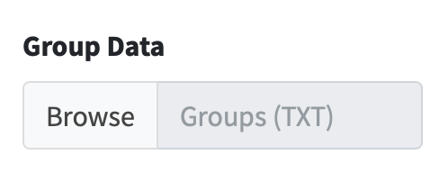
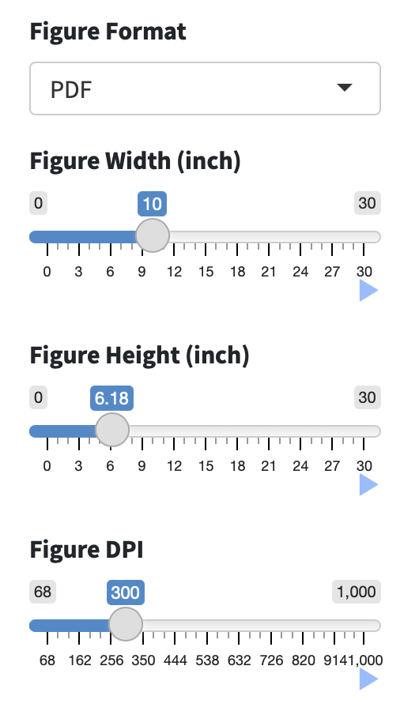

# Input and output
## Data input
The sample data comprises an integrated analysis of metabolomic and transcriptomic profiles in triple-negative breast cancer.

<ul>
<li>**Metabolite Data**: an interactive table for user-input metabolic data with rows corresponding to metabolites and columns corresponding to samples.

```{r,eval=TRUE,echo=FALSE}
knitr::include_graphics("figure/Meta.png")
knitr::include_graphics("figure/Metabolite.png")
```

<li>**GeneExp Data**: an interactive table for user-input metabolic data with rows corresponding to genes and columns correspond to the samples.

```{r,eval=TRUE,echo=FALSE}
knitr::include_graphics("figure/Gene.png")
knitr::include_graphics("figure/GeneExp.png")
```

<li>**Group Data**: Group information.

```{r,eval=TRUE,echo=FALSE,fig.align='left'}

knitr::include_graphics("figure/GroupInfo.png")
```

</ul>

## Result output
**The analysis results can be output in image form in two formats: PDF and JPEG. The figure width, height and resolution(DPI) can be adjusted.**

```{r,eval=TRUE,echo=FALSE}

```

