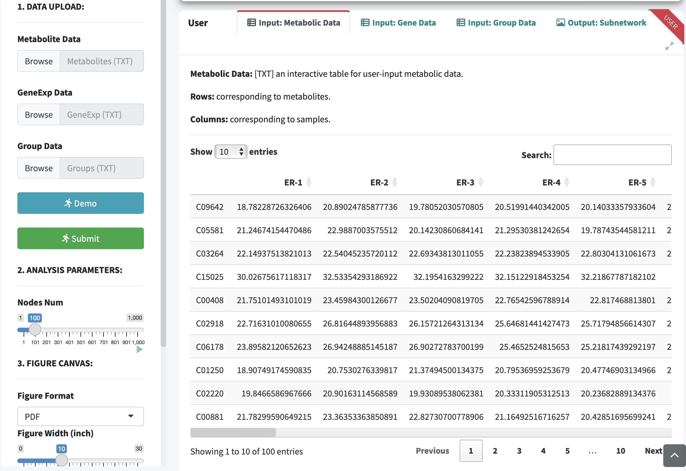
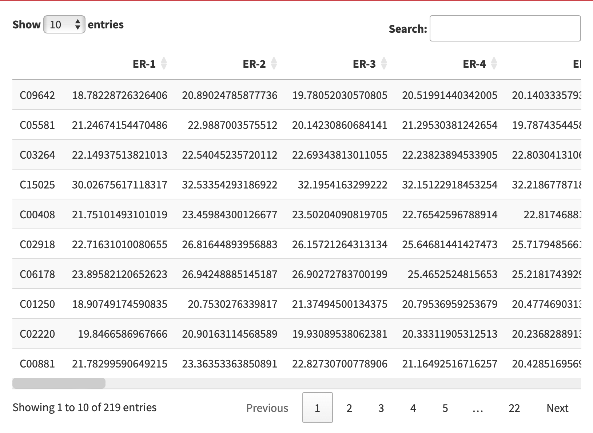
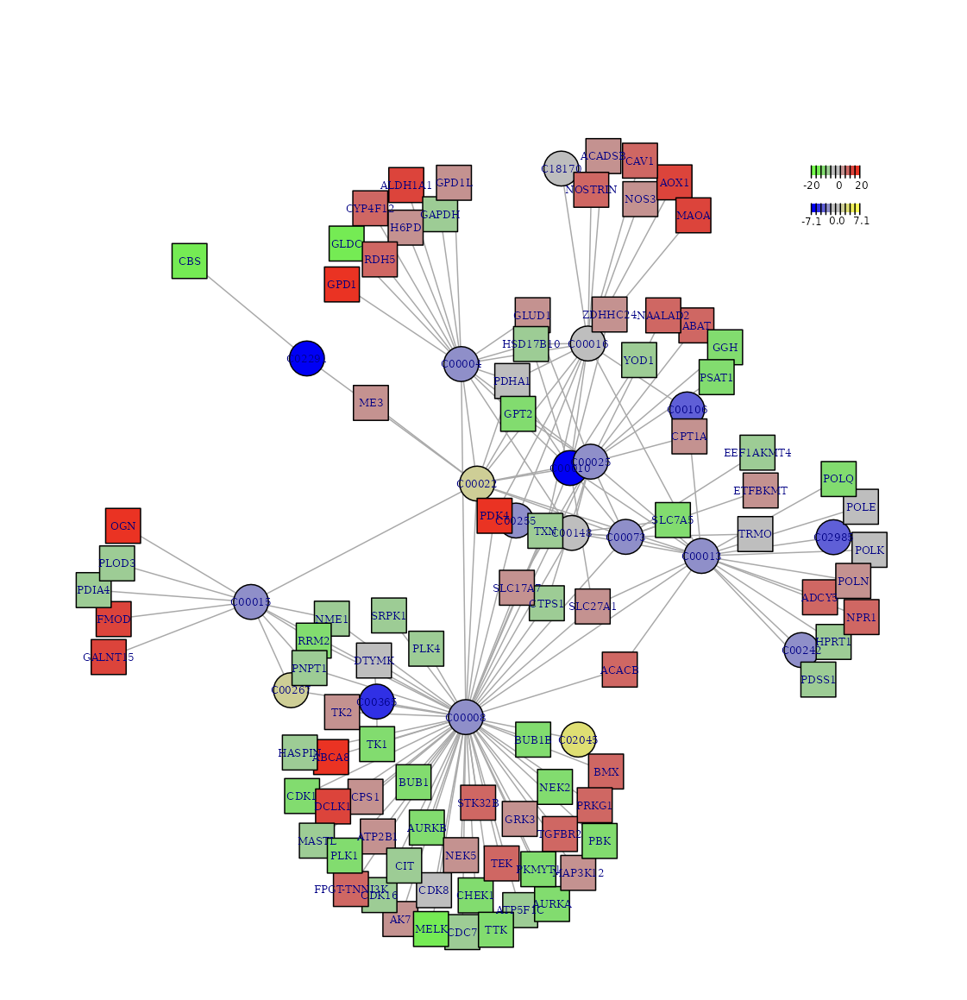

# Metabolic Network
**The metabolism-related subnetwork analysis is executed through an analyzer specifically designed to identify subnetwork based on input gene- and metabolite-level summary data.**  

## M-G Network

### Interface

<blockquote>
**Procedure**
</blockquote>

<ul>  

<li>Step 1: Enter **Metabolite Data**, **GeneExp Data** and **Group Data**,  respectively.  

<li>Step 2: Select **Nodes Number**.  

In R network analysis, nodes number refers to the total count of nodes, representing individual elements or entities within the network.

<li>Step 3: Select **Figure Format** and adjust **figure width, height and DPI**.  

<li>Step 4: Click the **User** panel to **view the input and output**, and finally click **Figure Download** and export the analysis results.  

</ul>


```{r,eval=TRUE,echo=FALSE,fig.align='center'}

```

<blockquote>
**Demo data**
</blockquote>

<ul>

<li>**Expand the Demo Panel and click Metabolic Data to download demo data**, which comprises an integrated analysis of metabolomic and transcriptomic profiles in triple-negative breast cancer.

<ul>
<li>**Metabolite Data**: an interactive table for user-input metabolic data with rows corresponding to metabolites and columns corresponding to samples.

```{r,eval=TRUE,echo=FALSE}

```

<li>**GeneExp Data**: an interactive table for user-input metabolic data with rows corresponding to genes and columns correspond to the samples.

```{r,eval=TRUE,echo=FALSE}
knitr::include_graphics("figure/GeneExp.png")
```

<li>**Group Data**: Group information.

```{r,eval=TRUE,echo=FALSE,fig.align='left'}
knitr::include_graphics("figure/GroupInfo.png")
```

</ul>

</ul>


### Results

<ul>

<li>By utilising the dbNet knowledgebase and employing the dnet algorithm, MNet analyses a list of genes and metabolites along with their significance information, allowing a graphical display of the metabolism-related subnetwork that contains both genes and metabolites.

</ul>

```{r,eval=TRUE,echo=FALSE,fig.align='center'}

```
