# Web Server Manual

## Metabolic Subnetwork Analyser

**The metabolism-related subnetwork analysis is executed through an analyzer specifically designed to identify subnetwork based on input gene- and metabolite-level summary data.**  

### sNETlyser

#### Interface

<blockquote>
**Procedure**
</blockquote>

<ul>  

<li>Step 1: Enter **Metabolite Data**, **GeneExp Data** and **Group Data**,  respectively.  

<li>Step 2: Select **Nodes Number**.  

In R network analysis, nodes number refers to the total count of nodes, representing individual elements or entities within the network.

<li>Step 3: Select **Figure Format** and adjust **figure width, height and DPI**.  

<li>Step 4: Click the **User** panel to **view the input and output**, and finally click **Figure Download** and export the analysis results.  

</ul>


```{r,eval=TRUE,echo=FALSE,fig.align='center'}
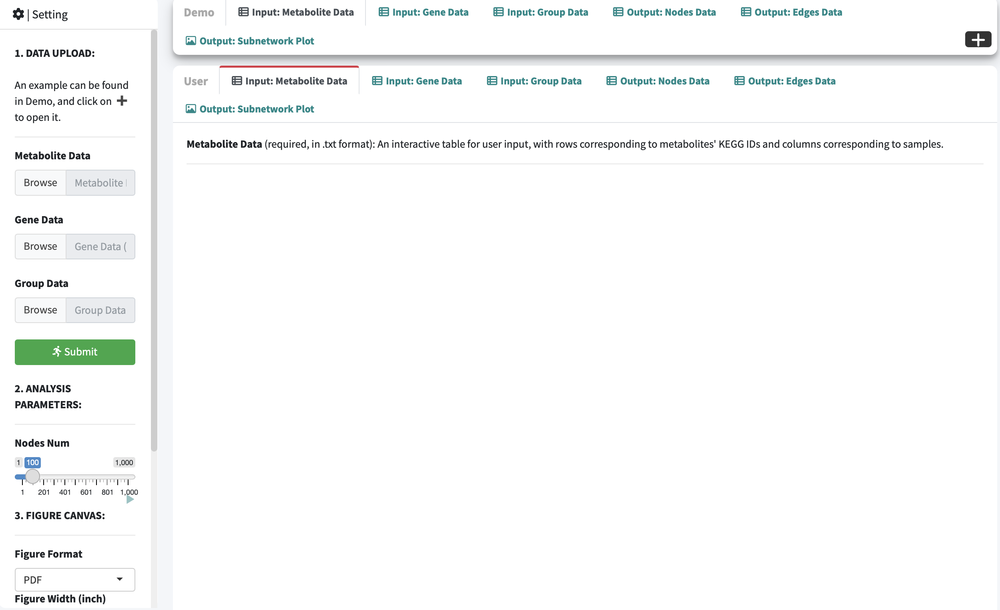
```

<blockquote>
**Demo data**
</blockquote>

<ul>

<li>**Input**

**Expand the Demo Panel and click Metabolic Data to download demo data**, which comprises an integrated analysis of metabolomic and transcriptomic profiles in triple-negative breast cancer.

<ul>
<li>**Metabolite Data**: an interactive table for user-input metabolic data with rows corresponding to metabolites and columns corresponding to samples.

```{r,eval=TRUE,echo=FALSE}
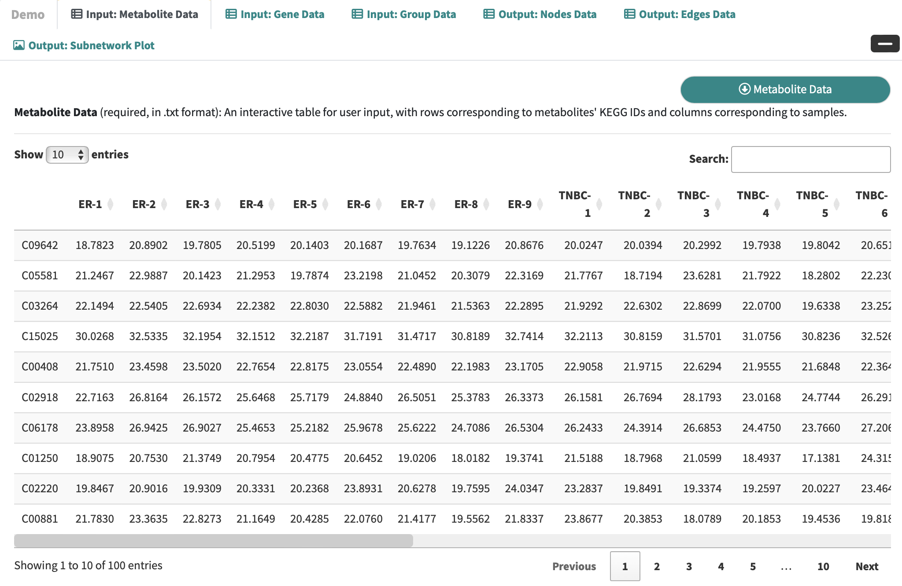
```

<li>**Gene Data**: an interactive table for user-input metabolic data with rows corresponding to genes and columns correspond to the samples.

```{r,eval=TRUE,echo=FALSE}
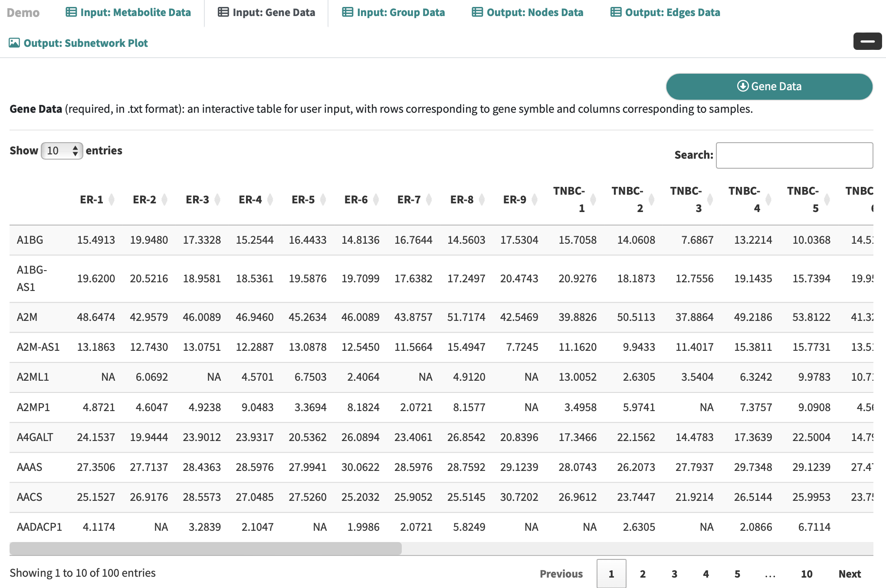
```

<li>**Group Data**: Group information.

```{r,eval=TRUE,echo=FALSE,fig.align='left'}
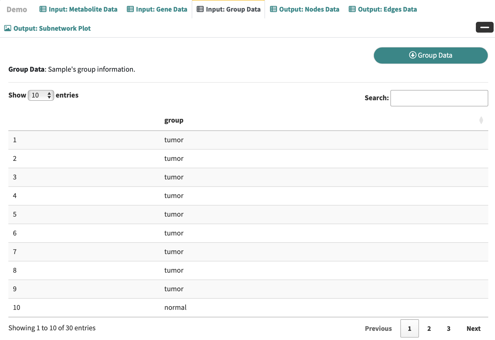
```

</ul>

</ul>


#### Output

<ul>

<li>**Nodes Data**: Nodes of subnetworks.

```{r,eval=TRUE,echo=FALSE,fig.align='center'}
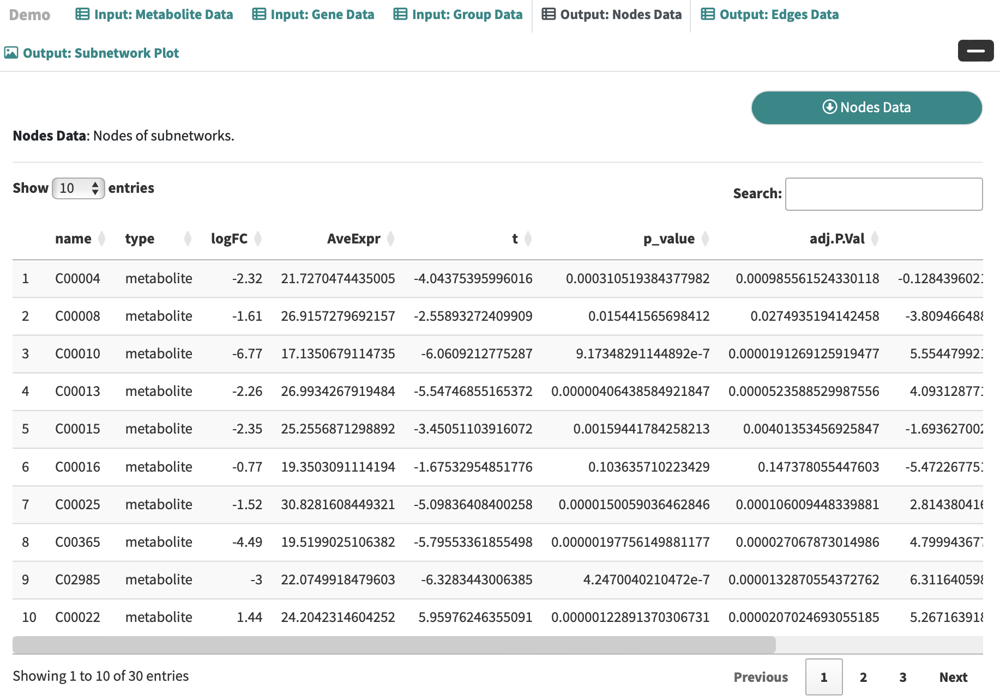
```

<li>**Edges Data**: Edges of subnetworks.

```{r,eval=TRUE,echo=FALSE,fig.align='center'}
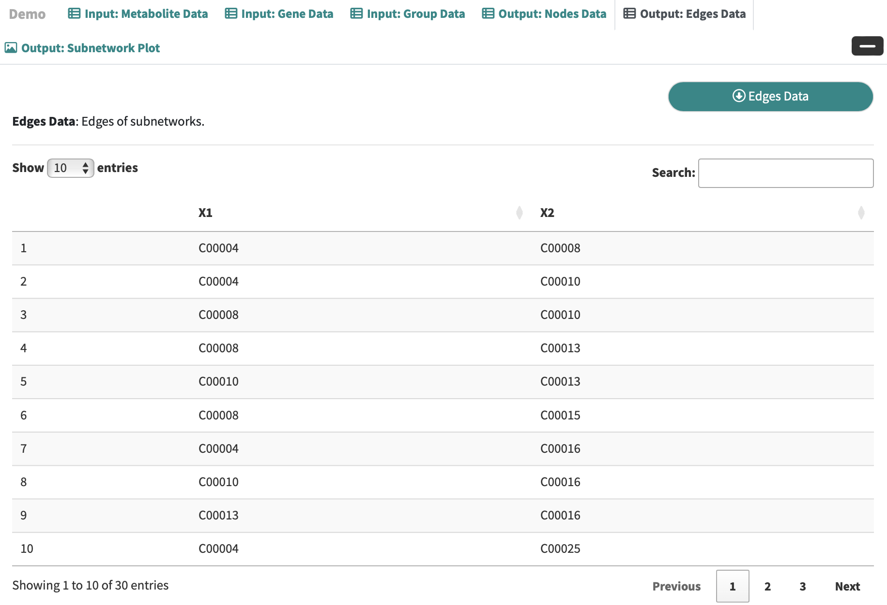
```

<li>**Subnetwork Plot**: A core metabolite-gene subnetwork can be downloaded as a PDF or JPEG file with specified width, height, and dpi setting.

```{r,eval=TRUE,echo=FALSE,fig.align='center'}
knitr::include_graphics("figure/subnetwork.png")
```
<center><b>Figure 1.</b> Visualization of the identified optimal subnetwork that best explains the biological processes comparing two groups. The colors represent the logFC (logarithm of fold change) of genes, with red and green indicating different expression levels, while yellow and blue represent the logFC of metabolites, indicating varying levels.</center>

</ul>

## Extended Pathway Analyses

### ePEAlyser
Extended pathway enrichment analysis

#### Interface

<blockquote>
**Procedure**
</blockquote>

<ul>  

<li>Step 1: Enter **Metabolite Data**, **GeneExp Data** and **Group Data**,  respectively.  

<li>Step 2: Select **Log(FoldChange), Padjust Cutoff and Pathway Pcutoff**, respectively.  

<ul>  

<li>**Fold change**: Identifies key metabolites with significant expression shifts between conditions, revealing potential metabolic alterations and pathway involvement in biological processes.  

<li>**Padjust Cutoff**: Helps filter significant results by controlling for false positives, ensuring that only statistically robust pathways are identified for further investigation.  

<li>**Pathway Pcutoff**: Sets a significance threshold, helping to identify pathways with meaningful changes while reducing the likelihood of false-positive findings.  

</ul>  

<li>Step 3: Select **Figure Format** and adjust **figure width, height and DPI**.  

<li>Step 4: Click the **User** panel to **view the input and output**, and finally click **Figure Download** and export the analysis results.  

</ul>

```{r,eval=TRUE,echo=FALSE,fig.align='center'}
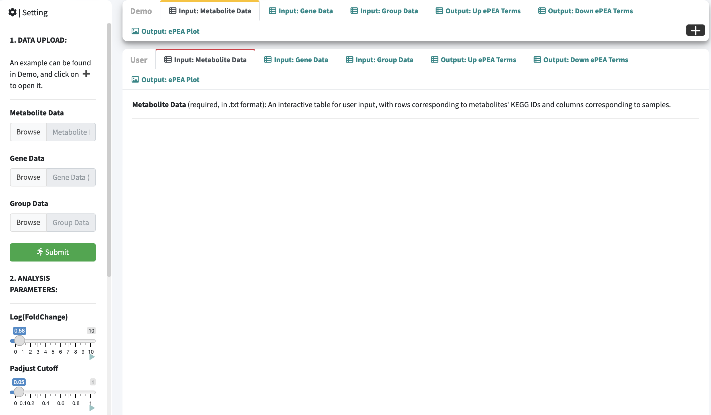
```

<blockquote>
**Demo data**
</blockquote>

<ul>

<li>**Input**

**Expand the Demo Panel and click Metabolic Data to download demo data**, which comprises an integrated analysis of metabolomic and transcriptomic profiles in triple-negative breast cancer.

<ul>
<li>**Metabolite Data**: an interactive table for user-input metabolic data with rows corresponding to metabolites and columns corresponding to samples.

```{r,eval=TRUE,echo=FALSE}
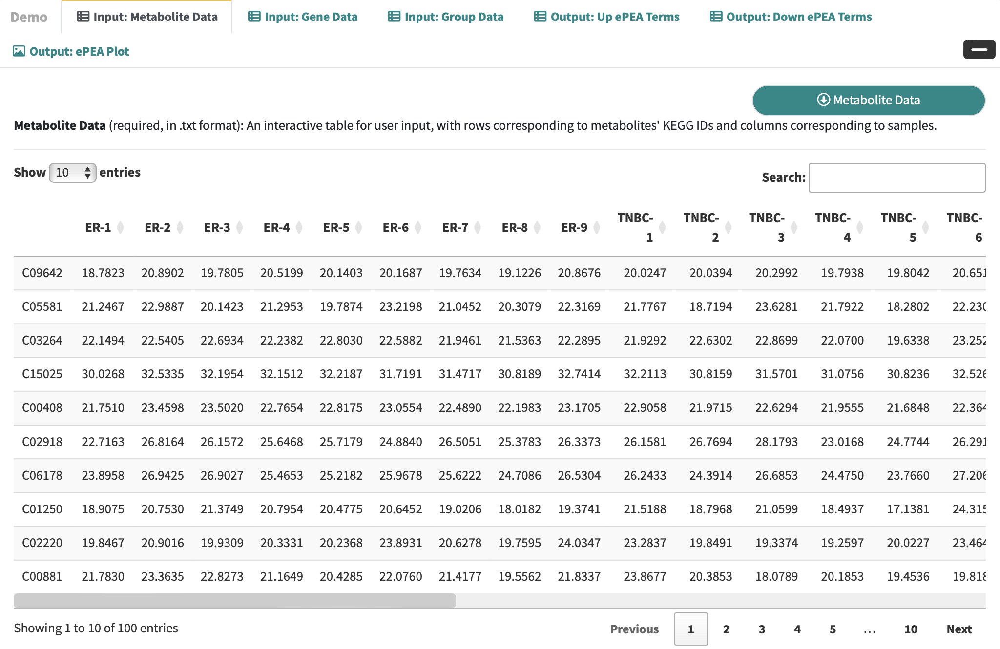
```

<li>**Gene Data**: an interactive table for user-input metabolic data with rows corresponding to genes and columns correspond to the samples.

```{r,eval=TRUE,echo=FALSE}
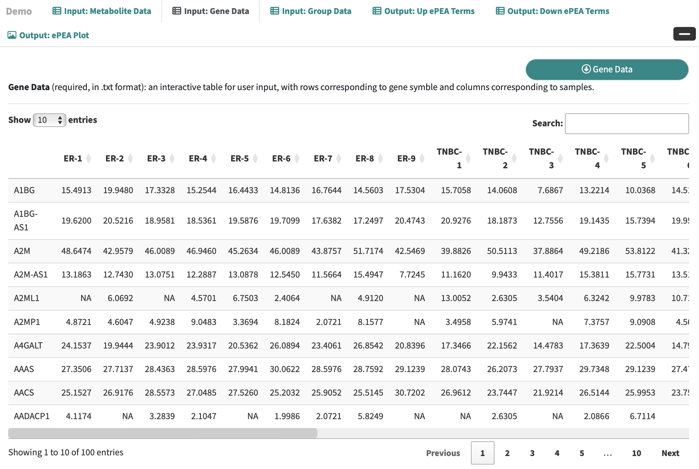
```

<li>**Group Data**: Group information.

```{r,eval=TRUE,echo=FALSE,fig.align='left'}
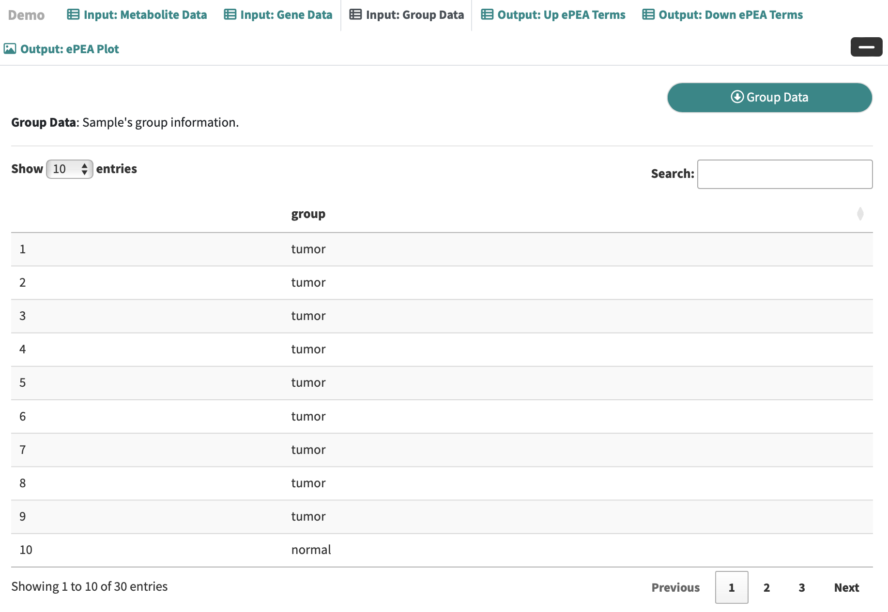
```

</ul>

</ul>


#### Output

<ul>

<li>**Up ePEA Terms**: Up-regulated pathways.

```{r,eval=TRUE,echo=FALSE,fig.align='center'}
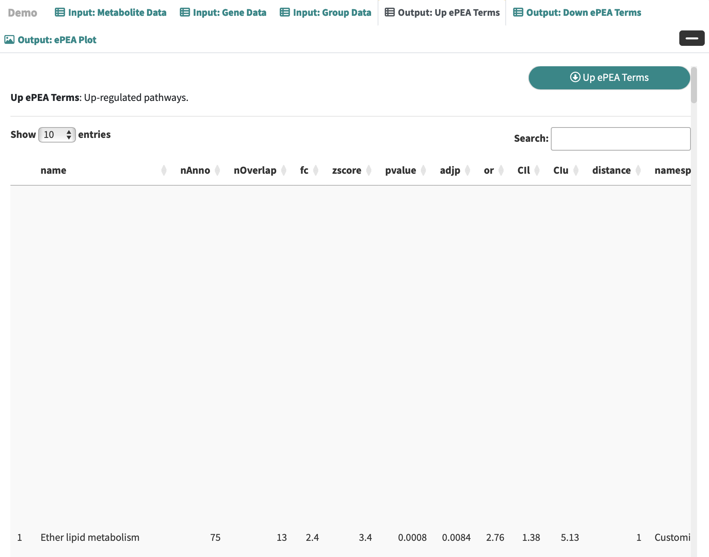
```

<li>**Down ePEA Terms**: Down-regulated pathways.

```{r,eval=TRUE,echo=FALSE,fig.align='center'}
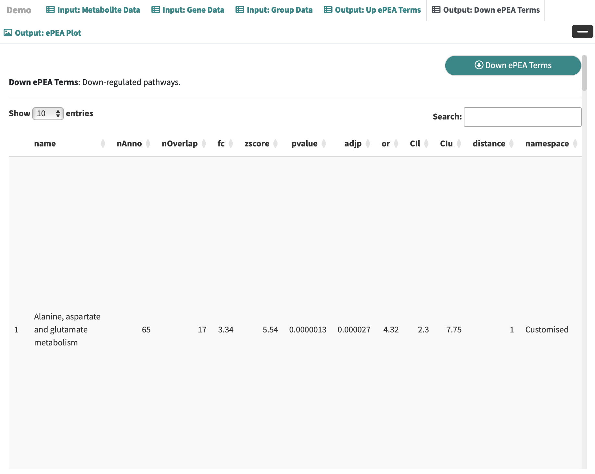
```

<li>**ePEA Plot**: Bar plot illustrating enriched pathways are available, and can be downloaded as a PDF or JPEG file with specified width, height, and dpi settings.

```{r,eval=TRUE,echo=FALSE,fig.align='center'}
knitr::include_graphics("figure/2.ePEA.png")
```
<center><b>Figure 1.</b> Extended pathway enrichment analysis. (A) Barplot of up-regulated metabolic pathways corresponding to metabolites and genes. (B) Barplot of down-regulated metabolic pathways corresponding to metabolites and genes. </center>

</ul>

### ePDAlyser
Extended pathway differential abundance (ePDA) score

#### Interface

<blockquote>
**Procedure**
</blockquote>

<ul>  

<li>Step 1: Enter **Metabolite Data**, **GeneExp Data** and **Group Data**,  respectively.  

<li>Step 2: Select **Log(FoldChange) and Padjust Cutoff**, respectively.  

<ul>  

<li>**Fold change**: Identifies key metabolites with significant expression shifts between conditions, revealing potential metabolic alterations and pathway involvement in biological processes.  

<li>**Padjust Cutoff**: Helps filter significant results by controlling for false positives, ensuring that only statistically robust pathways are identified for further investigation.  

</ul>  

<li>Step 3: Select **Figure Format** and adjust **figure width, height and DPI**.  

<li>Step 4: Click the **User** panel to **view the input and output**, and finally click **Figure Download** and export the analysis results.  

</ul>

```{r,eval=TRUE,echo=FALSE,fig.align='center'}
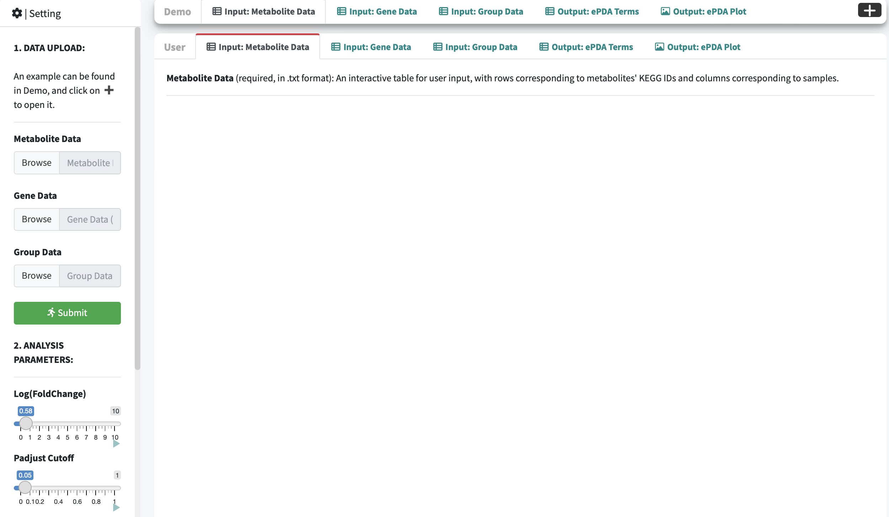
```

<blockquote>
**Demo data**
</blockquote>

<ul>

<li>**Input**

**Expand the Demo Panel and click Metabolic Data to download demo data**, which comprises an integrated analysis of metabolomic and transcriptomic profiles in triple-negative breast cancer.

<ul>
<li>**Metabolite Data**: an interactive table for user-input metabolic data with rows corresponding to metabolites and columns corresponding to samples.

```{r,eval=TRUE,echo=FALSE}
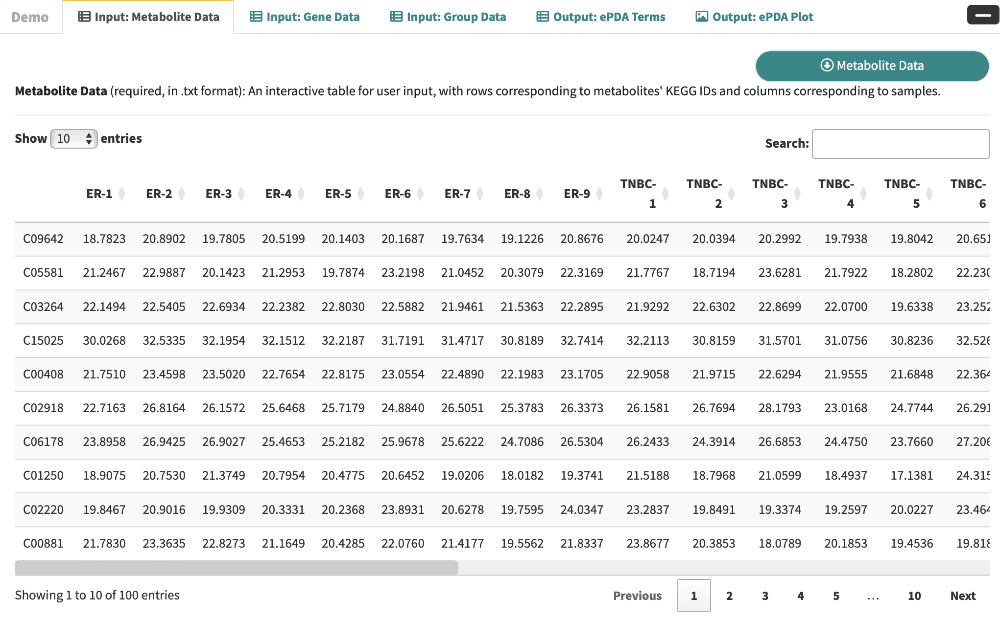
```

<li>**Gene Data**: an interactive table for user-input metabolic data with rows corresponding to genes and columns correspond to the samples.

```{r,eval=TRUE,echo=FALSE}
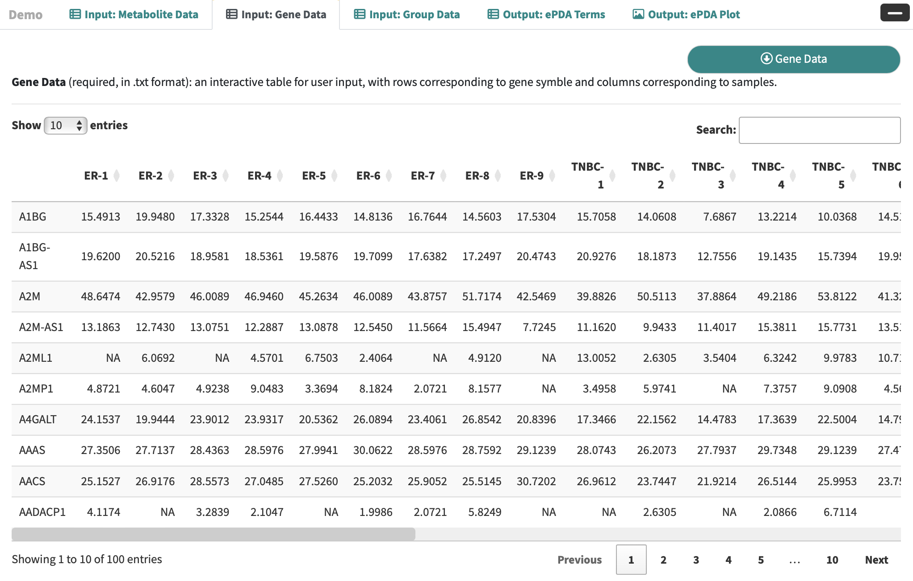
```

<li>**Group Data**: Group information.

```{r,eval=TRUE,echo=FALSE,fig.align='left'}
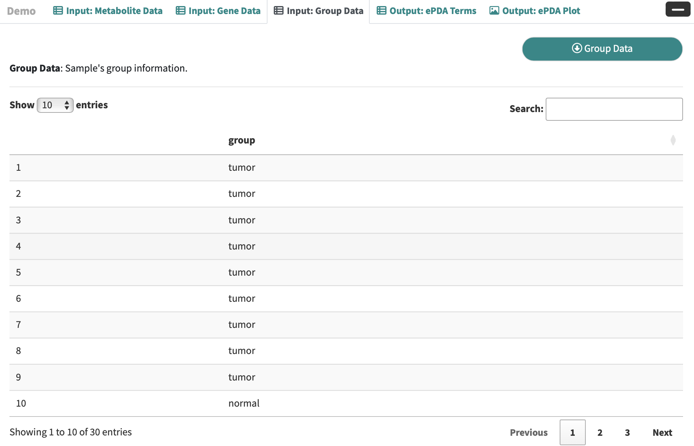
```

</ul>

</ul>

#### Output

<ul>

<li>**ePDA Terms**: Result of ePDA analysis.

```{r,eval=TRUE,echo=FALSE,fig.align='center'}
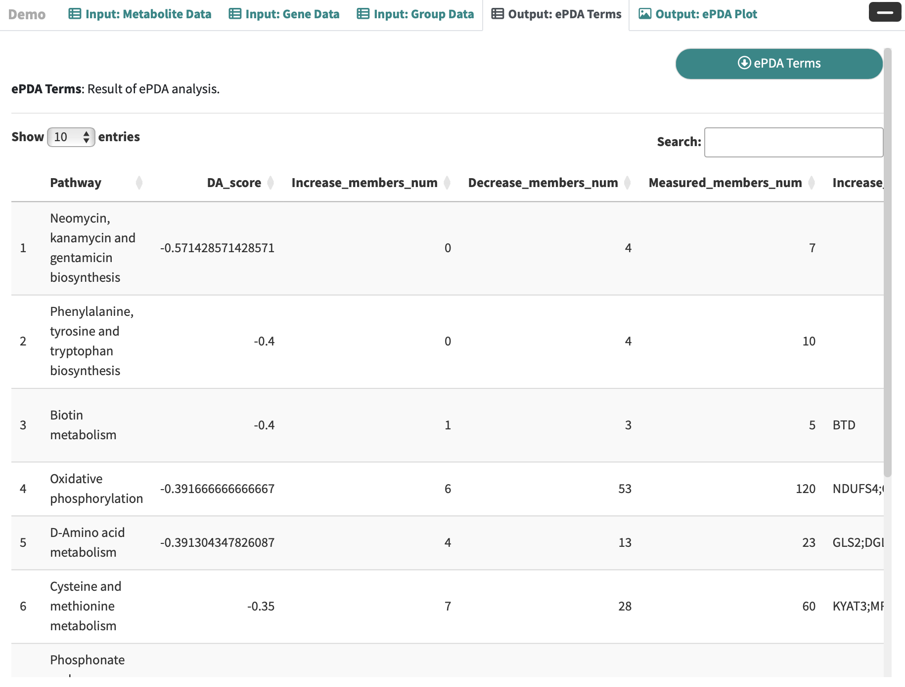
```

<li>**ePDA Plot**: A DAscore plot captures the tendency for a pathway, and can be downloaded as a PDF or JPEG file with specified width, height, and dpi settings.

```{r,eval=TRUE,echo=FALSE,fig.align='center'}
knitr::include_graphics("figure/2.ePDA.png")
```
<center><b>Figure 1.</b> ePDA score captures the tendency for a pathway to exhibit increased or decreased levels of genes and metabolites that are statistically significant differences between two group.</center>

</ul>

### eSEAlyser
Extended pathway set enrichment analysis

#### Interface

<blockquote>
**Procedure**
</blockquote>

<ul>  

<li>Step 1: Enter **Metabolite Data**, **GeneExp Data** and **Group Data**,  respectively.  

<li>Step 2: Enter interested **Pathway Name**.

<li>Step 3: Select **Figure Format** and adjust **figure width, height and DPI**.  

<li>Step 4: Click the **User** panel to **view the input and output**, and finally click **Figure Download** and export the analysis results.  

</ul>

```{r,eval=TRUE,echo=FALSE,fig.align='center'}
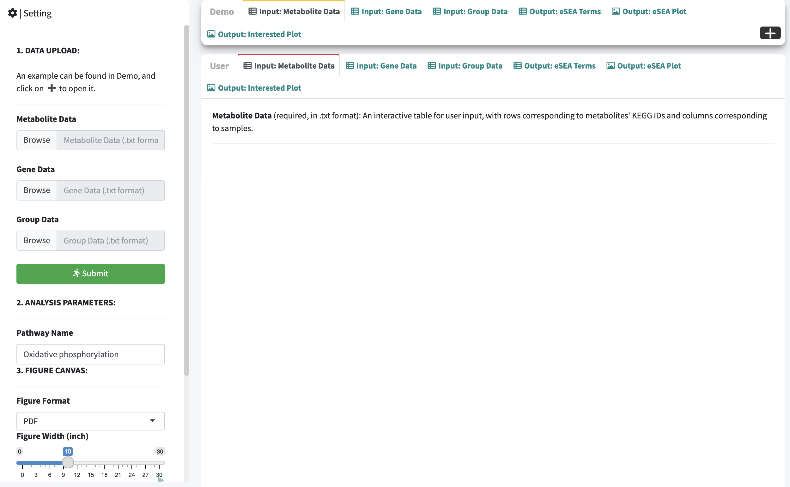
```

<blockquote>
**Demo data**
</blockquote>

<ul>

<li>**Input**

**Expand the Demo Panel and click Metabolic Data to download demo data**, which comprises an integrated analysis of metabolomic and transcriptomic profiles in triple-negative breast cancer.

<ul>
<li>**Metabolite Data**: an interactive table for user-input metabolic data with rows corresponding to metabolites and columns corresponding to samples.

```{r,eval=TRUE,echo=FALSE}
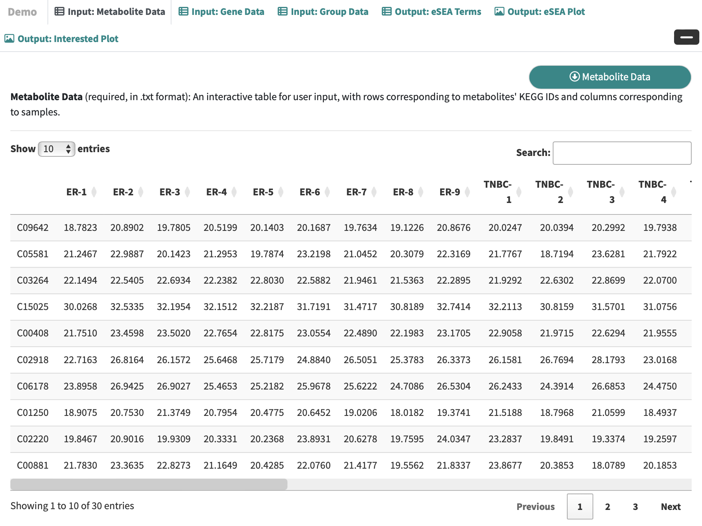
```

<li>**Gene Data**: an interactive table for user-input metabolic data with rows corresponding to genes and columns correspond to the samples.

```{r,eval=TRUE,echo=FALSE}
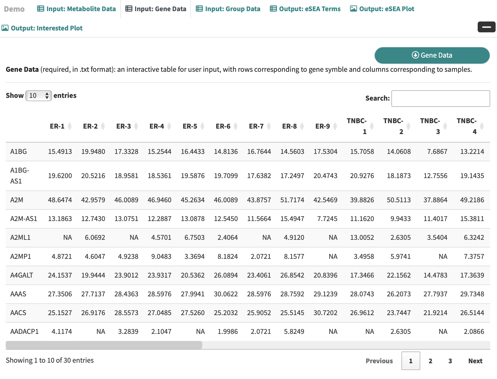
```

<li>**Group Data**: Group information.

```{r,eval=TRUE,echo=FALSE,fig.align='left'}
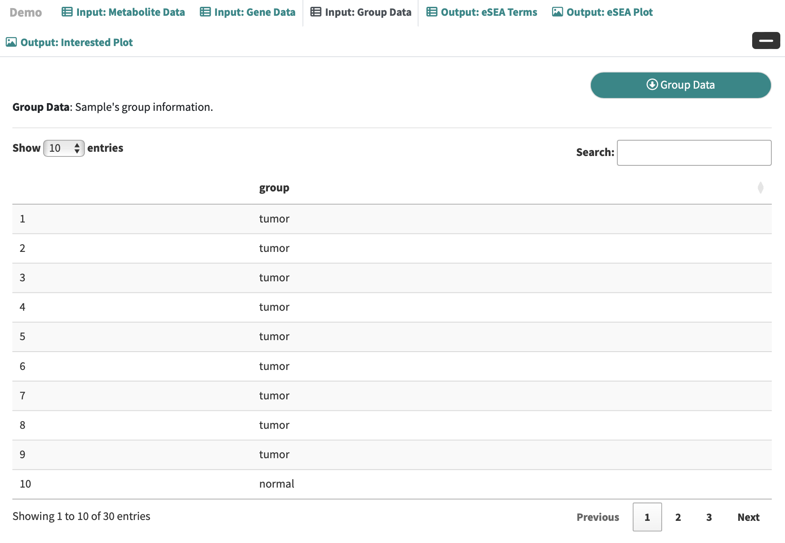
```

</ul>

</ul>


#### Output

<ul>

<li>**eSEA Terms**: Result of eSEA analysis.

```{r,eval=TRUE,echo=FALSE,fig.align='center'}
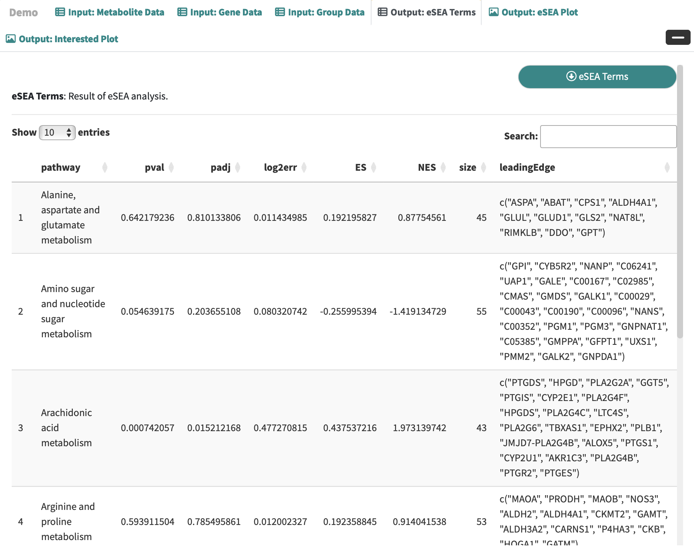
```

<li>**eSEA Plot**: Result of pathway set enrichment analysis can be downloaded as a PDF or JPEG file with specified width, height, and dpi settings.

```{r,eval=TRUE,echo=FALSE,fig.align='center'}
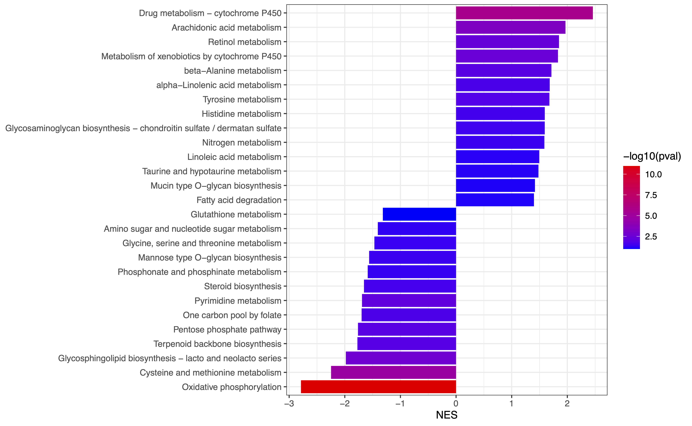
```
<center><b>Figure 1.</b> Extended pathway set enrichment analysis.</center>

<li>**Intested Plot**: Result of interested pathway set enrichment analysis can be downloaded as a PDF or JPEG file with specified width, height, and dpi settings.

```{r,eval=TRUE,echo=FALSE,fig.align='center',out.width="70%"}
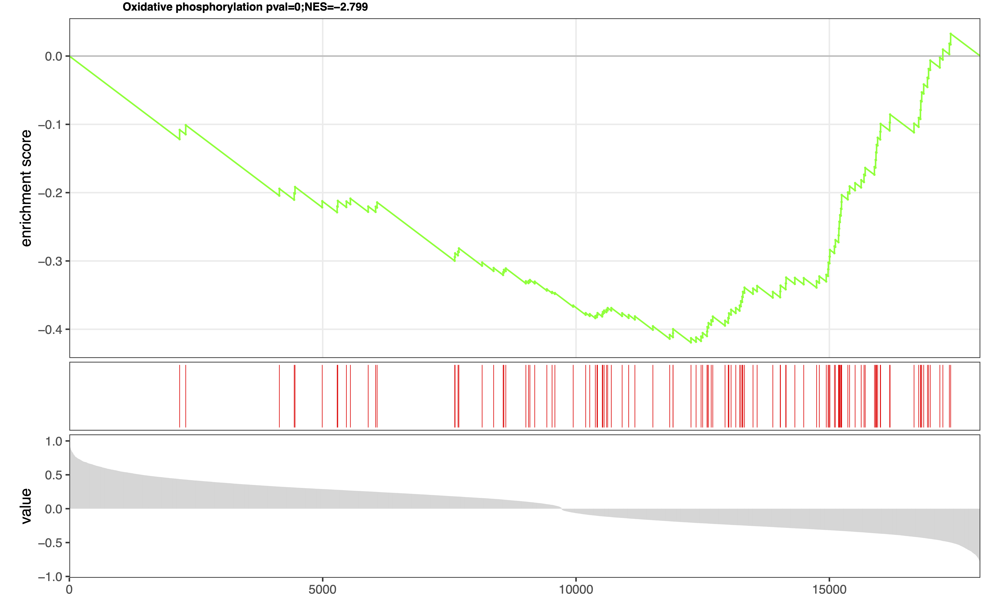
```

</ul>

## Construction of Knowledgebase dbMNet

Knowledgebase - dbMNet: dbKEGG for extended pathway analysis and dbNet for metabolism-related subnetwork analysis
The construction may takes more than 60 hours.

### dbKEGG

dbKEGG for extended pathway analysis

#### KEGG pathway’s metabolite and gene

This is the metabolites and the genes in every metabolism KEGG pathway.
```{r}
library(KEGGREST)
library(dplyr)

## All human metabolic pathways
pathway_meta <- data.table::fread("input/pathway_hsa.txt",sep="\t",header=F) %>%
  as.data.frame()

## Extract corresponding genes and metabolites for each pathway
result_gene <- data.frame()
result_compound <- data.frame()
for (i in 1:length(pathway_meta$V2)){

  print(pathway_meta$V2[i])

  path <- keggGet(pathway_meta$V2[i])

  ## Extract the genetic information of this pathway
  gene.info <- path[[1]]$GENE %>%
    as.data.frame() %>%
    dplyr::rename("V1"=".") %>%
    tidyr::separate(V1,sep=";","V1") %>%
    dplyr::pull(V1)

  ## Extract gene symbols from genes
  gene.symbol <- unique(gene.info[1:length(gene.info)%%2 == 0])
  #gene.id <- gene.info[1:length(gene.info)%%2 == 1]

  ## Generate a data frame matching gene symbol and Entrez ID
  gene.df <- data.frame(type="gene",name = gene.symbol,kegg_pathwayid=pathway_meta$V2[i],kegg_pathwayname=path[[1]]$PATHWAY_MAP,kegg_category =pathway_meta$V1[i])
  result_gene <- rbind(result_gene,gene.df)

  ## Extract metabolite information for this pathway 
  if (length(path[[1]]$COMPOUND)>0) {
    compound.info <- path[[1]]$COMPOUND %>%
      as.data.frame() %>%
      dplyr::rename("V1"=".") %>%
      rownames()

    ## Generate compound and corresponding pathway information
    compound.df <- data.frame(type="metabolite",name = compound.info,kegg_pathwayid=pathway_meta$V2[i],kegg_pathwayname=path[[1]]$PATHWAY_MAP,kegg_category =pathway_meta$V1[i])
    result_compound <- rbind(result_compound,compound.df)
  }

}
result <- rbind(result_gene,result_compound) %>%
  as_tibble()
dim(result)
write.table(result,"result/KEGGpathway_metabolite_gene.txt",quote=F,row.names = F,sep="\t")
```

### dbNet
dbNet for metabolism-related subnetwork analysis

#### KEGG metabolite-metabolite pairs and metabolite-gene pairs

<blockquote>
**KEGG’s reaction and compound’s download**
</blockquote>

```{r}
library(KEGGREST)
library(plyr)

source("input/get.kegg.all.R")
source("input/get.kegg.byId.R")

## Metabolic reactions and metabolite annotation information in the KEGG database
keggAll = get.kegg.all()

saveRDS(keggAll, file = "result/keggAll.RDS")

dim(keggAll$reaction)
dim(keggAll$compound)

write.csv(keggAll$reaction,file = "result/keggAllreaction.csv",row.names = F)
write.csv(keggAll$compound,file = "result/keggAllcompound.csv",row.names = F)
```

<blockquote>
**Downloading the enzyme and its corresponding gene information from the htext,and extract the gene and the enzyme’s relationship**
</blockquote>

```{r}
## Download the htext file.
curl https://www.genome.jp/kegg-bin/get_htext?hsa01000 -o result/hsa01000.keg

grep "^E" result/hsa01000.keg | sed 's/E        //g'|cut -d" " -f2 |cut -d";" -f1 >result/gene.txt

###sed 's/\[EC\:/ /g' is followed by a tab character
grep "^E" result/hsa01000.keg | sed 's/E        //g'|sed 's/\[EC\:/	/g' |sed 's/\] //g' |cut -f3 >result/enzyme.txt

paste result/gene.txt result/enzyme.txt |grep -v "D-dopachrome" |grep -v "cytochrome"|grep -v "putative" >result/gene_enzyme.txt

## The gene_enzyme.txt is like this:
ADH5^I1.1.1.284 1.1.1.1$
ADH1A^I1.1.1.1$
```

<blockquote>
**Extracting the metabolite-gene pairs and metabolite-metabolite pairs**
</blockquote>

```{r}
library(dplyr)

## Transformed the enzyme and its corresponding gene to one-to-one relationship
gene_enzyme <- data.table::fread("result/gene_enzyme.txt",header=F) %>%
  as.data.frame() %>%
  tidyr::separate_rows("V2",sep=" ") %>%
  unique() %>%
  dplyr::rename("gene_name"="V1") %>%
  dplyr::rename("enzyme"="V2")

## All the reaction in kegg
a <- read.csv("result/keggAllreaction.csv")

# Get all the metabolite and its corresponding gene from all the reaction in kegg

## The metabolite-gene pairs are exacted from every compound in the equation and the gene with the enzyme

metabolite_gene <- a %>%
  dplyr::select(c("EQUATION","ENZYME")) %>%
  tidyr::separate_rows(EQUATION,sep=" <=> ") %>%
  tidyr::separate_rows(EQUATION,sep=" ") %>%
  dplyr::filter(grepl("^C",EQUATION)) %>%
  tidyr::separate_rows(ENZYME,sep="///") %>%
  dplyr::rename("compound"="EQUATION") %>%
  dplyr::rename("enzyme"="ENZYME") %>%
  dplyr::left_join(gene_enzyme,by="enzyme") %>%
  dplyr::filter(!is.na(gene_name)) %>%
  dplyr::select(-"enzyme") %>%
  dplyr::mutate(compound=gsub("[(]n[)]","",compound)) %>%
  dplyr::mutate(compound=gsub("[(]m[)]","",compound)) %>%
  dplyr::mutate(compound=gsub("[(]n[+]1[)]","",compound)) %>%
  dplyr::mutate(compound=gsub("[(]n[+]m[)]","",compound)) %>%
  dplyr::mutate(compound=gsub("[(]n[-]1[)]","",compound)) %>%
  unique() %>%
  dplyr::mutate(src_type="metabolite") %>%
  dplyr::mutate(dest_type="gene") %>%
  dplyr::rename("src"="compound") %>%
  dplyr::rename("dest"="gene_name") %>%
  dplyr::select(c("src_type","src","dest_type","dest"))

# Get all the metabolite-metabolite pairs in the reactions
## Get the metabolite from the EQUATION, the metabolite-metabolite pairs are exacted from every compound in left of equation and every compound in right of equation.
metabolite_metabolite <- a %>%
  dplyr::select(c("EQUATION","ENZYME")) %>%
  tidyr::separate(EQUATION,c("a","b"),sep=" <=> ")%>%
  tidyr::separate_rows(a,sep=" ") %>%
  tidyr::separate_rows(b,sep=" ") %>%
  dplyr::filter(grepl("^C",a)) %>%
  dplyr::filter(grepl("^C",b)) %>%
  dplyr::select(c("a","b")) %>%
  unique() %>%
  dplyr::mutate(metabolite_1=gsub("[(]n[)]","",a)) %>%
  dplyr::mutate(metabolite_1=gsub("[(]n[+]m[)]","",metabolite_1)) %>%
  dplyr::mutate(metabolite_1=gsub("[(]side","",metabolite_1)) %>%
  dplyr::mutate(metabolite_1=gsub("[(]m[+]n[)]","",metabolite_1)) %>%
  dplyr::mutate(metabolite_1=gsub("[(]n[+]1[)]","",metabolite_1)) %>%
  dplyr::mutate(metabolite_1=gsub("[(]m[)]","",metabolite_1)) %>%
  dplyr::mutate(metabolite_2=gsub("[(]n[)]","",b)) %>%
  dplyr::mutate(metabolite_2=gsub("[(]n[+]m[)]","",metabolite_2)) %>%
  dplyr::mutate(metabolite_2=gsub("[(]side","",metabolite_2)) %>%
  dplyr::mutate(metabolite_2=gsub("[(]m[+]n[)]","",metabolite_2)) %>%
  dplyr::mutate(metabolite_2=gsub("[(]n[+]1[)]","",metabolite_2)) %>%
  dplyr::mutate(metabolite_2=gsub("[(]m[)]","",metabolite_2)) %>%
  dplyr::mutate(metabolite_2=gsub("[(]n[-]1[)]","",metabolite_2)) %>%
  dplyr::mutate(metabolite_2=gsub("[(]x[)]","",metabolite_2)) %>%
  dplyr::mutate(metabolite_2=gsub("[(]n[-]x[)]","",metabolite_2)) %>%
  dplyr::mutate(metabolite_2=gsub("[(]n[+]2[)]","",metabolite_2)) %>%
  dplyr::mutate(metabolite_2=gsub("[(]m[-]1[)]","",metabolite_2)) %>%
  dplyr::select(-c("a","b")) %>%
  dplyr::filter(metabolite_1 != metabolite_2) %>%
  dplyr::mutate(src_type="metabolite") %>%
  dplyr::mutate(dest_type="metabolite") %>%
  dplyr::rename("src"="metabolite_1") %>%
  dplyr::rename("dest"="metabolite_2") %>%
  dplyr::select(c("src_type","src","dest_type","dest"))

write.table(metabolite_gene,"result/KEGG_metabolite_gene.txt",quote=F,row.names = F,sep="\t")
write.table(metabolite_metabolite,"result/KEGG_metabolite_metabolite.txt",quote=F,row.names = F,sep="\t")
```

#### Graphite

<blockquote>
**Download all the data from graphite**
</blockquote>

```{r}
library(graphite)
library(clipper)
library(dplyr)

kpaths <- pathways("hsapiens", "kegg")
kpaths_result <- data.frame()
for (i in 1:length(kpaths)) {
  kid <- attributes(kpaths[[i]])$id
  ktitle <- attributes(kpaths[[i]])$title
  kpaths_1 <- convertIdentifiers(convertIdentifiers(kpaths[[i]], "symbol"),"KEGGCOMP")
  kpaths_result_temp <- edges(kpaths_1,"mixed") %>%
    dplyr::mutate(pathwayid=kid) %>%
    dplyr::mutate(pathway=ktitle)
  kpaths_result <- rbind(kpaths_result,kpaths_result_temp)
}
write.table(kpaths_result,"result/Graphite/gene-metabolite-kegg.txt",quote=F,sep="\t",row.names=F)

spaths <- pathways("hsapiens", "smpdb")
smpdb_result <- data.frame()
for (i in 1:length(spaths)) {
  kid <- attributes(spaths[[i]])$id
  ktitle <- attributes(spaths[[i]])$title
  smpdb_1 <- convertIdentifiers(convertIdentifiers(spaths[[i]], "symbol"),"KEGGCOMP")
  smpdb_result_temp <- edges(smpdb_1, "mixed") %>%
    dplyr::mutate(pathwayid=kid) %>%
    dplyr::mutate(pathway=ktitle)

  smpdb_result <- rbind(smpdb_result,smpdb_result_temp)
}
write.table(smpdb_result,"result/Graphite/gene-metabolite-smpdb.txt",quote=F,sep="\t",row.names=F)

wikipaths <- pathways("hsapiens", "wikipathways")
wikipaths_result <- data.frame()
for (i in 1:length(wikipaths)) {
  kid <- attributes(wikipaths[[i]])$id
  ktitle <- attributes(wikipaths[[i]])$title
  wikipaths_1 <- convertIdentifiers(convertIdentifiers(wikipaths[[i]], "symbol"),"KEGGCOMP")
  wikipaths_result_temp <- edges(wikipaths_1,"mixed") %>%
    dplyr::mutate(pathwayid=kid) %>%
    dplyr::mutate(pathway=ktitle)
  wikipaths_result <- rbind(wikipaths_result,wikipaths_result_temp)

}
write.table(wikipaths_result,"result/Graphite/gene-metabolite-wikipaths.txt",quote=F,sep="\t",row.names=F)

reactomepaths <- pathways("hsapiens", "reactome")
reactome_result <- data.frame()
for (i in 1:length(reactomepaths)) {
  kid <- attributes(reactomepaths[[i]])$id
  ktitle <- attributes(reactomepaths[[i]])$title
  reactome_1 <- convertIdentifiers(convertIdentifiers(reactomepaths[[i]], "symbol"),"KEGGCOMP")
  reactome_result_temp <- edges(reactome_1,"mixed") %>%
    dplyr::mutate(pathwayid=kid) %>%
    dplyr::mutate(pathway=ktitle)
  reactome_result <- rbind(reactome_result,reactome_result_temp)
}
write.table(reactome_result,"result/Graphite/gene-metabolite-reactome.txt",quote=F,sep="\t",row.names=F)
```

<blockquote>
**Download the information of metabolism pathways**
</blockquote>


Download all gpml files of homo-species from Wikipathway and extract the file names
```{bash}
## Wikipathway
wget https://data.wikipathways.org/current/gpml/wikipathways-20241010-gpml-Homo_sapiens.zip
```

```{r}
ls wikipathways-20241010-gpml-Homo_sapiens/* >all.txt
rev all.txt|cut -d"_" -f2|rev >all.1.txt
cat /dev/null > test.txt


if (0) {
cat all.1.txt |while read line
do
grep TERM homo/*${line}_*.gpml |cut -d">" -f2|cut -d"<" -f1|  tr -s "\n" ";"|sed -e 's/;$//g' | sed "s/^/${line}
        /" >>test.txt
done

grep -i metabolic test.txt >test_metabolic.txt
}

cat all.1.txt | while read line
do
grep TERM homo/*${line}_*.gpml | cut -d">" -f2 | cut -d"<" -f1 | tr '\n' ';' | sed -e 's/;$//' | sed "s/^/${line} /" >> test.txt
done
grep -i metabolic test.txt >test_metabolic.txt

## SMPDB
wget https://smpdb.ca/downloads/smpdb_pathways.csv.zip

## Reactome
R-HSA-1430728 is the metabolism, then choose the hierarchical is lower than it
wget https://reactome.org/download/current/ReactomePathwaysRelation.txt

## KEGG
#choose the metabolism pathway
```

<blockquote>
**Extract the data of metabolism**
</blockquote>

```{r}
library(dplyr)
library(MNet)

kegg_data_metabolism <- data.table::fread("result/Graphite/gene-metabolite-kegg.txt") %>%
  as.data.frame() %>%
  dplyr::filter(pathway %in% unique(kegg_pathway$PATHWAY)) %>%
  dplyr::select(-c("direction","type")) %>%
  unique() %>%
  dplyr::filter(src_type =="KEGGCOMP" | dest_type=="KEGGCOMP") %>%
  dplyr::mutate(src_new = ifelse(src_type=="KEGGCOMP",src,dest),
                dest_new = ifelse(src_type=="KEGGCOMP",dest,src),
                src_type_new=ifelse(src_type=="KEGGCOMP",src_type,dest_type),
                dest_type_new=ifelse(src_type=="KEGGCOMP",dest_type,src_type)) %>%
  dplyr::mutate(src_new1=ifelse(src_type=="KEGGCOMP" & dest_type=="KEGGCOMP",
                                ifelse(src_new>dest_new,src_new,dest_new),
                                src_new)) %>%
  dplyr::mutate(dest_new1=ifelse(src_type=="KEGGCOMP" & dest_type=="KEGGCOMP",
                                 ifelse(src_new>dest_new,dest_new,src_new),
                                 dest_new)) %>%
  dplyr::select(-c("src_type","src","dest_type","dest","src_new","dest_new")) %>%
  dplyr::rename("src_type"="src_type_new","src"="src_new1","dest_type"="dest_type_new","dest"="dest_new1") %>%
  dplyr::select(c("src_type","src","dest_type","dest","pathwayid","pathway")) %>%
  unique()
write.table(kegg_data_metabolism,"result/Graphite/gene-metabolite-kegg_metabolism.txt",quote=F,sep="\t",row.names=F)

## SMPDB
metabolism_pathway <- read.csv("result/Graphite/smpdb_pathways.csv") %>%
  dplyr::filter(Subject=="Metabolic")

smpdb_data <- data.table::fread("result/Graphite/gene-metabolite-smpdb.txt") %>%
  as.data.frame()
smpdb_metabolism <-  smpdb_data %>%
  dplyr::filter(pathway %in% metabolism_pathway$Name) %>%
  dplyr::filter(src_type=="KEGGCOMP"|dest_type=="KEGGCOMP") %>%
  dplyr::filter(!grepl("De Novo",pathway)) %>%
  dplyr::mutate(pathway_new=ifelse(grepl("Phosphatidylcholine Biosynthesis",pathway),
                                   "Phosphatidylcholine Biosynthesis",pathway)) %>%
  dplyr::mutate(pathway_new=ifelse(grepl("Cardiolipin Biosynthesis",pathway_new),
                                   "Cardiolipin Biosynthesis",pathway_new)) %>%
  dplyr::mutate(pathway_new=ifelse(grepl("Phosphatidylethanolamine Biosynthesis",pathway_new),
                                   "Phosphatidylethanolamine Biosynthesis",pathway_new)) %>%
  dplyr::mutate(pathway_new=ifelse(grepl("Mitochondrial Beta-Oxidation",pathway_new),
                                   "Mitochondrial Beta-Oxidation",pathway_new)) %>%
  dplyr::select(-"pathway") %>%
  dplyr::rename("pathway"="pathway_new") %>%
  dplyr::mutate(src_new = ifelse(src_type=="KEGGCOMP",src,dest),
                dest_new = ifelse(src_type=="KEGGCOMP",dest,src),
                src_type_new=ifelse(src_type=="KEGGCOMP",src_type,dest_type),
                dest_type_new=ifelse(src_type=="KEGGCOMP",dest_type,src_type)) %>%
  dplyr::mutate(src_new1=ifelse(src_type=="KEGGCOMP" & dest_type=="KEGGCOMP",
                                ifelse(src_new>dest_new,src_new,dest_new),
                                src_new)) %>%
  dplyr::mutate(dest_new1=ifelse(src_type=="KEGGCOMP" & dest_type=="KEGGCOMP",
                                 ifelse(src_new>dest_new,dest_new,src_new),
                                 dest_new)) %>%
  dplyr::select(-c("src_type","src","dest_type","dest","src_new","dest_new")) %>%
  dplyr::rename("src_type"="src_type_new","src"="src_new1","dest_type"="dest_type_new","dest"="dest_new1") %>%
  dplyr::select(c("src_type","src","dest_type","dest","pathwayid","pathway")) %>%
  unique()
write.table(smpdb_metabolism,"result/Graphite/gene-metabolite-smpdb_metabolism.txt",quote=F,sep="\t",row.names=F)

## Reactome
# metabolism pathway
reactome_metabolism_pathwayid <- data.table::fread("result/Graphite/ReactomePathwaysRelation.txt",header=F) %>%
  as.data.frame() %>%
  dplyr::filter(V1=="R-HSA-1430728")

reactome_metabolism_data <- data.table::fread("result/Graphite/gene-metabolite-reactome.txt") %>%
  as.data.frame() %>%
  dplyr::filter(pathwayid %in% reactome_metabolism_pathwayid$V2) %>%
  dplyr::filter(src_type=="KEGGCOMP"|dest_type=="KEGGCOMP") %>%
  dplyr::mutate(src_new = ifelse(src_type=="KEGGCOMP",src,dest),
                dest_new = ifelse(src_type=="KEGGCOMP",dest,src),
                src_type_new=ifelse(src_type=="KEGGCOMP",src_type,dest_type),
                dest_type_new=ifelse(src_type=="KEGGCOMP",dest_type,src_type)) %>%
  dplyr::mutate(src_new1=ifelse(src_type=="KEGGCOMP" & dest_type=="KEGGCOMP",
                                ifelse(src_new>dest_new,src_new,dest_new),
                                src_new)) %>%
  dplyr::mutate(dest_new1=ifelse(src_type=="KEGGCOMP" & dest_type=="KEGGCOMP",
                                 ifelse(src_new>dest_new,dest_new,src_new),
                                 dest_new)) %>%
  dplyr::select(-c("src_type","src","dest_type","dest","src_new","dest_new")) %>%
  dplyr::rename("src_type"="src_type_new","src"="src_new1","dest_type"="dest_type_new","dest"="dest_new1") %>%
  dplyr::select(c("src_type","src","dest_type","dest","pathwayid","pathway")) %>%
  unique()
write.table(reactome_metabolism_data,"result/Graphite/gene-metabolite-reactome_metabolism.txt",quote=F,sep="\t",row.names=F)

## Wikipathways
wikipathway_metabolism_id <- data.table::fread("result/wikipath/test_metabolic.txt",header=F) %>%
  as.data.frame()

wikipathway_data <- data.table::fread("result/Graphite/gene-metabolite-wikipaths.txt") %>%
  as.data.frame() %>%
  dplyr::filter(pathwayid %in% wikipathway_metabolism_id$V1) %>%
  dplyr::filter(src_type=="KEGGCOMP"|dest_type=="KEGGCOMP") %>%
  dplyr::mutate(src_new = ifelse(src_type=="KEGGCOMP",src,dest),
                dest_new = ifelse(src_type=="KEGGCOMP",dest,src),
                src_type_new=ifelse(src_type=="KEGGCOMP",src_type,dest_type),
                dest_type_new=ifelse(src_type=="KEGGCOMP",dest_type,src_type)) %>%
  dplyr::mutate(src_new1=ifelse(src_type=="KEGGCOMP" & dest_type=="KEGGCOMP",
                                ifelse(src_new>dest_new,src_new,dest_new),
                                src_new)) %>%
  dplyr::mutate(dest_new1=ifelse(src_type=="KEGGCOMP" & dest_type=="KEGGCOMP",
                                 ifelse(src_new>dest_new,dest_new,src_new),
                                 dest_new)) %>%
  dplyr::select(-c("src_type","src","dest_type","dest","src_new","dest_new")) %>%
  dplyr::rename("src_type"="src_type_new","src"="src_new1","dest_type"="dest_type_new","dest"="dest_new1") %>%
  dplyr::select(c("src_type","src","dest_type","dest","pathwayid","pathway")) %>%
  unique()
write.table(wikipathway_data,"result/Graphite/gene-metabolite-wikipathway_metabolism.txt",quote=F,sep="\t",row.names=F)

```

<blockquote>
**Combine the data from database kegg, wikipathway, reactome, smpdb and then uniq the data**
</blockquote>

```{r}
cat gene-metabolite-*metabolism.txt |cut -f1-4,6|sort|uniq >result.graphite.txt
```

#### BiGG

<blockquote>
**Down all the models in the BiGG**
</blockquote>

```{r}
## Down all the models in the BiGG
curl 'http://bigg.ucsd.edu/api/v2/models'

## Then, choice the model from Homo sapiens,then in reserve model is iAT_PLT_636, iAB_RBC_283, RECON1, Recon3D.

## Get all the reactions names in the 4 human models.
2 minutes

curl 'http://bigg.ucsd.edu/api/v2/models/iAT_PLT_636/reactions' >result/BiGG/iAT_PLT_636.reactions
curl 'http://bigg.ucsd.edu/api/v2/models/iAB_RBC_283/reactions' >result/BiGG/iAB_RBC_283.reactions
curl 'http://bigg.ucsd.edu/api/v2/models/RECON1/reactions' >result/BiGG/RECON1.reactions
curl 'http://bigg.ucsd.edu/api/v2/models/Recon3D/reactions' >result/BiGG/Recon3D.reactions

## Change the json reaction names to txt file.
tt<-jsonlite::stream_in(file("result/BiGG/iAB_RBC_283.reactions"),pagesize = 100)
write.table(tt$results[[1]]$bigg_id,"result/BiGG/iAB_RBC_283.reaction.txt",quote=F,row.names=F,col.names=F)

tt<-jsonlite::stream_in(file("result/BiGG/iAT_PLT_636.reactions"),pagesize = 100)
write.table(tt$results[[1]]$bigg_id,"result/BiGG/iAT_PLT_636.reaction.txt",quote=F,row.names=F,col.names=F)

tt<-jsonlite::stream_in(file("result/BiGG/RECON1.reactions"),pagesize = 100)
write.table(tt$results[[1]]$bigg_id,"result/BiGG/RECON1.reaction.txt",quote=F,row.names=F,col.names=F)

tt<-jsonlite::stream_in(file("result/BiGG/Recon3D.reactions"),pagesize = 100)
write.table(tt$results[[1]]$bigg_id,"result/BiGG/Recon3D.reaction.txt",quote=F,row.names=F,col.names=F)
```

<blockquote>
**Download the every reaction**
</blockquote>

<ul>

<li>Download the every reaction.

Download iAB_RBC_283 reaction

```{bash}
#!/bin/bash

#####Does output_dir need to add result/BiGG/mainly depends on the path of the full text
input_file='iAB_RBC_283.reaction.txt'
output_dir='iAB_RBC_283/reaction/json'
mkdir -p "$output_dir"

cat "$input_file" | while read line
do
curl "http://bigg.ucsd.edu/api/v2/models/iAB_RBC_283/reactions/${line}" > "${output_dir}/${line}.txt"
done 
```
Download iAT_PLT_636 reaction

```{bash}
#!/bin/bash

#####Does output_dir need to add result/BiGG/mainly depends on the path of the full text
input_file='iAT_PLT_636.reaction.txt'
output_dir='iAT_PLT_636/reaction/json'
mkdir -p "$output_dir"

cat "$input_file" | while read line
do
curl "http://bigg.ucsd.edu/api/v2/models/iAT_PLT_636/reactions/${line}" > "${output_dir}/${line}.txt"
done
```

Download RECON1 reaction

```{bash}
#!/bin/bash

#####Does output_dir need to add result/BiGG/mainly depends on the path of the full text
input_file='RECON1.reaction.txt'
output_dir='RECON1/reaction/json'
mkdir -p "$output_dir"

cat "$input_file" | while read line
do
curl "http://bigg.ucsd.edu/api/v2/models/RECON1/reactions/${line}" > "${output_dir}/${line}.txt"
done
```

Download Recon3D reaction

```{bash}
#!/bin/bash 

#####Does output_dir need to add result/BiGG/mainly depends on the path of the full text
input_file='Recon3D.reaction.txt'
output_dir='Recon3D/reaction/json'
mkdir -p "$output_dir"

cat "$input_file" | while read line   
do
curl "http://bigg.ucsd.edu/api/v2/models/Recon3D/reactions/${line}" > "${output_dir}/${line}.txt"
done
```


<li>Get the information in every reaction.

```{r}
## The R script that change the reaction information in json to txt.
args <- commandArgs(T) 

library(dplyr)

mydata <- paste0("result/BiGG/",args[1],"/reaction/json/",args[2],".txt")

recon1<-jsonlite::stream_in(file(mydata),pagesize = 100)

metabolite_biggid <- recon1$metabolites[[1]]$bigg_id
metabolites <- recon1$metabolites[[1]]$name
compartment_bigg_id <- recon1$metabolites[[1]]$compartment_bigg_id

gene <- recon1$results[[1]]$genes[[1]]$name

subsystem <- recon1$results[[1]]$subsystem

model=args[1]

if (length(gene)>0) {

  dd <- data.frame(metabolite_biggid1=paste(metabolite_biggid,compartment_bigg_id,sep="_"),src_type="metabolite",src=metabolites,metabolite_biggid2=NA,dest_type="gene",dest=paste(gene,collapse=";"),subsystems=subsystem,models=model)

}else {
  dd <- data.frame()
}

if (length(unique(recon1$metabolites[[1]]$stoichiometry))>1) {

  metabolites_stoichiometry1 <- recon1$metabolites[[1]] %>%
    dplyr::filter(stoichiometry>0)

  metabolites_stoichiometry2 <- recon1$metabolites[[1]] %>%
    dplyr::filter(stoichiometry<0)

  result <- data.frame()
  for (i in 1:nrow(metabolites_stoichiometry1)) {
    for (j in 1:nrow(metabolites_stoichiometry2)) {
      temp <- data.frame(metabolite_biggid1=paste(metabolites_stoichiometry1$bigg_id[i],metabolites_stoichiometry1$compartment_bigg_id[i],sep="_"),src_type="metabolite",src=metabolites_stoichiometry1$name[i],
                         metabolite_biggid2=paste(metabolites_stoichiometry2$bigg_id[j],metabolites_stoichiometry2$compartment_bigg_id[j],sep="_"),dest_type="metabolite",dest=metabolites_stoichiometry2$name[j],subsystems=subsystem,models=model)
      result <- rbind(result,temp)
    }
  }

  result_final <- rbind(dd,result)

  write.table(result_final,paste0("result/BiGG/",args[1],"/reaction/txt/",args[2],".txt"),quote=F,sep="\t",row.names=F)
}else {
  print(0)
}
```

<li>Run the R script that change the reaction information in json to txt in batch.
This step takes about 3 hours.

```{r}
cat result/BiGG/iAB_RBC_283.reaction.txt |while read line
do
Rscript reaction_json2txt.R iAB_RBC_283 $line
done

cat result/BiGG/iAT_PLT_636.reaction.txt |while read line
do
Rscript reaction_json2txt.R iAT_PLT_636 $line
done

cat result/BiGG/RECON1.reaction.txt |while read line
do
Rscript reaction_json2txt.R RECON1 $line
done

cat result/BiGG/Recon3D.reaction.txt |while read line
do
Rscript reaction_json2txt.R Recon3D $line
done
```

<li>Combine all the reactions info include the gene-metabolite pair,the metabolite-metabolite pair,subsystem,model.

```{r}
cat result/BiGG/iAB_RBC_283/reaction/txt/*|grep -v metabolite_biggid1 >result/BiGG/cat_reaction_info_iAB_RBC_283.txt
cat result/BiGG/iAT_PLT_636/reaction/txt/*|grep -v metabolite_biggid1 >result/BiGG/cat_reaction_info_iAT_PLT_636.txt

## Recon3D manually modified several lines starting with (GlcNAc)7 (Man)3

cat result/BiGG/Recon3D/reaction/txt/*|grep -v metabolite_biggid1 >result/BiGG/cat_reaction_info_Recon3D.txt
cat result/BiGG/RECON1/reaction/txt/*|grep -v metabolite_biggid1 >result/BiGG/cat_reaction_info_RECON1.txt
```

</ul>

<blockquote>
**Exact all the metabolites names in every model in BiGG**
</blockquote>

<ul>

<li>Dwonload the metabolites in every model in BiGG.

```{r}
curl 'http://bigg.ucsd.edu/api/v2/models/iAB_RBC_283/metabolites' >result/BiGG/iAB_RBC_283_metabolite.json
curl 'http://bigg.ucsd.edu/api/v2/models/iAT_PLT_636/metabolites' >result/BiGG/iAT_PLT_636_metabolite.json
curl 'http://bigg.ucsd.edu/api/v2/models/Recon3D/metabolites' >result/BiGG/Recon3D_metabolite.json
curl 'http://bigg.ucsd.edu/api/v2/models/RECON1/metabolites' >result/BiGG/RECON1_metabolite.json
```

<li>Change the json to txt and extract metabolite bigg_id.

```{r}
args=commandArgs(T)
recon1<-jsonlite::stream_in(file(paste0("result/BiGG/",args[1],"_metabolite.json")),pagesize = 100)

aa <- recon1$results[[1]]
write.table(paste0(aa$bigg_id,"_",aa$compartment_bigg_id),paste0("result/BiGG/",args[1],"_metabolite.txt"),row.names = F,col.names=F,sep="\t",quote=F)

## Use the script.
Rscript metabolitename_json2txt.R iAB_RBC_283
Rscript metabolitename_json2txt.R iAT_PLT_636
Rscript metabolitename_json2txt.R RECON1
Rscript metabolitename_json2txt.R Recon3D
```

<li>Download every metabolite information.

Download iAB_RBC_283 metabolite
```{bash}
#!/bin/bash

#####Does output_dir need to add result/BiGG/mainly depends on the path of the full text

input_file='iAB_RBC_283_metabolite.txt'
output_dir='iAB_RBC_283/metabolite/json'
mkdir -p "$output_dir"

cat "$input_file" | while read line
do
curl "http://bigg.ucsd.edu/api/v2/models/iAB_RBC_283/metabolites/${line}" > "${output_dir}/${line}.json"
done

```

Download iAT_PLT_636 metabolite
```{bash}
#!/bin/bash

#####Does output_dir need to add result/BiGG/mainly depends on the path of the full text

input_file='iAT_PLT_636_metabolite.txt'
output_dir='iAT_PLT_636/metabolite/json'
mkdir -p "$output_dir"

cat "$input_file" | while read line
do
curl "http://bigg.ucsd.edu/api/v2/models/iAT_PLT_636/metabolites/${line}" > "${output_dir}/${line}.json"
done

```

Download RECON1 metabolite
```{bash}
#!/bin/bash

#####Does output_dir need to add result/BiGG/mainly depends on the path of the full text

input_file='RECON1_metabolite.txt'
output_dir='RECON1/metabolite/json'
mkdir -p "$output_dir"

cat "$input_file" | while read line
do
curl "http://bigg.ucsd.edu/api/v2/models/RECON1/metabolites/${line}" > "${output_dir}/${line}.json"
done

```

Download Recon3D metabolite
```{bash}
#!/bin/bash

#####Does output_dir need to add result/BiGG/mainly depends on the path of the full text

input_file='Recon3D_metabolite.txt'
output_dir='Recon3D/metabolite/json'
mkdir -p "$output_dir"

cat "$input_file" | while read line
do
curl "http://bigg.ucsd.edu/api/v2/models/Recon3D/metabolites/${line}" > "${output_dir}/${line}.json"
done

```


<li>The R script that exact the KEGG ID in metabolite file.

```{r}
args <- commandArgs(T)
mydata <- paste0("result/BiGG/",args[1],"/metabolite/json/",args[2],".json")
# "iAB_RBC_283_metabolites/glu__L_c.json"
recon1<-jsonlite::stream_in(file(mydata),pagesize = 100)
kegg_id <- paste(recon1$database_links$`KEGG Compound`[[1]]$id,collapse = ";")
name <- recon1$name

result <- data.frame(name=name,kegg_id=kegg_id,source=args[1])
write.table(result,paste0("result/BiGG/",args[1],"/metabolite/txt/",args[2],".txt"),quote=F,row.names = F,sep="\t")
```

<li>Run the R script that exact the KEGG ID in the metabolite file.

```{r}
cat result/BiGG/iAB_RBC_283_metabolite.txt|while read line
do
  Rscript metabolite_json2txt.R iAB_RBC_283 ${line}
done

cat result/BiGG/iAT_PLT_636_metabolite.txt |while read line
do
  Rscript metabolite_json2txt.R iAT_PLT_636 ${line}
done

cat result/BiGG/RECON1_metabolite.txt|while read line
do
  Rscript metabolite_json2txt.R RECON1 ${line}
done

cat result/BiGG/Recon3D_metabolite.txt|while read line
do
  Rscript metabolite_json2txt.R Recon3D ${line}
done
```

<li>Combine all the metabolite in 1 file for every model.

```{r}
cat result/BiGG/iAB_RBC_283/metabolite/txt/*.txt|grep -v kegg_id|grep -v '^ $' >result/BiGG/iAB_RBC_283_metabolite_all.txt
cat result/BiGG/iAT_PLT_636/metabolite/txt/*.txt |grep -v kegg_id |grep -v '^ $' >result/BiGG/iAT_PLT_636_metabolite_all.txt
cat result/BiGG/RECON1/metabolite/txt/*.txt|grep -v kegg_id|grep -v '^ $' >result/BiGG/RECON1_metabolite_all.txt

## Recon3D metabolites is so many, so please cat 2 times
cat result/BiGG/Recon3D/metabolite/txt/*.txt|grep -v kegg_id|grep -v '^ $' >result/BiGG/Recon3D_metabolite_all.txt
```

</ul>

<blockquote>
**The R script that change the metabolite name to kegg id in the final output**
</blockquote>

```{r}
args <- commandArgs(T)

library(dplyr)

metabolite_info <- data.table::fread(paste0("result/BiGG/",args[1],"_metabolite_all.txt"),header=F) %>%
  as.data.frame()

gene_metabolite_pairs <- data.table::fread(paste0("result/BiGG/cat_reaction_info_",args[1],".txt"),header=F,sep="\t",fill=T) %>%
  as.data.frame() %>%
  dplyr::left_join(metabolite_info,by=c("V3"="V1")) %>%
  dplyr::left_join(metabolite_info,by=c("V6"="V1")) %>%
  dplyr::mutate(src=ifelse(V2.y=="" | is.na(V2.y),
                           V3.x,V2.y)) %>%
  dplyr::mutate(dest=ifelse(V2=="" | is.na(V2),
                            V6,V2)) %>%
  dplyr::select(c("V2.x","src","V5","dest","V7","V8")) %>%
  dplyr::rename("src_type"="V2.x","dest_type"="V5","subsystems"="V7","model"="V8") %>%
  tidyr::separate_rows(src,sep=";") %>%
  tidyr::separate_rows(dest,sep=";") %>%
  dplyr::filter(src != dest) %>%
  unique()
write.table(gene_metabolite_pairs,paste0("result/BiGG/result_",args[1],".txt"),quote=F,row.names = F,sep="\t")

## Use the R script that change the metabolite name to KEGG ID.
Rscript result.R iAB_RBC_283
Rscript result.R iAT_PLT_636
Rscript result.R RECON1
Rscript result.R Recon3D
cat result_*.txt |cut -f1-5 |sort|uniq >result/BiGG/result.BiGG.txt
```

<blockquote>
**Combine the data from BiGG, graphite, and KEGG**
</blockquote>

```{r}
library(dplyr)

kegg1 <- data.table::fread("KEGG_metabolite_gene.txt") %>%
  as.data.frame()
kegg2 <- data.table::fread("KEGG_metabolite_metabolite.txt") %>%
  as.data.frame()
dat_kegg <- rbind(kegg1,kegg2)

dat_graphite <- data.table::fread("Graphite/result.graphite.txt",header=F) %>%
  as.data.frame() %>%
  dplyr::select(-V5) %>%
  filter(V1 != "src_type") %>%
  rename("src_type"="V1","src"="V2","dest_type"="V3","dest"="V4")

dat_bigg <- data.table::fread("BiGG/result.BiGG.txt",header=F) %>%
  as.data.frame() %>%
  dplyr::select(-V5) %>%
  filter(V1 != "src_type") %>%
  rename("src_type"="V1","src"="V2","dest_type"="V3","dest"="V4")

dat <- rbind(dat_kegg,dat_graphite,dat_bigg) 
dat1 <- dat %>%
  filter(src_type==dest_type)
dat2 <- dat %>%
  filter(src_type!=dest_type)

dat11 <- dat1 %>%
  mutate(src1=ifelse( src > dest,src,dest)) %>%
  mutate(dest1=ifelse(src > dest, dest, src)) %>%
  select(-src,-dest) %>%
  rename("src"="src1","dest"="dest1") %>%
  select(src_type,src,dest_type,dest)
dat_all <- rbind(dat2,dat11) %>%
  unique()
write.table(dat_all,"Gene-Metabolite-data.txt",quote=F,row.names = F,sep="\t")
```

## Deployment

[MNet Source Files](https://github.com/tuantuangui/MNet)

[MNet Web Server](http://www.mnet4all.com/MNet/)

### Installing R 4.4.1 for Ubuntu 20

```{bash}
## 1. Sources
sudo sh -c 'echo "deb https://mirrors.tuna.tsinghua.edu.cn/CRAN/bin/linux/ubuntu $(lsb_release -cs)-cran40/" >> /etc/apt/sources.list'

sudo apt-key adv --keyserver keyserver.ubuntu.com --recv-keys E298A3A825C0D65DFD57CBB651716619E084DAB9

## 2. Update and Install
sudo apt-get update
sudo apt install -y libcurl4-openssl-dev libssl-dev libxml2-dev
sudo apt-get install r-base
```

### Installing R Packages

```{bash}
## In Order Install
sudo R

options(repos = c(CRAN = "https://mirrors.tuna.tsinghua.edu.cn/CRAN/"))
options(BioC_mirror="https://mirrors.tuna.tsinghua.edu.cn/bioconductor")

install.packages("shiny")
install.packages("Rcpp")
install.packages("RcppEigen")

install.packages("BiocManager")
BiocManager::install(c("supraHex", "limma", "pathview", "ropls", "fgsea"))

install.packages("remotes") 
remotes::install_github("hfang-bristol/dnet")
remotes::install_github("hfang-bristol/XGR")

remotes::install_github("tuantuangui/MNet")
```

### Installing shiny-sever

```{bash}
## 1. Install
sudo apt-get install gdebi-core
wget https://download3.rstudio.org/ubuntu-14.04/x86_64/shiny-server-1.5.14.948-amd64.deb
sudo gdebi shiny-server-1.5.14.948-amd64.deb

## 2. Start and Enable shiny-server
sudo systemctl start shiny-server.service
sudo systemctl enable shiny-server

## 3. Config
sudo vim /etc/shiny-server/shiny-server.conf

# Instruct Shiny Server to run applications as the user "shiny"
run_as shiny;

# Define a server that listens on port 3838
server {
  listen 3838;
  
# Define a location at the base URL
location / {

# Host the directory of Shiny Apps stored in this directory
site_dir /srv/shiny-server;

# Log all Shiny output to files in this directory
log_dir /var/log/shiny-server;

# When a user visits the base URL rather than a particular application,
# an index of the applications available in this directory will be shown.
directory_index on;
  
app_idle_timeout 0;
}
}
```

### Shiny App Server and Logs

```{bash}
## 1. Shinyapp
cd ~/
git clone https://github.com/tuantuangui/MNet.git
sudo cp -r ~/MNet/inst/shinyapp/* /srv/shiny-server/MNet/

## 2. Restart shiny-server
sudo systemctl restart shiny-server.service

## 3. Less New Logs
sudo less /var/log/shiny-server/*.log
```

### Firewall: firewalld or ufw

```{bash}
## firewalld
# 1. Install
sudo apt-get install firewalld

# 2. Start and Enable 
sudo systemctl start firewalld
sudo systemctl enable firewalld

# 3. Usage
sudo firewall-cmd --list-ports
sudo firewall-cmd --zone=public --add-port=3838/tcp —-permanent
sudo firewall-cmd --reload
sudo firewall-cd --list-ports

## ufw
# 1. Install
sudo apt-get install ufw

# 2. Enable
sudo ufw enable

# 3. Usage
sudo ufw status
sudo ufw allow 3838/tcp
sudo ufw reload

sudo ufw delete allow 3838/tcp
```

### Apache2 Config

```{bash}
## 1. Install 
sudo apt-get install apache2 
sudo systemctl start apache2
sudo systemctl enable apache2

## 2. a2enmod config 
sudo a2enmod proxy
sudo a2enmod proxy_http 
sudo a2enmod rewrite
sudo systemctl restart apache2

## 3. Apache2 Config for shiny-server
sudo vim /etc/apache2/sites-available/000-default.conf

<VirtualHost *:80>
# The ServerName directive sets the request scheme, hostname and port that the server uses to identify itself. This is used when creating redirection URLs. In the context of virtual hosts, the ServerName specifies what hostname must appear in the request's Host: header to match this virtual host. For the default virtual host (this file) this value is not decisive as it is used as a last resort host regard less. However, you must set it for any further virtual host explicitly.

ServerName www.mnet4all.com
ServerAdmin webmaster@localhost
DocumentRoot /var/www/html

# Available loglevels: trace8, ..., tracel, debug, info, notice, warn, error,  crit, alert, emerg. It is also possible to configure the loglevel for particular modules, e.g.
# LogLevel info ssl:warn

ErrorLog ${APACHE_LOG_DIR}/error.log
CustomLog ${APACHE_LOG_DIR}/access.log combined

# For most configuration files from conf-available/, which are enabled or disabled at a global level, it is possible to include a line for only one particular virtual host. For example the following line enables the CGI configuration for this host only after it has been globally disabled with "a2disconf". Include conf-available/serve-cgi-bin.conf

ProxyPass /MNet http://localhost:3838/MNet
ProxyPassReverse /MNet http://localhost: 3838/MNet

<Location /MNet>
  ProxyPassReverse / 
  Order allow,deny
  Allow from all
</Location>

</VirtualHost>
    
# vim: syntax=apache ts=4 sw=4 sts=4 sr noet
  
## 4. Static Sites
cp -r ~/MNet/pkgdown/docs /var/www/html/mnet-docs
cp -r ~/MNet/bookdown/book /var/www/html/mnet-manual
```
