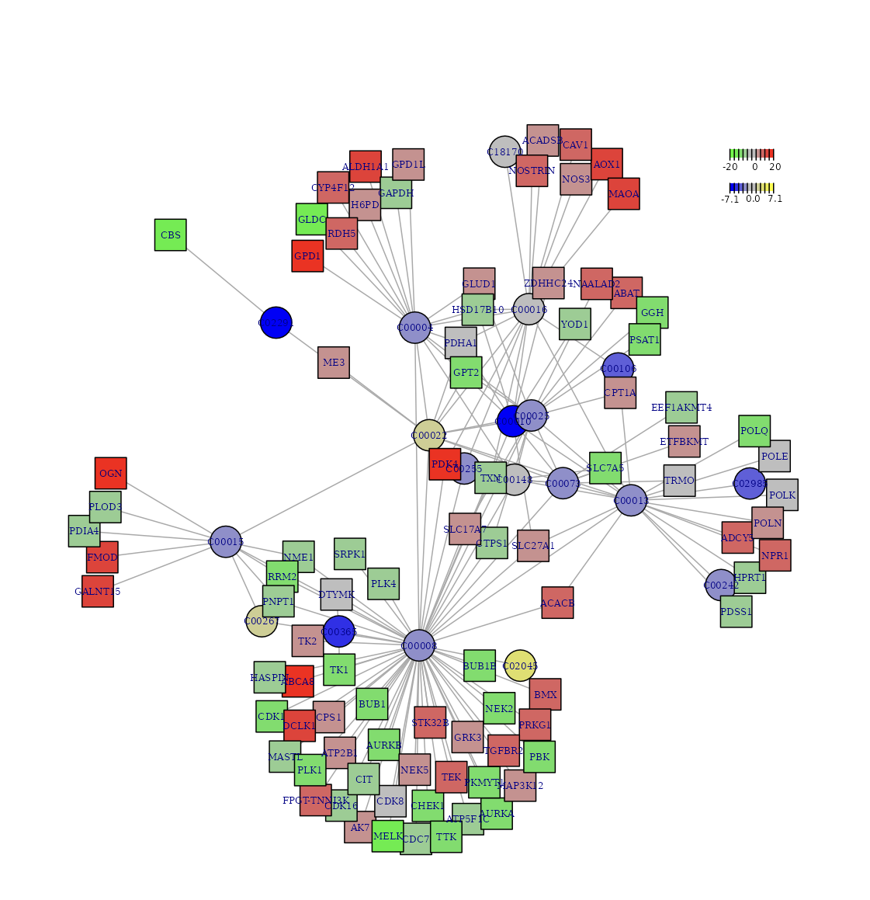
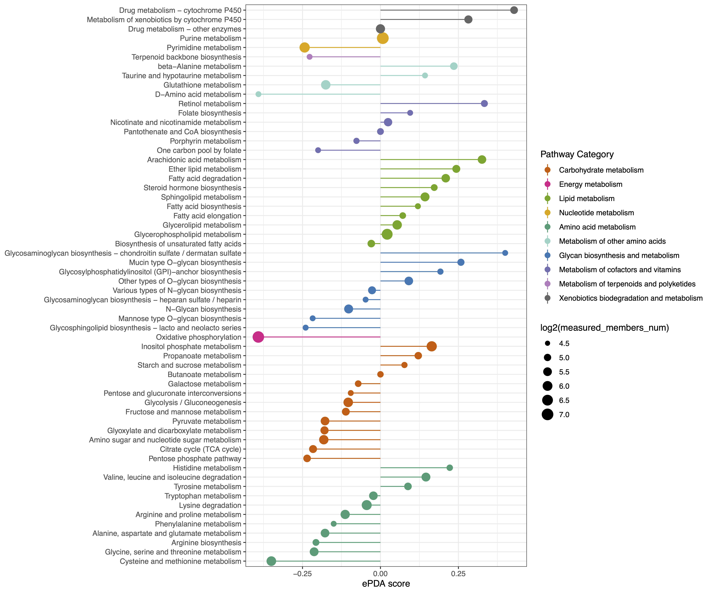

# Web Server Manual

## Metabolic Subnetwork

**The metabolism-related subnetwork analysis is executed through an analyzer specifically designed to identify subnetwork based on input gene- and metabolite-level summary data.**  

### Met-Gene Subnetwork

#### Interface

<blockquote>
**Procedure**
</blockquote>

<ul>  

<li>Step 1: Enter **Metabolite Data**, **GeneExp Data** and **Group Data**,  respectively.  

<li>Step 2: Select **Nodes Number**.  

In R network analysis, nodes number refers to the total count of nodes, representing individual elements or entities within the network.

<li>Step 3: Select **Figure Format** and adjust **figure width, height and DPI**.  

<li>Step 4: Click the **User** panel to **view the input and output**, and finally click **Figure Download** and export the analysis results.  

</ul>


```{r,eval=TRUE,echo=FALSE,fig.align='center'}
knitr::include_graphics("figure/1.M-G.png")
```

<blockquote>
**Demo data**
</blockquote>

<ul>

<li>**Expand the Demo Panel and click Metabolic Data to download demo data**, which comprises an integrated analysis of metabolomic and transcriptomic profiles in triple-negative breast cancer.

<ul>
<li>**Metabolite Data**: an interactive table for user-input metabolic data with rows corresponding to metabolites and columns corresponding to samples.

```{r,eval=TRUE,echo=FALSE}
knitr::include_graphics("figure/Metabolite.png")
```

<li>**GeneExp Data**: an interactive table for user-input metabolic data with rows corresponding to genes and columns correspond to the samples.

```{r,eval=TRUE,echo=FALSE}
knitr::include_graphics("figure/GeneExp.png")
```

<li>**Group Data**: Group information.

```{r,eval=TRUE,echo=FALSE,fig.align='left'}
knitr::include_graphics("figure/GroupInfo.png")
```

</ul>

</ul>


#### Results

<ul>

<li>By utilising the dbNet knowledgebase and employing the dnet algorithm, MNet analyses a list of genes and metabolites along with their significance information, allowing a graphical display of the metabolism-related subnetwork that contains both genes and metabolites.

</ul>

```{r,eval=TRUE,echo=FALSE,fig.align='center'}

```
<center><b>Figure 1.</b> Visualization of the identified optimal subnetwork that best explains the biological processes comparing two groups. The colors represent the logFC (logarithm of fold change) of genes, with red and green indicating different expression levels, while yellow and blue represent the logFC of metabolites, indicating varying levels.</center>

## Extended Pathway Analyses

### ePEA
Extended pathway enrichment analysis

#### Interface

<blockquote>
**Procedure**
</blockquote>

<ul>  

<li>Step 1: Enter **Metabolite Data**, **GeneExp Data** and **Group Data**,  respectively.  

<li>Step 2: Select **Log(FoldChange), Padjust Cutoff and Pathway Pcutoff**, respectively.  

<ul>  

<li>**Fold change**: Identifies key metabolites with significant expression shifts between conditions, revealing potential metabolic alterations and pathway involvement in biological processes.  

<li>**Padjust Cutoff**: Helps filter significant results by controlling for false positives, ensuring that only statistically robust pathways are identified for further investigation.  

<li>**Pathway Pcutoff**: Sets a significance threshold, helping to identify pathways with meaningful changes while reducing the likelihood of false-positive findings.  

</ul>  

<li>Step 3: Select **Figure Format** and adjust **figure width, height and DPI**.  

<li>Step 4: Click the **User** panel to **view the input and output**, and finally click **Figure Download** and export the analysis results.  

</ul>

```{r,eval=TRUE,echo=FALSE,fig.align='center'}
knitr::include_graphics("figure/1.M-G.png")
```

<blockquote>
**Demo data**
</blockquote>

<ul>

<li>**Expand the Demo Panel and click Metabolic Data to download demo data**, which comprises an integrated analysis of metabolomic and transcriptomic profiles in triple-negative breast cancer.

<ul>
<li>**Metabolite Data**: an interactive table for user-input metabolic data with rows corresponding to metabolites and columns corresponding to samples.

```{r,eval=TRUE,echo=FALSE}
knitr::include_graphics("figure/Metabolite.png")
```

<li>**GeneExp Data**: an interactive table for user-input metabolic data with rows corresponding to genes and columns correspond to the samples.

```{r,eval=TRUE,echo=FALSE}
knitr::include_graphics("figure/GeneExp.png")
```

<li>**Group Data**: Group information.

```{r,eval=TRUE,echo=FALSE,fig.align='left'}
knitr::include_graphics("figure/GroupInfo.png")
```

</ul>

</ul>


#### Results

```{r,eval=TRUE,echo=FALSE,fig.align='center'}
knitr::include_graphics("figure/2.ePEA.png")
```
<center><b>Figure 1.</b> Extended pathway enrichment analysis. (A) Barplot of up-regulated metabolic pathways corresponding to metabolites and genes. (B) Dotplot of up-regulated metabolic pathways corresponding to metabolites and genes. (C) Barplot of down-regulated metabolic pathways corresponding to metabolites and genes. (D) Dotplot of down-regulated metabolic pathways corresponding to metabolites and genes.</center>

### ePDA
Extended pathway differential abundance (ePDA) score

#### Interface

<blockquote>
**Procedure**
</blockquote>

<ul>  

<li>Step 1: Enter **Metabolite Data**, **GeneExp Data** and **Group Data**,  respectively.  

<li>Step 2: Select **Log(FoldChange), Padjust Cutoff and Pathway Pcutoff**, respectively.  

<ul>  

<li>**Fold change**: Identifies key metabolites with significant expression shifts between conditions, revealing potential metabolic alterations and pathway involvement in biological processes.  

<li>**Padjust Cutoff**: Helps filter significant results by controlling for false positives, ensuring that only statistically robust pathways are identified for further investigation.  

<li>**Pathway Pcutoff**: Sets a significance threshold, helping to identify pathways with meaningful changes while reducing the likelihood of false-positive findings.  

</ul>  

<li>Step 3: Select **Figure Format** and adjust **figure width, height and DPI**.  

<li>Step 4: Click the **User** panel to **view the input and output**, and finally click **Figure Download** and export the analysis results.  

</ul>

```{r,eval=TRUE,echo=FALSE,fig.align='center'}
knitr::include_graphics("figure/1.M-G.png")
```

<blockquote>
**Demo data**
</blockquote>

<ul>

<li>**Expand the Demo Panel and click Metabolic Data to download demo data**, which comprises an integrated analysis of metabolomic and transcriptomic profiles in triple-negative breast cancer.

<ul>
<li>**Metabolite Data**: an interactive table for user-input metabolic data with rows corresponding to metabolites and columns corresponding to samples.

```{r,eval=TRUE,echo=FALSE}
knitr::include_graphics("figure/Metabolite.png")
```

<li>**GeneExp Data**: an interactive table for user-input metabolic data with rows corresponding to genes and columns correspond to the samples.

```{r,eval=TRUE,echo=FALSE}
knitr::include_graphics("figure/GeneExp.png")
```

<li>**Group Data**: Group information.

```{r,eval=TRUE,echo=FALSE,fig.align='left'}
knitr::include_graphics("figure/GroupInfo.png")
```

</ul>

</ul>


#### Results

```{r,eval=TRUE,echo=FALSE,fig.align='center',out.width="70%"}

```
<center><b>Figure 1.</b> ePDA score captures the tendency for a pathway to exhibit increased or decreased levels of genes and metabolites that are statistically significant differences between two group.</center>

### eSEA
Extended pathway set enrichment analysis

#### Interface

<blockquote>
**Procedure**
</blockquote>

<ul>  

<li>Step 1: Enter **Metabolite Data**, **GeneExp Data** and **Group Data**,  respectively.  

<li>Step 2: Select **Log(FoldChange), Padjust Cutoff and Pathway Pcutoff**, respectively.  

<ul>  

<li>**Fold change**: Identifies key metabolites with significant expression shifts between conditions, revealing potential metabolic alterations and pathway involvement in biological processes.  

<li>**Padjust Cutoff**: Helps filter significant results by controlling for false positives, ensuring that only statistically robust pathways are identified for further investigation.  

<li>**Pathway Pcutoff**: Sets a significance threshold, helping to identify pathways with meaningful changes while reducing the likelihood of false-positive findings.  

</ul>  

<li>Step 3: Select **Figure Format** and adjust **figure width, height and DPI**.  

<li>Step 4: Click the **User** panel to **view the input and output**, and finally click **Figure Download** and export the analysis results.  

</ul>

```{r,eval=TRUE,echo=FALSE,fig.align='center'}
knitr::include_graphics("figure/1.M-G.png")
```

<blockquote>
**Demo data**
</blockquote>

<ul>

<li>**Expand the Demo Panel and click Metabolic Data to download demo data**, which comprises an integrated analysis of metabolomic and transcriptomic profiles in triple-negative breast cancer.

<ul>
<li>**Metabolite Data**: an interactive table for user-input metabolic data with rows corresponding to metabolites and columns corresponding to samples.

```{r,eval=TRUE,echo=FALSE}
knitr::include_graphics("figure/Metabolite.png")
```

<li>**GeneExp Data**: an interactive table for user-input metabolic data with rows corresponding to genes and columns correspond to the samples.

```{r,eval=TRUE,echo=FALSE}
knitr::include_graphics("figure/GeneExp.png")
```

<li>**Group Data**: Group information.

```{r,eval=TRUE,echo=FALSE,fig.align='left'}
knitr::include_graphics("figure/GroupInfo.png")
```

</ul>

</ul>

#### Results

```{r,eval=TRUE,echo=FALSE,fig.align='center',out.width="60%"}
knitr::include_graphics("figure/2.eSEA.png")
```
<center><b>Figure 1.</b> Extended pathway set enrichment analysis.</center>


## Knowledgebase Construction

### dbKEGG

dbKEGG for extended pathway analysis and dbNet for metabolism-related subnetwork analysis.

#### KEGG pathway’s metabolite and gene

This is the metabolites and the genes in every metabolism KEGG pathway.

```{r}
library(KEGGREST)
library(dplyr)

## All human metabolic pathways
pathway_meta <- data.table::fread("input/pathway_hsa.txt",sep="\t",header=F) %>%
  as.data.frame()

## Extract corresponding genes and metabolites for each pathway
result_gene <- data.frame()
result_compound <- data.frame()
for (i in 1:length(pathway_meta$V2)){

  print(pathway_meta$V2[i])

  path <- keggGet(pathway_meta$V2[i])

  ## Extract the genetic information of this pathway
  gene.info <- path[[1]]$GENE %>%
    as.data.frame() %>%
    dplyr::rename("V1"=".") %>%
    tidyr::separate(V1,sep=";","V1") %>%
    dplyr::pull(V1)

  ## Extract gene symbols from genes
  gene.symbol <- unique(gene.info[1:length(gene.info)%%2 == 0])
  #gene.id <- gene.info[1:length(gene.info)%%2 == 1]

  ## Generate a data frame matching gene symbol and Entrez ID
  gene.df <- data.frame(type="gene",name = gene.symbol,kegg_pathwayid=pathway_meta$V2[i],kegg_pathwayname=path[[1]]$PATHWAY_MAP,kegg_category =pathway_meta$V1[i])
  result_gene <- rbind(result_gene,gene.df)

  ## Extract metabolite information for this pathway 
  if (length(path[[1]]$COMPOUND)>0) {
    compound.info <- path[[1]]$COMPOUND %>%
      as.data.frame() %>%
      dplyr::rename("V1"=".") %>%
      rownames()

    ## Generate compound and corresponding pathway information
    compound.df <- data.frame(type="metabolite",name = compound.info,kegg_pathwayid=pathway_meta$V2[i],kegg_pathwayname=path[[1]]$PATHWAY_MAP,kegg_category =pathway_meta$V1[i])
    result_compound <- rbind(result_compound,compound.df)
  }

}
result <- rbind(result_gene,result_compound) %>%
  as_tibble()
dim(result)
write.table(result,"result/KEGGpathway_metabolite_gene-v20240427.txt",quote=F,row.names = F,sep="\t")
```

### dbNet

#### KEGG metabolite-metabolite pairs and metabolite-gene pairs

<blockquote>
**KEGG’s reaction and compound’s download**
</blockquote>

```{r}
## the code is runing in 2024.04.28
library(KEGGREST)
library(plyr)

source("input/get.kegg.all.R")
source("input/get.kegg.byId.R")

## Metabolic reactions and metabolite annotation information in the KEGG database
keggAll = get.kegg.all()

saveRDS(keggAll, file = "result/keggAll-v20240428.RDS")

dim(keggAll$reaction)
dim(keggAll$compound)

write.csv(keggAll$reaction,file = "result/keggAllreaction_v20240428.csv",row.names = F)
write.csv(keggAll$compound,file = "result/keggAllcompound_v20240428.csv",row.names = F)
```

<blockquote>
**Downloading the enzyme and its corresponding gene information from the htext,and extract the gene and the enzyme’s relationship**
</blockquote>

```{r}
## Download the htext file.
curl https://www.genome.jp/kegg-bin/get_htext?hsa01000 -o result/hsa01000.keg
grep "^E" result/hsa01000.keg | sed 's/E        //g'|cut -d" " -f2 |cut -d";" -f1 >result/gene.txt
grep "^E" result/hsa01000.keg | sed 's/E        //g'|sed 's/\[EC\:/    /g' |sed 's/\] //g' |cut -f3 >result/enzyme.txt
sed 's/\[EC\:/    /g'
paste result/gene.txt result/enzyme.txt |grep -v "D-dopachrome" |grep -v "cytochrome"|grep -v "putative" >result/gene_enzyme.txt

## The gene_enzyme.txt is like this:
ADH5^I1.1.1.284 1.1.1.1$
ADH1A^I1.1.1.1$
```

<blockquote>
**Extracting the metabolite-gene pairs and metabolite-metabolite pairs**
</blockquote>

```{r}
library(dplyr)

## Transformed the enzyme and its corresponding gene to one-to-one relationship
gene_enzyme <- data.table::fread("result/gene_enzyme.txt",header=F) %>%
  as.data.frame() %>%
  tidyr::separate_rows("V2",sep=" ") %>%
  unique() %>%
  dplyr::rename("gene_name"="V1") %>%
  dplyr::rename("enzyme"="V2")

## all the reaction in kegg
a <- read.csv("result/keggAllreaction_v20240428.csv")

# get all the metabolite and its corresponding gene from all the reaction in kegg

## the metabolite-gene pairs are exacted from every compound in the equation and the gene with the enzyme

metabolite_gene <- a %>%
  dplyr::select(c("EQUATION","ENZYME")) %>%
  tidyr::separate_rows(EQUATION,sep=" <=> ") %>%
  tidyr::separate_rows(EQUATION,sep=" ") %>%
  dplyr::filter(grepl("^C",EQUATION)) %>%
  tidyr::separate_rows(ENZYME,sep="///") %>%
  dplyr::rename("compound"="EQUATION") %>%
  dplyr::rename("enzyme"="ENZYME") %>%
  dplyr::left_join(gene_enzyme,by="enzyme") %>%
  dplyr::filter(!is.na(gene_name)) %>%
  dplyr::select(-"enzyme") %>%
  dplyr::mutate(compound=gsub("[(]n[)]","",compound)) %>%
  dplyr::mutate(compound=gsub("[(]m[)]","",compound)) %>%
  dplyr::mutate(compound=gsub("[(]n[+]1[)]","",compound)) %>%
  dplyr::mutate(compound=gsub("[(]n[+]m[)]","",compound)) %>%
  dplyr::mutate(compound=gsub("[(]n[-]1[)]","",compound)) %>%
  unique() %>%
  dplyr::mutate(src_type="metabolite") %>%
  dplyr::mutate(dest_type="gene") %>%
  dplyr::rename("src"="compound") %>%
  dplyr::rename("dest"="gene_name") %>%
  dplyr::select(c("src_type","src","dest_type","dest"))

# get all the metabolite-metabolite pairs in the reactions
## get the metabolite from the EQUATION, the metabolite-metabolite pairs are exacted from every compound in left of equation and every compound in right of equation.

metabolite_metabolite <- a %>%
  dplyr::select(c("EQUATION","ENZYME")) %>%
  tidyr::separate(EQUATION,c("a","b"),sep=" <=> ")%>%
  tidyr::separate_rows(a,sep=" ") %>%
  tidyr::separate_rows(b,sep=" ") %>%
  dplyr::filter(grepl("^C",a)) %>%
  dplyr::filter(grepl("^C",b)) %>%
  dplyr::select(c("a","b")) %>%
  unique() %>%
  dplyr::mutate(metabolite_1=gsub("[(]n[)]","",a)) %>%
  dplyr::mutate(metabolite_1=gsub("[(]n[+]m[)]","",metabolite_1)) %>%
  dplyr::mutate(metabolite_1=gsub("[(]side","",metabolite_1)) %>%
  dplyr::mutate(metabolite_1=gsub("[(]m[+]n[)]","",metabolite_1)) %>%
  dplyr::mutate(metabolite_1=gsub("[(]n[+]1[)]","",metabolite_1)) %>%
  dplyr::mutate(metabolite_1=gsub("[(]m[)]","",metabolite_1)) %>%
  dplyr::mutate(metabolite_2=gsub("[(]n[)]","",b)) %>%
  dplyr::mutate(metabolite_2=gsub("[(]n[+]m[)]","",metabolite_2)) %>%
  dplyr::mutate(metabolite_2=gsub("[(]side","",metabolite_2)) %>%
  dplyr::mutate(metabolite_2=gsub("[(]m[+]n[)]","",metabolite_2)) %>%
  dplyr::mutate(metabolite_2=gsub("[(]n[+]1[)]","",metabolite_2)) %>%
  dplyr::mutate(metabolite_2=gsub("[(]m[)]","",metabolite_2)) %>%
  dplyr::mutate(metabolite_2=gsub("[(]n[-]1[)]","",metabolite_2)) %>%
  dplyr::mutate(metabolite_2=gsub("[(]x[)]","",metabolite_2)) %>%
  dplyr::mutate(metabolite_2=gsub("[(]n[-]x[)]","",metabolite_2)) %>%
  dplyr::mutate(metabolite_2=gsub("[(]n[+]2[)]","",metabolite_2)) %>%
  dplyr::mutate(metabolite_2=gsub("[(]m[-]1[)]","",metabolite_2)) %>%
  dplyr::select(-c("a","b")) %>%
  dplyr::filter(metabolite_1 != metabolite_2) %>%
  dplyr::mutate(src_type="metabolite") %>%
  dplyr::mutate(dest_type="metabolite") %>%
  dplyr::rename("src"="metabolite_1") %>%
  dplyr::rename("dest"="metabolite_2") %>%
  dplyr::select(c("src_type","src","dest_type","dest"))

write.table(metabolite_gene,"result/KEGG_metabolite_gene_v20240428.txt",quote=F,row.names = F,sep="\t")
write.table(metabolite_metabolite,"result/KEGG_metabolite_metabolite_v20240428.txt",quote=F,row.names = F,sep="\t")
```

#### Graphite

<blockquote>
**Download all the data from graphite**
</blockquote>

```{r}
library(graphite)
library(clipper)
library(dplyr)

kpaths <- pathways("hsapiens", "kegg")
kpaths_result <- data.frame()
for (i in 1:length(kpaths)) {
  kid <- attributes(kpaths[[i]])$id
  ktitle <- attributes(kpaths[[i]])$title
  kpaths_1 <- convertIdentifiers(convertIdentifiers(kpaths[[i]], "symbol"),"KEGGCOMP")
  kpaths_result_temp <- edges(kpaths_1,"mixed") %>%
    dplyr::mutate(pathwayid=kid) %>%
    dplyr::mutate(pathway=ktitle)
  kpaths_result <- rbind(kpaths_result,kpaths_result_temp)
}
write.table(kpaths_result,"result/Graphite/gene-metabolite-kegg.txt",quote=F,sep="\t",row.names=F)

spaths <- pathways("hsapiens", "smpdb")
smpdb_result <- data.frame()
for (i in 1:length(spaths)) {
  kid <- attributes(spaths[[i]])$id
  ktitle <- attributes(spaths[[i]])$title
  smpdb_1 <- convertIdentifiers(convertIdentifiers(spaths[[i]], "symbol"),"KEGGCOMP")
  smpdb_result_temp <- edges(smpdb_1, "mixed") %>%
    dplyr::mutate(pathwayid=kid) %>%
    dplyr::mutate(pathway=ktitle)

  smpdb_result <- rbind(smpdb_result,smpdb_result_temp)
}
write.table(smpdb_result,"result/Graphite/gene-metabolite-smpdb.txt",quote=F,sep="\t",row.names=F)

wikipaths <- pathways("hsapiens", "wikipathways")
wikipaths_result <- data.frame()
for (i in 1:length(wikipaths)) {
  kid <- attributes(wikipaths[[i]])$id
  ktitle <- attributes(wikipaths[[i]])$title
  wikipaths_1 <- convertIdentifiers(convertIdentifiers(wikipaths[[i]], "symbol"),"KEGGCOMP")
  wikipaths_result_temp <- edges(wikipaths_1,"mixed") %>%
    dplyr::mutate(pathwayid=kid) %>%
    dplyr::mutate(pathway=ktitle)
  wikipaths_result <- rbind(wikipaths_result,wikipaths_result_temp)

}
write.table(wikipaths_result,"result/Graphite/gene-metabolite-wikipaths.txt",quote=F,sep="\t",row.names=F)

reactomepaths <- pathways("hsapiens", "reactome")
reactome_result <- data.frame()
for (i in 1:length(reactomepaths)) {
  kid <- attributes(reactomepaths[[i]])$id
  ktitle <- attributes(reactomepaths[[i]])$title
  reactome_1 <- convertIdentifiers(convertIdentifiers(reactomepaths[[i]], "symbol"),"KEGGCOMP")
  reactome_result_temp <- edges(reactome_1,"mixed") %>%
    dplyr::mutate(pathwayid=kid) %>%
    dplyr::mutate(pathway=ktitle)
  reactome_result <- rbind(reactome_result,reactome_result_temp)
}
write.table(reactome_result,"result/Graphite/gene-metabolite-reactome.txt",quote=F,sep="\t",row.names=F)
```

<blockquote>
**Download the information of metabolism pathways**
</blockquote>

```{r}
## Wikipathway
# Download all gpml files of homo-species from Wikipathway and extract the file names
ls > all.txt
rev all.txt|cut -d"_" -f2|rev >all.1.txt
touch test.txt
cat /dev/null > test.txt

cat all.1.txt |while read line
do
grep TERM homo/*${line}_*.gpml |cut -d">" -f2|cut -d"<" -f1|  tr -s "\n" ";"|sed -e 's/;$//g' | sed "s/^/${line}
        /" >>test.txt
done

grep -i metabolic test.txt >test_metabolic.txt

cat all.1.txt | while read line
do
grep TERM homo/*${line}_*.gpml | cut -d">" -f2 | cut -d"<" -f1 | tr '\n' ';' | sed -e 's/;$//' | sed "s/^/${line} /" >> test.txt
done
grep -i metabolic test.txt >test_metabolic.txt

## SMPDB
wget https://smpdb.ca/downloads/smpdb_pathways.csv.zip

## Reactome
#R-HSA-1430728 is the metabolism, then choose the hierarchical is lower than it

## KEGG
#choose the metabolism pathway
```

<blockquote>
**Extract the data of metabolism**
</blockquote>

```{r}
library(dplyr)
library(MNet)

kegg_data_metabolism <- data.table::fread("result/Graphite/gene-metabolite-kegg.txt") %>%
  as.data.frame() %>%
  dplyr::filter(pathway %in% unique(kegg_pathway$PATHWAY)) %>%
  dplyr::select(-c("direction","type")) %>%
  unique() %>%
  dplyr::filter(src_type =="KEGGCOMP" | dest_type=="KEGGCOMP") %>%
  dplyr::mutate(src_new = ifelse(src_type=="KEGGCOMP",src,dest),
                dest_new = ifelse(src_type=="KEGGCOMP",dest,src),
                src_type_new=ifelse(src_type=="KEGGCOMP",src_type,dest_type),
                dest_type_new=ifelse(src_type=="KEGGCOMP",dest_type,src_type)) %>%
  dplyr::mutate(src_new1=ifelse(src_type=="KEGGCOMP" & dest_type=="KEGGCOMP",
                                ifelse(src_new>dest_new,src_new,dest_new),
                                src_new)) %>%
  dplyr::mutate(dest_new1=ifelse(src_type=="KEGGCOMP" & dest_type=="KEGGCOMP",
                                 ifelse(src_new>dest_new,dest_new,src_new),
                                 dest_new)) %>%
  dplyr::select(-c("src_type","src","dest_type","dest","src_new","dest_new")) %>%
  dplyr::rename("src_type"="src_type_new","src"="src_new1","dest_type"="dest_type_new","dest"="dest_new1") %>%
  dplyr::select(c("src_type","src","dest_type","dest","pathwayid","pathway")) %>%
  unique()
write.table(kegg_data_metabolism,"result/Graphite/gene-metabolite-kegg_metabolism.txt",quote=F,sep="\t",row.names=F)

## SMPDB
metabolism_pathway <- read.csv("result/Graphite/smpdb_pathways.csv") %>%
  dplyr::filter(Subject=="Metabolic")

smpdb_data <- data.table::fread("result/Graphite/gene-metabolite-smpdb.txt") %>%
  as.data.frame()
smpdb_metabolism <-  smpdb_data %>%
  dplyr::filter(pathway %in% metabolism_pathway$Name) %>%
  dplyr::filter(src_type=="KEGGCOMP"|dest_type=="KEGGCOMP") %>%
  dplyr::filter(!grepl("De Novo",pathway)) %>%
  dplyr::mutate(pathway_new=ifelse(grepl("Phosphatidylcholine Biosynthesis",pathway),
                                   "Phosphatidylcholine Biosynthesis",pathway)) %>%
  dplyr::mutate(pathway_new=ifelse(grepl("Cardiolipin Biosynthesis",pathway_new),
                                   "Cardiolipin Biosynthesis",pathway_new)) %>%
  dplyr::mutate(pathway_new=ifelse(grepl("Phosphatidylethanolamine Biosynthesis",pathway_new),
                                   "Phosphatidylethanolamine Biosynthesis",pathway_new)) %>%
  dplyr::mutate(pathway_new=ifelse(grepl("Mitochondrial Beta-Oxidation",pathway_new),
                                   "Mitochondrial Beta-Oxidation",pathway_new)) %>%
  dplyr::select(-"pathway") %>%
  dplyr::rename("pathway"="pathway_new") %>%
  dplyr::mutate(src_new = ifelse(src_type=="KEGGCOMP",src,dest),
                dest_new = ifelse(src_type=="KEGGCOMP",dest,src),
                src_type_new=ifelse(src_type=="KEGGCOMP",src_type,dest_type),
                dest_type_new=ifelse(src_type=="KEGGCOMP",dest_type,src_type)) %>%
  dplyr::mutate(src_new1=ifelse(src_type=="KEGGCOMP" & dest_type=="KEGGCOMP",
                                ifelse(src_new>dest_new,src_new,dest_new),
                                src_new)) %>%
  dplyr::mutate(dest_new1=ifelse(src_type=="KEGGCOMP" & dest_type=="KEGGCOMP",
                                 ifelse(src_new>dest_new,dest_new,src_new),
                                 dest_new)) %>%
  dplyr::select(-c("src_type","src","dest_type","dest","src_new","dest_new")) %>%
  dplyr::rename("src_type"="src_type_new","src"="src_new1","dest_type"="dest_type_new","dest"="dest_new1") %>%
  dplyr::select(c("src_type","src","dest_type","dest","pathwayid","pathway")) %>%
  unique()

## Reactome
# metabolism pathway
reactome_metabolism_pathwayid <- data.table::fread("result/Graphite/ReactomePathwaysRelation.txt",header=F) %>%
  as.data.frame() %>%
  dplyr::filter(V1=="R-HSA-1430728")

reactome_metabolism_data <- data.table::fread("result/Graphite/gene-metabolite-reactome.txt") %>%
  as.data.frame() %>%
  dplyr::filter(pathwayid %in% reactome_metabolism_pathwayid$V2) %>%
  dplyr::filter(src_type=="KEGGCOMP"|dest_type=="KEGGCOMP") %>%
  dplyr::mutate(src_new = ifelse(src_type=="KEGGCOMP",src,dest),
                dest_new = ifelse(src_type=="KEGGCOMP",dest,src),
                src_type_new=ifelse(src_type=="KEGGCOMP",src_type,dest_type),
                dest_type_new=ifelse(src_type=="KEGGCOMP",dest_type,src_type)) %>%
  dplyr::mutate(src_new1=ifelse(src_type=="KEGGCOMP" & dest_type=="KEGGCOMP",
                                ifelse(src_new>dest_new,src_new,dest_new),
                                src_new)) %>%
  dplyr::mutate(dest_new1=ifelse(src_type=="KEGGCOMP" & dest_type=="KEGGCOMP",
                                 ifelse(src_new>dest_new,dest_new,src_new),
                                 dest_new)) %>%
  dplyr::select(-c("src_type","src","dest_type","dest","src_new","dest_new")) %>%
  dplyr::rename("src_type"="src_type_new","src"="src_new1","dest_type"="dest_type_new","dest"="dest_new1") %>%
  dplyr::select(c("src_type","src","dest_type","dest","pathwayid","pathway")) %>%
  unique()
write.table(reactome_metabolism_data,"result/Graphite/gene-metabolite-reactome_metabolism.txt",quote=F,sep="\t",row.names=F)

## Wikipathways
wikipathway_metabolism_id <- data.table::fread("result/wikipath/test_metabolic.txt",header=F) %>%
  as.data.frame()

wikipathway_data <- data.table::fread("result/Graphite/gene-metabolite-wikipaths.txt") %>%
  as.data.frame() %>%
  dplyr::filter(pathwayid %in% wikipathway_metabolism_id$V1) %>%
  dplyr::filter(src_type=="KEGGCOMP"|dest_type=="KEGGCOMP") %>%
  dplyr::mutate(src_new = ifelse(src_type=="KEGGCOMP",src,dest),
                dest_new = ifelse(src_type=="KEGGCOMP",dest,src),
                src_type_new=ifelse(src_type=="KEGGCOMP",src_type,dest_type),
                dest_type_new=ifelse(src_type=="KEGGCOMP",dest_type,src_type)) %>%
  dplyr::mutate(src_new1=ifelse(src_type=="KEGGCOMP" & dest_type=="KEGGCOMP",
                                ifelse(src_new>dest_new,src_new,dest_new),
                                src_new)) %>%
  dplyr::mutate(dest_new1=ifelse(src_type=="KEGGCOMP" & dest_type=="KEGGCOMP",
                                 ifelse(src_new>dest_new,dest_new,src_new),
                                 dest_new)) %>%
  dplyr::select(-c("src_type","src","dest_type","dest","src_new","dest_new")) %>%
  dplyr::rename("src_type"="src_type_new","src"="src_new1","dest_type"="dest_type_new","dest"="dest_new1") %>%
  dplyr::select(c("src_type","src","dest_type","dest","pathwayid","pathway")) %>%
  unique()
write.table(wikipathway_data,"result/Graphite/gene-metabolite-wikipathway_metabolism.txt",quote=F,sep="\t",row.names=F)

## Combine the data from database kegg, wikipathway, reactome, smpdb and then uniq the data.
cat gene-metabolite-*metabolism.txt |cut -f1-4,6|sort|uniq >result.graphite.txt
```

<blockquote>
**Combine the data from database kegg, wikipathway, reactome, smpdb and then uniq the data**
</blockquote>

```{r}
cat gene-metabolite-*metabolism.txt |cut -f1-4,6|sort|uniq >result.graphite.txt
```

#### BiGG

<blockquote>
**Down all the models in the BiGG**
</blockquote>

```{r}
## Down all the models in the BiGG
curl 'http://bigg.ucsd.edu/api/v2/models'

## Then, choice the model from Homo sapiens,then in reserve model is iAT_PLT_636, iAB_RBC_283, RECON1, Recon3D.

## Get all the reactions names in the 4 human models.
curl 'http://bigg.ucsd.edu/api/v2/models/iAT_PLT_636/reactions' >result/BiGG/iAT_PLT_636.reactions
curl 'http://bigg.ucsd.edu/api/v2/models/iAB_RBC_283/reactions' >result/BiGG/iAB_RBC_283.reactions
curl 'http://bigg.ucsd.edu/api/v2/models/RECON1/reactions' >result/BiGG/RECON1.reactions
curl 'http://bigg.ucsd.edu/api/v2/models/Recon3D/reactions' >result/BiGG/Recon3D.reactions

## Change the json reaction names to txt file.
tt<-jsonlite::stream_in(file("result/BiGG/iAB_RBC_283.reactions"),pagesize = 100)
write.table(tt$results[[1]],"result/BiGG/iAB_RBC_283.reactions.txt",quote=F,row.names=F,col.names=F)

tt<-jsonlite::stream_in(file("result/BiGG/iAT_PLT_636.reactions"),pagesize = 100)
write.table(tt$results[[1]],"result/BiGG/iAT_PLT_636.reactions.txt",quote=F,row.names=F,col.names=F)

tt<-jsonlite::stream_in(file("result/BiGG/RECON1.reactions"),pagesize = 100)
write.table(tt$results[[1]],"result/BiGG/RECON1.reactions.txt",quote=F,row.names=F,col.names=F)

tt<-jsonlite::stream_in(file("result/BiGG/Recon3D.reactions"),pagesize = 100)
write.table(tt$results[[1]],"result/BiGG/Recon3D.reactions.txt",quote=F,row.names=F,col.names=F)
```

<blockquote>
**Download the every reaction**
</blockquote>

<ul>

<li>Download the every reaction.

```{r}
curl 'http://bigg.ucsd.edu/api/v2/models/iAT_PLT_636/reactions/10FTHF6GLUtm'    >result/BiGG/iAT_PLT_636/reaction/json/10FTHF6GLUtm.txt
curl 'http://bigg.ucsd.edu/api/v2/models/iAT_PLT_636/reactions/10FTHF7GLUtl'    >result/BiGG/iAT_PLT_636/reaction/json/10FTHF7GLUtl.txt
```

<li>Get the information in every reaction.

```{r}
## The R script that change the reaction information in json to txt.
args <- commandArgs(T) 

library(dplyr)

mydata <- paste0("result/BiGG/",args[1],"/reaction/json/",args[2],".txt")

recon1<-jsonlite::stream_in(file(mydata),pagesize = 100)

metabolite_biggid <- recon1$metabolites[[1]]$bigg_id
metabolites <- recon1$metabolites[[1]]$name
compartment_bigg_id <- recon1$metabolites[[1]]$compartment_bigg_id

gene <- recon1$results[[1]]$genes[[1]]$name

subsystem <- recon1$results[[1]]$subsystem

model=args[1]

if (length(gene)>0) {

  dd <- data.frame(metabolite_biggid1=paste(metabolite_biggid,compartment_bigg_id,sep="_"),src_type="metabolite",src=metabolites,metabolite_biggid2=NA,dest_type="gene",dest=paste(gene,collapse=";"),subsystems=subsystem,models=model)

}else {
  dd <- data.frame()
}

if (length(unique(recon1$metabolites[[1]]$stoichiometry))>1) {

  metabolites_stoichiometry1 <- recon1$metabolites[[1]] %>%
    dplyr::filter(stoichiometry>0)

  metabolites_stoichiometry2 <- recon1$metabolites[[1]] %>%
    dplyr::filter(stoichiometry<0)

  result <- data.frame()
  for (i in 1:nrow(metabolites_stoichiometry1)) {
    for (j in 1:nrow(metabolites_stoichiometry2)) {
      temp <- data.frame(metabolite_biggid1=paste(metabolites_stoichiometry1$bigg_id[i],metabolites_stoichiometry1$compartment_bigg_id[i],sep="_"),src_type="metabolite",src=metabolites_stoichiometry1$name[i],
                         metabolite_biggid2=paste(metabolites_stoichiometry2$bigg_id[j],metabolites_stoichiometry2$compartment_bigg_id[j],sep="_"),dest_type="metabolite",dest=metabolites_stoichiometry2$name[j],subsystems=subsystem,models=model)
      result <- rbind(result,temp)
    }
  }

  result_final <- rbind(dd,result)

  write.table(result_final,paste0("result/BiGG/",args[1],"/reaction/txt/",args[2],".txt"),quote=F,sep="\t",row.names=F)
}else {
  print(0)
}
```

<li>Run the R script that change the reaction information in json to txt in batch.

```{r}
cat result/BiGG/iAB_RBC_283.reaction.txt |while read line
do
Rscript reaction_json2txt.R iAB_RBC_283 $line
done

cat result/BiGG/iAT_PLT_636.reaction.txt |while read line
do
Rscript reaction_json2txt.R iAT_PLT_636 $line
done

cat result/BiGG/RECON1.reaction.txt |while read line
do
Rscript reaction_json2txt.R RECON1 $line
done

cat result/BiGG/Recon3D.reaction.txt |while read line
do
Rscript reaction_json2txt.R Recon3D $line
done
```

<li>Combine all the reactions info include the gene-metabolite pair,the metabolite-metabolite pair,subsystem,model.

```{r}
cat result/BiGG/iAB_RBC_283/reaction/txt/*|grep -v metabolite_biggid1 >result/BiGG/cat_reaction_info_iAB_RBC_283.txt
cat result/BiGG/iAT_PLT_636/reaction/txt/*|grep -v metabolite_biggid1 >result/BiGG/cat_reaction_info_iAT_PLT_636.txt
cat result/BiGG/Recon3D/reaction/txt/*|grep -v metabolite_biggid1 >result/BiGG/cat_reaction_info_Recon3D.txt
cat result/BiGG/RECON1/reaction/txt/*|grep -v metabolite_biggid1 >result/BiGG/cat_reaction_info_RECON1.txt
```

</ul>

<blockquote>
**Exact all the metabolites names in every model in BiGG**
</blockquote>

<ul>

<li>Dwonload the metabolites in every model in BiGG.

```{r}
curl 'http://bigg.ucsd.edu/api/v2/models/iAB_RBC_283/metabolites' >result/BiGG/iAB_RBC_283_metabolite.json
curl 'http://bigg.ucsd.edu/api/v2/models/iAT_PLT_636/metabolites' >result/BiGG/iAT_PLT_636_metabolite.json
curl 'http://bigg.ucsd.edu/api/v2/models/Recon3D/metabolites' >result/BiGG/Recon3D_metabolite.json
curl 'http://bigg.ucsd.edu/api/v2/models/RECON1/metabolites' >result/BiGG/RECON1_metabolite.json
```

<li>Change the json to txt and extract metabolite bigg_id.

```{r}
args=commandArgs(T)
recon1<-jsonlite::stream_in(file(paste0("result/BiGG/",args[1],"_metabolite.json")),pagesize = 100)

aa <- recon1$results[[1]]
write.table(aa$bigg_id,paste0("result/BiGG/",args[1],"_metabolite.txt"),row.names = F,col.names=F,sep="\t",quote=F)

## Use the script.
Rscript metabolitename_json2txt.R iAB_RBC_283
Rscript metabolitename_json2txt.R iAT_PLT_636
Rscript metabolitename_json2txt.R RECON1
Rscript metabolitename_json2txt.R Recon3D
```

<li>Download every metabolite information.

```{r}
curl 'http://bigg.ucsd.edu/api/v2/models/iAB_RBC_283/metabolites/13dpg_c'       >result/BiGG/iAB_RBC_283_metabolites/13dpg_c.json
curl 'http://bigg.ucsd.edu/api/v2/models/iAB_RBC_283/metabolites/23dpg_c'       >result/BiGG/iAB_RBC_283_metabolites/23dpg_c.json
curl 'http://bigg.ucsd.edu/api/v2/models/iAB_RBC_283/metabolites/2kmb_c'        >result/BiGG/iAB_RBC_283_metabolites/2kmb_c.json
curl 'http://bigg.ucsd.edu/api/v2/models/iAB_RBC_283/metabolites/2pg_c' >result/BiGG/iAB_RBC_283_metabolites/2pg_c.json
```

<li>The R script that exact the KEGG ID in metabolite file.

```{r}
args <- commandArgs(T)
mydata <- paste0("result/BiGG/",args[1],"/metabolite/json/",args[2],".json")
# "iAB_RBC_283_metabolites/glu__L_c.json"
recon1<-jsonlite::stream_in(file(mydata),pagesize = 100)
kegg_id <- paste(recon1$database_links$`KEGG Compound`[[1]]$id,collapse = ";")
name <- recon1$name

result <- data.frame(name=name,kegg_id=kegg_id,source=args[1])
write.table(result,paste0("result/BiGG/",args[1],"/metabolite/txt/",args[2],".txt"),quote=F,row.names = F,sep="\t")
```

<li>Run the R script that exact the KEGG ID in the metabolite file.

```{r}
cat result/BiGG/iAB_RBC_283_metabolite.txt|while read line
do
  Rscript metabolite_json2txt.R iAB_RBC_283 ${line}
done

cat result/BiGG/iAT_PLT_636_metabolite.txt |while read line
do
  Rscript metabolite_json2txt.R iAT_PLT_636 ${line}
done

cat result/BiGG/RECON1_metabolite.txt|while read line
do
  Rscript metabolite_json2txt.R RECON1 ${line}
done

cat result/BiGG/Recon3D_metabolite.txt|while read line
do
  Rscript metabolite_json2txt.R Recon3D ${line}
done
```

<li>Combine all the metabolite in 1 file for every model.

```{r}
cat result/BiGG/iAB_RBC_283/metabolite/txt/*_metabolite.txt|grep -v kegg_id >result/BiGG/iAB_RBC_283_metabolite_all.txt
cat result/BiGG/iAT_PLT_636/metabolite/txt/*_metabolite.txt |grep -v kegg_id >result/BiGG/iAT_PLT_636_metabolite_all.txt
cat result/BiGG/RECON1/metabolite/txt/*_metabolite.txt|grep -v kegg_id >result/BiGG/RECON1_metabolite_all.txt
cat result/BiGG/Recon3D/metabolite/txt/*_metabolite.txt|grep -v kegg_id >result/BiGG/Recon3D_metabolite_all.txt
```

</ul>

<blockquote>
**The R script that change the metabolite name to kegg id in the final output**
</blockquote>

```{r}
args <- commandArgs(T)

library(dplyr)

metabolite_info <- data.table::fread(paste0("result/BiGG/",args[1],"_metabolite_all.txt"),header=F) %>%
  as.data.frame()

gene_metabolite_pairs <- data.table::fread(paste0("result/BiGG/cat_reaction_info_",args[1],".txt"),header=F) %>%
  as.data.frame() %>%
  dplyr::left_join(metabolite_info,by=c("V3"="V1")) %>%
  dplyr::left_join(metabolite_info,by=c("V6"="V1")) %>%
  dplyr::mutate(src=ifelse(V2.y=="" | is.na(V2.y),
                           V3.x,V2.y)) %>%
  dplyr::mutate(dest=ifelse(V2=="" | is.na(V2),
                            V6,V2)) %>%
  dplyr::select(c("V2.x","src","V5","dest","V7","V8")) %>%
  dplyr::rename("src_type"="V2.x","dest_type"="V5","subsystems"="V7","model"="V8") %>%
  tidyr::separate_rows(src,sep=";") %>%
  tidyr::separate_rows(dest,sep=";") %>%
  dplyr::filter(src != dest) %>%
  unique()
write.table(gene_metabolite_pairs,paste0("result/BiGG/result_",args[1],".txt"),quote=F,row.names = F,sep="\t")

## Use the R script that change the metabolite name to KEGG ID.
Rscript result.R iAB_RBC_283
Rscript result.R iAT_PLT_636
Rscript result.R RECON1
Rscript result.R Recon3D
cat result_*.txt |cut -f1-5 |sort|uniq >result/BiGG/result.BiGG.txt
```

<blockquote>
**Combine the data from BiGG and graphite**
</blockquote>

```{r}
 cat result/BiGG/result.BiGG.txt ../graphite/result.graphite.txt |sed s/KEGGCOMP/metabolite/g |sed s/SYMBOL/gene/g |sort|uniq >gene-metabolite_BiGG_graphite.txt
```

```{r}
dat <- data.table::fread("/Users/guituantuan/Desktop/projects/database/gene-metabolite/gene-metabolite_BiGG_graphite.txt") %>%
  as.data.frame() %>%
  dplyr::filter(keggId!=gene) %>%
  dplyr::mutate(keggId_new=ifelse(src_type=="metabolite" & dest_type=="metabolite",
                                ifelse(keggId>gene,keggId,gene),
                                keggId)) %>%
  dplyr::mutate(gene_new=ifelse(src_type=="metabolite" & dest_type=="metabolite",
                                 ifelse(keggId>gene,gene,keggId),
                                 gene)) %>%
  dplyr::select(-c("keggId","gene")) %>%
  dplyr::rename("keggId"="keggId_new","gene"="gene_new") %>%
  dplyr::select(c("src_type","keggId","dest_type","gene","subsystems"))

dat$subsystems <- stringr::str_to_title(dat$subsystems)

kegg_pathway1 <- kegg_pathway %>%
  dplyr::mutate(pathway1=stringr::str_to_title(PATHWAY)) %>%
  dplyr::select(c("pathway1","pathway_type")) %>%
  dplyr::rename("subsystems"="pathway1") %>%
  unique()

pathway_type_1 <- data.table::fread("pathway_type.txt",header=F) %>%
  as.data.frame()

names(pathway_type_1) <- c("subsystems","pathway_type")
aa <- rbind(kegg_pathway1,pathway_type_1)

dat2 <- dat %>%
  dplyr::mutate(subsystems=ifelse(subsystems=="Urea Cycle/Amino Group Metabolism","Urea Cycle",subsystems)) %>%
  dplyr::mutate(subsystems=ifelse(subsystems=="Nucleotides","Nucleotide Interconversion",subsystems)) %>%
  dplyr::mutate(subsystems=ifelse(subsystems=="Citric Acid Cycle","TCA Cycle",subsystems)) %>%
  dplyr::mutate(subsystems=ifelse(subsystems=="Citrate Cycle (Tca Cycle)","TCA Cycle",subsystems)) %>%
  dplyr::mutate(subsystems=ifelse(subsystems=="The Citric Acid (Tca) Cycle And Respiratory Electron Transport","TCA Cycle",subsystems)) %>%
  dplyr::mutate(subsystems=ifelse(grepl("Vitamin",subsystems),"Vitamin Metabolism",subsystems)) %>%
  dplyr::mutate(subsystems=ifelse(grepl("Tca Cycle",subsystems),"TCA Cycle",subsystems)) %>%
  dplyr::mutate(subsystems=ifelse(grepl("Amino Acid",subsystems),"Amino Acid Metabolism",subsystems)) %>%
  dplyr::mutate(subsystems=ifelse(grepl("Coa ",subsystems),"CoA Metabolism",subsystems)) %>%
  dplyr::mutate(subsystems=ifelse(grepl("Fatty Acid",subsystems),"Fatty Acid Metabolism",subsystems)) %>%
  dplyr::mutate(subsystems=ifelse(subsystems=="Fatty Acid Oxidation","Fatty Acid Metabolism",subsystems)) %>%
  dplyr::mutate(subsystems=ifelse(subsystems=="Aminosugar Metabolism","Amino Sugar Metabolism",subsystems)) %>%
  unique() %>%
  dplyr::left_join(aa,by="subsystems")

write.table(dat2,"/Users/guituantuan/Desktop/projects/database/gene-metabolite/gene-metabolite_BiGG_graphite_uniq.txt",
            quote=F,row.names=F,sep="\t")
```

## Deployment

[MNet Source Files](https://github.com/tuantuangui/MNet)

[MNet Web server](http://www.mnet4all.com/MNet/)

### Installing R 4.4.1 for Ubuntu 20

```{r,eval=TRUE,echo=FALSE,fig.align='center'}
knitr::include_graphics("figure/3.1.png")
```

### Installing R Packages

```{r,eval=TRUE,echo=FALSE,fig.align='center'}
knitr::include_graphics("figure/3.2.png")
```

### Installing shiny-sever

```{r,eval=TRUE,echo=FALSE,fig.align='center'}
knitr::include_graphics("figure/3.3.1.png")
```

```{r,eval=TRUE,echo=FALSE,fig.align='center'}
knitr::include_graphics("figure/3.3.2.png")
```

### Shiny App Server and Logs

```{r,eval=TRUE,echo=FALSE,fig.align='center'}
knitr::include_graphics("figure/3.4.1.png")
```

### Firewall: firewalld or ufw

```{r,eval=TRUE,echo=FALSE,fig.align='center'}
knitr::include_graphics("figure/3.5.1.png")
```

```{r,eval=TRUE,echo=FALSE,fig.align='center'}
knitr::include_graphics("figure/3.5.2.png")
```

### Apache2 Config

```{r,eval=TRUE,echo=FALSE,fig.align='center'}
knitr::include_graphics("figure/3.6.1.png")
```

```{r,eval=TRUE,echo=FALSE,fig.align='center'}
knitr::include_graphics("figure/3.6.2.png")
```

```{r,eval=TRUE,echo=FALSE,fig.align='center',out.width="150%"}
knitr::include_graphics("figure/3.6.3.png")
```
