# R Function Mannual

## Get Started

<blockquote>
**R Installation**
</blockquote>

[R](http://www.r-project.org) is a language and environment for statistical computing and graphics. We assume R (version 4.0.0 or higher) has been installed in your local machine. The latest version can be installed following instructions below for different platforms (Windows, Mac, and Linux).

<ul>

<li>Quick link for Windows: [Download R for Windows](https://cran.r-project.org/bin/windows/base/).

<li>Quick link for Mac: [Download R for Mac OS X 11](https://cran.r-project.org/bin/macosx/big-sur-arm64/base/).

<li>Below are shell command lines in Terminal (for Linux):

```{bash}
#Ensure you have the conda:
conda install -c conda-forge r-base
```

</ul>

<blockquote>
**MNet Installation**
</blockquote>

```{r}
if(!require(BiocManager)){
  install.packages("BiocManager")
}

if (!require(remotes)) {
  BiocManager::install("remotes", dependencies=T)
}

if (!require(devtools)) {
  BiocManager::install("devtools", dependencies=T)
}

BiocManager::install("hfang-bristol/dnet", dependencies=T)
BiocManager::install("tuantuangui/MNet", dependencies=T)

## Check the package ‘MNet’ successfully installed
library(help=MNet)
```

## Performance evaluation for pathway enrichment analysis

### Compare MNet with TidyMass

#### Analyze data

Analyzing metabolites data using MNet and TidyMass and using different method parameters.

```{r}
library(dplyr)
library(MNet)

all_meta <- mlimma(meta_dat,group)

## metabolite
### Filter the increase differential genes and metabolites
diff_meta <- all_meta %>%
  dplyr::filter(abs(logFC) > 0.58) %>%
  dplyr::filter(adj.P.Val < 0.05)

time_start <- Sys.time()
result_meta <- ePEAlyser(diff_meta$name,out="metabolite",p_cutoff=1.5,test="hypergeo")
time_end <- Sys.time()
run_time <- difftime(time_end, time_start, units = "secs")
print(paste("hypergeo_code execution time:", round(run_time, 2), "second"))
write.table(result_meta$out,"result/ORA/MNet_pathway-hypergeo.txt",quote=F,row.names = F,sep="\t")

time_start <- Sys.time()
result_meta <- ePEAlyser(diff_meta$name,out="metabolite",p_cutoff=1.5,test="fisher")
time_end <- Sys.time()
run_time <- difftime(time_end, time_start, units = "secs")
print(paste("fisher—_code execution time:", round(run_time, 2), "second"))
write.table(result_meta$out,"result/ORA/MNet_pathway-fisher.txt",quote=F,row.names = F,sep="\t")

time_start <- Sys.time()
result_meta <- ePEAlyser(diff_meta$name,out="metabolite",p_cutoff=1.5,test="binomial")
time_end <- Sys.time()
run_time <- difftime(time_end, time_start, units = "secs")
print(paste("binomial_code execution time:", round(run_time, 2), "second"))
write.table(result_meta$out,"result/ORA/MNet_pathway-binomial.txt",quote=F,row.names = F,sep="\t")

library(tidymass)

data("kegg_hsa_pathway", package = "metpath")
pathway_database = kegg_hsa_pathway

time_start <- Sys.time()
result <- enrich_kegg(query_id = diff_meta$name,
                      query_type = "compound",
                      id_type = "KEGG",method = "hypergeometric",
                      pathway_database = pathway_database,
                      p_cutoff = 1.1,
                      p_adjust_method = "BH",
                      threads = 10)
time_end <- Sys.time()
run_time <- difftime(time_end, time_start, units = "secs")
print(paste("Tidymass-hypergeometric_code execution time:", round(run_time, 2), "second"))
write.table(result@result,"result/ORA/TidyMass_pathway-hypergeometric.txt",quote=F,row.names = F,sep="\t")

time_start <- Sys.time()
result <- enrich_kegg(query_id = diff_meta$name,
                      query_type = "compound",
                      id_type = "KEGG",method = "fisher",
                      pathway_database = pathway_database,
                      p_cutoff = 1.1,
                      p_adjust_method = "BH",
                      threads = 10)
time_end <- Sys.time()
run_time <- difftime(time_end, time_start, units = "secs")
print(paste("Tidymass-fisher_code execution time:", round(run_time, 2), "second"))
write.table(result@result,"result/ORA/TidyMass_pathway-fisher.txt",quote=F,row.names = F,sep="\t")
```

#### Set different cutoffs

Compare the stability of the results of different methods under different cutoff values.

```{r}
library(ggplot2)

pathway_mnet_hypergeo <- data.table::fread("result/ORA/MNet_pathway-hypergeo.txt") %>%
  as.data.frame()
pathway_mnet_fisher <- data.table::fread("result/ORA/MNet_pathway-fisher.txt") %>%
  as.data.frame()
pathway_mnet_binomial <- data.table::fread("result/ORA/MNet_pathway-binomial.txt") %>%
  as.data.frame()

pathway_tidymass_hypergeometric <- data.table::fread("result/ORA/TidyMass_pathway-hypergeometric.txt") %>%
  as.data.frame() %>%
  filter(pathway_name %in% PathwayExtendData$kegg_pathwayname) %>%
  filter(mapped_number != 0)

pathway_tidymass_fisher <- data.table::fread("result/ORA/TidyMass_pathway-fisher.txt") %>%
  as.data.frame() %>%
  filter(pathway_name %in% PathwayExtendData$kegg_pathwayname) %>%
  filter(mapped_number != 0)

n = seq(1,0.0001,-0.005)

result_mnet_hypergeo <- data.frame()
result_mnet_fisher <- data.frame()
result_mnet_binomial <- data.frame()

result_tidymass_hypergeometric <- data.frame()
result_tidymass_fisher <- data.frame()

for (i in n) {
  ## hypergeo
  pathway_mnet_filter <- pathway_mnet_hypergeo %>%
    filter(pvalue < i)
  result_mnet_temp <- data.frame(n=nrow(pathway_mnet_filter),cutoff=i)
  result_mnet_hypergeo <- rbind(result_mnet_hypergeo,result_mnet_temp)

  ## fisher
  pathway_mnet_filter <- pathway_mnet_fisher %>%
    filter(pvalue < i)
  result_mnet_temp <- data.frame(n=nrow(pathway_mnet_filter),cutoff=i)
  result_mnet_fisher <- rbind(result_mnet_fisher,result_mnet_temp)

  ## binomial
  pathway_mnet_filter <- pathway_mnet_binomial %>%
    filter(pvalue < i)
  result_mnet_temp <- data.frame(n=nrow(pathway_mnet_filter),cutoff=i)
  result_mnet_binomial <- rbind(result_mnet_binomial,result_mnet_temp)

  ## hypergeometric
  pathway_tidymass_filter <- pathway_tidymass_hypergeometric %>%
    filter(p_value < i)
  result_tidymass_temp <- data.frame(n=nrow(pathway_tidymass_filter),cutoff=i)
  result_tidymass_hypergeometric <- rbind(result_tidymass_hypergeometric,result_tidymass_temp)

  ## fisher
  pathway_tidymass_filter <- pathway_tidymass_fisher %>%
    filter(p_value < i)
  result_tidymass_temp <- data.frame(n=nrow(pathway_tidymass_filter),cutoff=i)
  result_tidymass_fisher <- rbind(result_tidymass_fisher,result_tidymass_temp)
}

result <- rbind(result_mnet_hypergeo %>% mutate(type="MNet_hypergeo"),
                result_mnet_fisher %>% mutate(type="MNet_fisher"),
                result_mnet_binomial %>% mutate(type="MNet_binomial"),
                result_tidymass_hypergeometric %>% mutate(type="tidymass_hypergeometric"),
                result_tidymass_fisher %>% mutate(type="tidymass_fisher"))

p <- ggplot(result,aes(cutoff,n))+
  geom_point(color="gray",size=.5)+
  geom_smooth(aes(color=type))+
  geom_vline(xintercept=c(0.01), linetype = 'dashed',color="gray")+
  scale_color_manual(values=c("#F3B169","#f16c23","#F94141","#37AB78","#589FF3"))+
  scale_x_reverse()+
  theme_bw()
ggsave("result/ORA/Tidymass-cutoff.pdf",p,width=6.5,height = 5)
```

```{r,eval=TRUE,echo=FALSE,fig.align='center'}
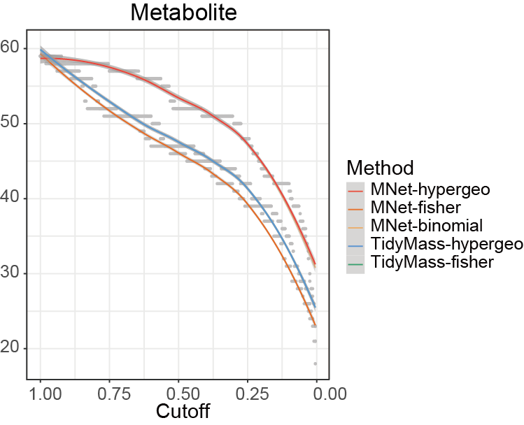
```

#### Venn plot

Quantifying the agreement of different methods using Venn diagrams.

```{r}
library(VennDiagram)

pathway_mnet_hypergeo <- data.table::fread("result/ORA/MNet_pathway-hypergeo.txt") %>%
  as.data.frame() %>%
  filter(pvalue < 0.05)
pathway_mnet_fisher <- data.table::fread("result/ORA/MNet_pathway-fisher.txt") %>%
  as.data.frame() %>%
  filter(pvalue < 0.05)
pathway_mnet_binomial <- data.table::fread("result/ORA/MNet_pathway-binomial.txt") %>%
  as.data.frame() %>%
  filter(pvalue < 0.05)

pathway_tidymass_hypergeometric <- data.table::fread("result/ORA/TidyMass_pathway-hypergeometric.txt") %>%
  as.data.frame()  %>%
  filter(pathway_name %in% PathwayExtendData$kegg_pathwayname) %>%
  dplyr::filter(p_value < 0.05)
pathway_tidymass_fisher <- data.table::fread("result/ORA/TidyMass_pathway-fisher.txt") %>%
  as.data.frame() %>%
  filter(pathway_name %in% PathwayExtendData$kegg_pathwayname) %>%
  dplyr::filter(p_value < 0.05)

venn.plot <- venn.diagram(
  x = list(
    MNet_hypergeo = pathway_mnet_hypergeo$name,
    MNet_fisher = pathway_mnet_fisher$name,
    MNet_binomial = pathway_mnet_binomial$name,
    tidymass_hypergeometric = pathway_tidymass_hypergeometric$pathway_name,
    tidymass_fisher = pathway_tidymass_fisher$pathway_name
  ),
  filename = NULL,
  fill = c("#F94141","#f16c23","#F3B169","#589FF3","#37AB78"),
  alpha = 0.9)

pdf("result/ORA/MNet-TidyMass-venn.pdf",width=7,height = 7)
grid.draw(venn.plot)
dev.off()
```

```{r,eval=TRUE,echo=FALSE,fig.align='center'}
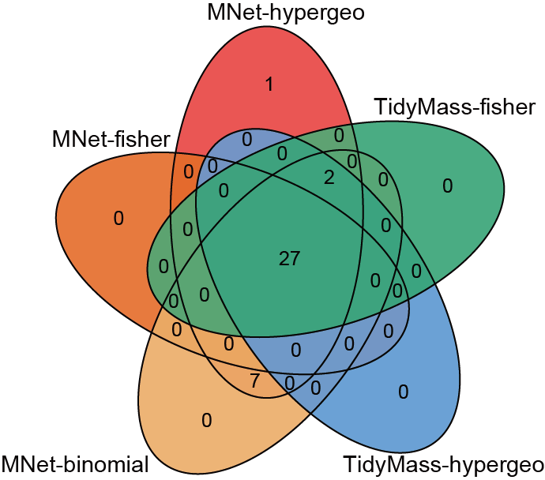
```

### Compare MNet with clusterProfiler

#### Analyze data

Analyzing metabolite-related genes data using MNet and clusterProfiler and using different method parameters.

```{r}
library(clusterProfiler)
library(dplyr)
library(MNet)
library(KEGG.db)

all_gene <- mlimma(gene_dat,group)

gene_filter <- PathwayExtendData %>%
  filter(type=="gene") %>%
  pull(name) %>% unique()

## metabolite
### Filter the increase differential genes and metabolites
diff_gene_all <- all_gene %>%
  dplyr::filter(abs(logFC) > 0.58) %>%
  dplyr::filter(adj.P.Val < 0.05)

gene.data <- clusterProfiler::bitr(diff_gene_all$name,fromType = "SYMBOL",toType ="ENTREZID",OrgDb='org.Hs.eg.db')

diff_gene_clusterprofiler <- diff_gene_all %>%
  inner_join(gene.data,by=c("name"="SYMBOL"))

kegg_F <- enrichKEGG(
  gene = diff_gene_clusterprofiler$ENTREZID,
  keyType = 'kegg',  
  organism = 'hsa',
  minGSSize = 1,
  pAdjustMethod = 'BH',  
  pvalueCutoff = 1.1,  
  use_internal_data = F)

write.table(kegg_F@result,"result/ORA/clusterprofiler-gene-F.txt",quote=F,row.names = F,sep="\t")

kegg_T <- enrichKEGG(
  gene = diff_gene_clusterprofiler$ENTREZID,  
  keyType = 'kegg',  
  organism = 'hsa',
  minGSSize = 1,
  pAdjustMethod = 'BH',  
  pvalueCutoff = 1.1,  
  use_internal_data = T)

write.table(kegg_T@result,"result/ORA/clusterprofiler-gene-T.txt",quote=F,row.names = F,sep="\t")

diff_gene_mnet <- diff_gene_all %>%
  filter(name %in% gene_filter)

gene_MNet_result_hypergeo <- ePEAlyser(diff_gene_mnet$name,out="gene",p_cutoff=1.1,test="hypergeo")
write.table(gene_MNet_result_hypergeo$output,"result/ORA/MNet-gene_hypergeo.txt",quote=F,row.names = F,sep="\t")

gene_MNet_result_fisher <- ePEAlyser(diff_gene_mnet$name,out="gene",p_cutoff=1.1,test="fisher")
write.table(gene_MNet_result_fisher$output,"result/ORA/MNet-gene_fisher.txt",quote=F,row.names = F,sep="\t")

gene_MNet_result_binomial <- ePEAlyser(diff_gene_mnet$name,out="gene",p_cutoff=1.1,test="binomial")
write.table(gene_MNet_result_binomial$output,"result/ORA/MNet-gene_binomial.txt",quote=F,row.names = F,sep="\t")
```

#### Set different cutoffs

Compare the stability of the results of different methods under different cutoff values.

```{r}
library(ggplot2)

pathway_mnet_hypergeo <- data.table::fread("result/ORA/MNet-gene_hypergeo.txt") %>%
  as.data.frame()
pathway_mnet_fisher <- data.table::fread("result/ORA/MNet-gene_fisher.txt") %>%
  as.data.frame()
pathway_mnet_binomial <- data.table::fread("result/ORA/MNet-gene_binomial.txt") %>%
  as.data.frame()

pathway_clusterprofiler_F <- data.table::fread("result/ORA/clusterprofiler-gene-F.txt") %>%
  as.data.frame() %>%
  filter(ID %in% PathwayExtendData$kegg_pathwayid)
pathway_clusterprofiler_T <- data.table::fread("result/ORA/clusterprofiler-gene-T.txt") %>%
  as.data.frame() %>%
  filter(ID %in% PathwayExtendData$kegg_pathwayid)

n = seq(1,0.0001,-0.005)

result_mnet_hypergeo <- data.frame()
result_mnet_fisher <- data.frame()
result_mnet_binomial <- data.frame()

result_clusterprofiler_T <- data.frame()
result_clusterprofiler_F <- data.frame()

for (i in n) {
  ## hypergeo
  pathway_mnet_hypergeo_filter <- pathway_mnet_hypergeo %>%
    filter(pvalue < i)
  result_mnet_hypergeo_temp <- data.frame(n=nrow(pathway_mnet_hypergeo_filter),cutoff=i)
  result_mnet_hypergeo <- rbind(result_mnet_hypergeo,result_mnet_hypergeo_temp)

  ## fisher
  pathway_mnet_fisher_filter <- pathway_mnet_fisher %>%
    filter(pvalue < i)
  result_mnet_fisher_temp <- data.frame(n=nrow(pathway_mnet_fisher_filter),cutoff=i)
  result_mnet_fisher <- rbind(result_mnet_fisher,result_mnet_fisher_temp)

  ## binomial
  pathway_mnet_binomial_filter <- pathway_mnet_binomial %>%
    filter(pvalue < i)
  result_mnet_binomial_temp <- data.frame(n=nrow(pathway_mnet_binomial_filter),cutoff=i)
  result_mnet_binomial <- rbind(result_mnet_binomial,result_mnet_binomial_temp)

  # clusterProfiler-T
  pathway_clusterprofiler_T_filter <- pathway_clusterprofiler_T %>%
    filter(pvalue < i)
  result_clusterprofiler_T_temp <- data.frame(n=nrow(pathway_clusterprofiler_T_filter),cutoff=i)
  result_clusterprofiler_T <- rbind(result_clusterprofiler_T,result_clusterprofiler_T_temp)

  # clusterProfiler-F
  pathway_clusterprofiler_F_filter <- pathway_clusterprofiler_F %>%
    filter(pvalue < i)
  result_clusterprofiler_F_temp <- data.frame(n=nrow(pathway_clusterprofiler_F_filter),cutoff=i)
  result_clusterprofiler_F <- rbind(result_clusterprofiler_F,result_clusterprofiler_F_temp)
}

result <- rbind(result_mnet_hypergeo %>% mutate(type="MNet_hypergeo"),
                result_mnet_fisher %>% mutate(type="MNet_fisher"),
                result_mnet_binomial %>% mutate(type="MNet_binomial"),
                result_clusterprofiler_F %>% mutate(type="clusterprofiler_F"))

p <- ggplot(result,aes(cutoff,n))+
  geom_point(color="gray",size=.5)+
  geom_smooth(aes(color=type))+
  geom_vline(xintercept=c(0.01), linetype = 'dashed',color="gray")+
  scale_color_manual(values=c("MNet_hypergeo"="#F94141",
                              "MNet_fisher"="#f16c23",
                              "MNet_binomial"="#F3B169",
                              "clusterprofiler_F"="#AA66EB"))+
  scale_x_reverse()+
  theme_bw()
ggsave("result/ORA/clusterprofiler-cutoff.pdf",p,width=6,height = 5)
```

```{r,eval=TRUE,echo=FALSE,fig.align='center'}
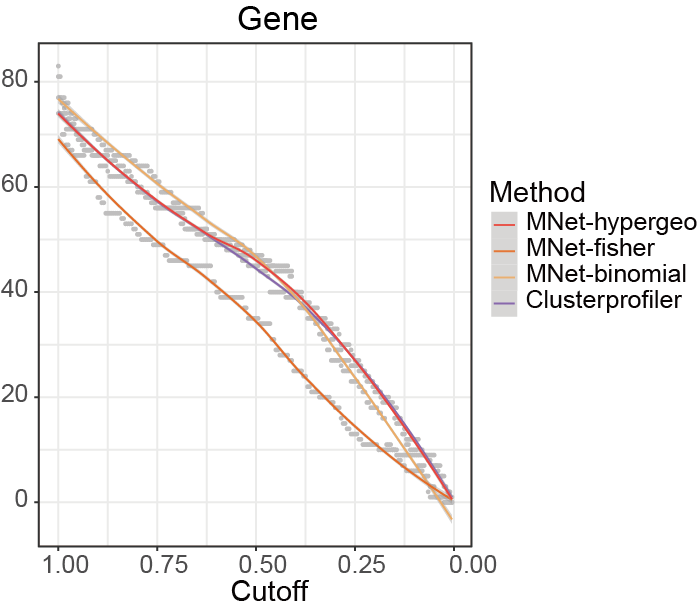
```

#### Venn plot

Quantifying the agreement of different methods using Venn diagrams.

```{r}
library(VennDiagram)

pathway_mnet_hypergeo <- data.table::fread("result/ORA/MNet-gene_hypergeo.txt") %>%
  as.data.frame() %>%
  dplyr::select(name,pvalue) %>%
  mutate(type="MNet_hypergeo") %>%
  filter(pvalue < 0.05)
pathway_mnet_fisher <- data.table::fread("result/ORA/MNet-gene_fisher.txt") %>%
  as.data.frame() %>%
  dplyr::select(name,pvalue) %>%
  mutate(type="MNet_fisher") %>%
  filter(pvalue < 0.05)
pathway_mnet_binomial <- data.table::fread("result/ORA/MNet-gene_binomial.txt") %>%
  as.data.frame() %>%
  dplyr::select(name,pvalue) %>%
  mutate(type="MNet_binomial") %>%
  filter(pvalue < 0.05)

pathway_clusterprofiler <- data.table::fread("result/ORA/clusterprofiler-gene-F.txt") %>%
  as.data.frame() %>%
  filter(ID %in% PathwayExtendData$kegg_pathwayid) %>%
  dplyr::select(Description,pvalue) %>%
  rename("name"="Description") %>%
  mutate(type="clusterprofiler")  %>%
  filter(pvalue < 0.05)

a<-venn.diagram(list(mnet_hypergeo=pathway_mnet_hypergeo$name,
                     mnet_fisher=pathway_mnet_fisher$name,
                     mnet_binomial=pathway_mnet_binomial$name,
                     clusterprofiler=pathway_clusterprofiler$name),
                filename=NULL,fill=c("#F94141","#f16c23","#F3B169","#AA66EB"),alpha =0.9)

pdf("result/ORA/clusterprofiler-venn.pdf",width=5,height = 5)
grid.draw(a)
dev.off()
```

```{r,eval=TRUE,echo=FALSE,fig.align='center'}
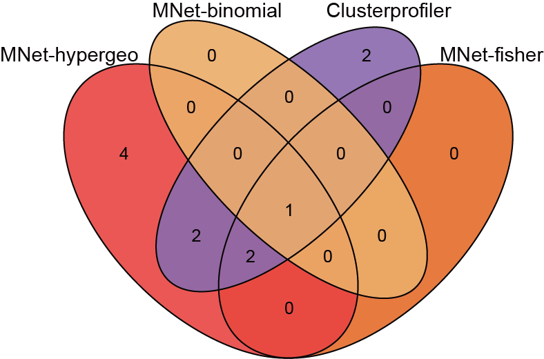
```

### Compare MNet with PaintOmics

#### Analyze data

Analyzing metabolites and metabolite-related genes data using MNet and PaintOmics and using different method parameters.

```{r}
library(dplyr)
library(MNet)

all_meta <- mlimma(meta_dat,group)

## metabolite
### Filter the increase differential genes and metabolites
diff_meta <- all_meta %>%
  dplyr::filter(abs(logFC) > 0.58) %>%
  dplyr::filter(adj.P.Val < 0.05)

all_gene <- mlimma(gene_dat,group)

## gene
## Filter the increase differential genes and metabolites
diff_gene <- all_gene %>%
  dplyr::filter(abs(logFC) > 0.58) %>%
  dplyr::filter(adj.P.Val < 0.05)

result <- rbind(diff_meta,diff_gene) %>%
  filter(name %in% PathwayExtendData$name)

result_pathway_hypergeo <- ePEAlyser(result$name,out="Extended",p_cutoff=1.1,test="hypergeo")
write.table(result_pathway_hypergeo$output,"result/ORA/MNet-Extended-hypergeo.txt",quote=F,row.names = F,sep="\t")

result_pathway_fisher <- ePEAlyser(result$name,out="Extended",p_cutoff=1.1,test="fisher")
write.table(result_pathway_fisher$output,"result/ORA/MNet-Extended-fisher.txt",quote=F,row.names = F,sep="\t")

result_pathway_binomial <- ePEAlyser(result$name,out="Extended",p_cutoff=1.1,test="binomial")
write.table(result_pathway_binomial$output,"result/ORA/MNet-Extended-binomial.txt",quote=F,row.names = F,sep="\t")
```

#### Set different cutoffs

Compare the stability of the results of different methods under different cutoff values.

```{r}
library(ggplot2)

pathway_mnet_hypergeo <- data.table::fread("result/ORA/MNet-Extended-hypergeo.txt") %>%
  as.data.frame()
pathway_mnet_fisher <- data.table::fread("result/ORA/MNet-Extended-fisher.txt") %>%
  as.data.frame()
pathway_mnet_binomial <- data.table::fread("result/ORA/MNet-Extended-binomial.txt") %>%
  as.data.frame()

pathway_paintomics <- data.table::fread("result/ORA/PaintOmics.txt") %>%
  as.data.frame() %>%
  dplyr::select(-V7) %>%
  dplyr::filter(`Pathway name` %in% PathwayExtendData$kegg_pathwayname)

n = seq(1,0.0001,-0.005)

result_mnet_hypergeo <- data.frame()
result_mnet_fisher <- data.frame()
result_mnet_binomial <- data.frame()

result_paintomics <- data.frame()

for (i in n) {
  ## hypergeo
  pathway_mnet_filter <- pathway_mnet_hypergeo %>%
    filter(pvalue < i)
  result_mnet_temp <- data.frame(n=nrow(pathway_mnet_filter),cutoff=i)
  result_mnet_hypergeo <- rbind(result_mnet_hypergeo,result_mnet_temp)

  ## fisher
  pathway_mnet_filter <- pathway_mnet_fisher %>%
    filter(pvalue < i)
  result_mnet_temp <- data.frame(n=nrow(pathway_mnet_filter),cutoff=i)
  result_mnet_fisher <- rbind(result_mnet_fisher,result_mnet_temp)

  ## binomial
  pathway_mnet_filter <- pathway_mnet_binomial %>%
    filter(pvalue < i)
  result_mnet_temp <- data.frame(n=nrow(pathway_mnet_filter),cutoff=i)
  result_mnet_binomial <- rbind(result_mnet_binomial,result_mnet_temp)

  ## hypergeometric
  pathway_paintomics_filter <- pathway_paintomics %>%
    filter(`Combined pValue(Fisher)` < i)
  result_paintomics_temp <- data.frame(n=nrow(pathway_paintomics_filter),cutoff=i)
  result_paintomics <- rbind(result_paintomics,result_paintomics_temp)
}

result <- rbind(result_mnet_hypergeo %>% mutate(type="MNet_hypergeo"),
                result_mnet_fisher %>% mutate(type="MNet_fisher"),
                result_mnet_binomial %>% mutate(type="MNet_binomial"),
                result_paintomics %>% mutate(type="paintomics"))

p <- ggplot(result,aes(cutoff,n))+
  geom_point(color="gray",size=.5)+
  geom_smooth(aes(color=type))+
  geom_vline(xintercept=c(0.01), linetype = 'dashed',color="gray")+
  scale_color_manual(values=c("#F3B169","#f16c23","#F94141","#008080"))+
  scale_x_reverse()+
  theme_bw()
ggsave("result/ORA/PaintOmics-cutoff.pdf",p,width=6.5,height = 5)
```

```{r,eval=TRUE,echo=FALSE,fig.align='center'}
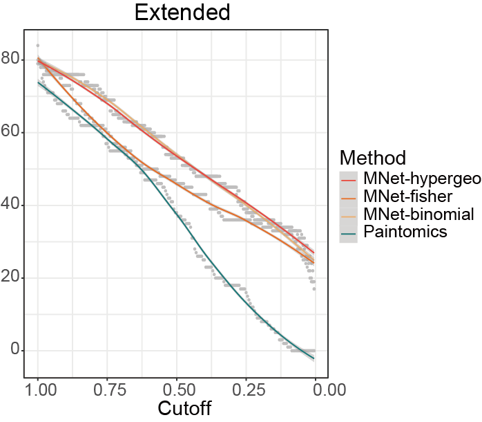
```

#### Venn plot

Quantifying the agreement of different methods using Venn diagrams.

```{r}
library(VennDiagram)

pathway_mnet_hypergeo <- data.table::fread("result/ORA/MNet-Extended-hypergeo.txt") %>%
  as.data.frame() %>%
  filter(pvalue < 0.05)
pathway_mnet_fisher <- data.table::fread("result/ORA/MNet-Extended-fisher.txt") %>%
  as.data.frame() %>%
  filter(pvalue < 0.05)
pathway_mnet_binomial <- data.table::fread("result/ORA/MNet-Extended-binomial.txt") %>%
  as.data.frame() %>%
  filter(pvalue < 0.05)

## Running metabolite pathway analysis at PaintOmics4 website
pathway_paintomics <- data.table::fread("result/ORA/PaintOmics.txt") %>%
  as.data.frame()  %>%
  filter(`Pathway name` %in% PathwayExtendData$kegg_pathwayname) %>%
  dplyr::filter(`Combined pValue(Fisher)` < 0.05)

venn.plot <- venn.diagram(
  x = list(
    MNet_hypergeo = pathway_mnet_hypergeo$name,
    MNet_fisher = pathway_mnet_fisher$name,
    MNet_binomial = pathway_mnet_binomial$name,
    PaintOmics = pathway_paintomics$`Pathway name`),
  filename = NULL,
  fill = c("#F94141","#f16c23","#F3B169","#008080"),
  alpha = 0.9)

pdf("result/ORA/MNet-PaintOmics-venn.pdf",width=7,height = 7)
grid.draw(venn.plot)
dev.off()
```

```{r,eval=TRUE,echo=FALSE,fig.align='center'}
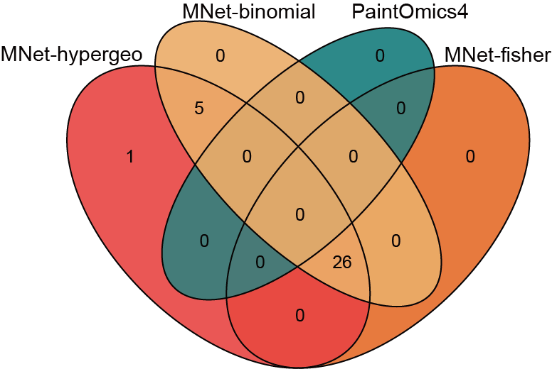
```

### Barplot

#### MNet vs TidyMass

The metabolites enriched pathways by MNer and TidyMass.

```{r}
library(dplyr)
library(ggplot2)
library(MNet)

pathway_mnet_hypergeo <- data.table::fread("result/ORA/MNet_pathway-hypergeo.txt") %>%
  as.data.frame() %>%
  filter(pvalue < 0.05) %>%
  dplyr::select(name,pvalue) %>%
  dplyr::mutate(type="MNet_hypergeo")
pathway_mnet_fisher <- data.table::fread("result/ORA/MNet_pathway-fisher.txt") %>%
  as.data.frame() %>%
  filter(pvalue < 0.05)%>%
  dplyr::select(name,pvalue) %>%
  dplyr::mutate(type="MNet_fisher")
pathway_mnet_binomial <- data.table::fread("result/ORA/MNet_pathway-binomial.txt") %>%
  as.data.frame() %>%
  filter(pvalue < 0.05)%>%
  dplyr::select(name,pvalue) %>%
  dplyr::mutate(type="MNet_binomial")

pathway_tidymass_hypergeometric <- data.table::fread("result/ORA/TidyMass_pathway-hypergeometric.txt") %>%
  as.data.frame()  %>%
  filter(pathway_name %in% PathwayExtendData$kegg_pathwayname) %>%
  dplyr::filter(p_value < 0.05) %>%
  dplyr::select(pathway_name,p_value) %>%
  dplyr::rename("name"="pathway_name","pvalue"="p_value") %>%
  dplyr::mutate(type="TidyMass_hypergeometric")
pathway_tidymass_fisher <- data.table::fread("result/ORA/TidyMass_pathway-fisher.txt") %>%
  as.data.frame() %>%
  filter(pathway_name %in% PathwayExtendData$kegg_pathwayname) %>%
  dplyr::filter(p_value < 0.05) %>%
  dplyr::select(pathway_name,p_value) %>%
  dplyr::rename("name"="pathway_name","pvalue"="p_value") %>%
  dplyr::mutate(type="TidyMass_fisher")

result <- rbind(pathway_mnet_hypergeo,pathway_mnet_fisher,pathway_mnet_binomial,
                pathway_tidymass_hypergeometric,pathway_tidymass_fisher) %>%
  dplyr::arrange(pvalue) %>%
  dplyr::arrange(type)

result$name <- factor(result$name,levels = rev(unique(result$name)))
result$type <- factor(result$type,levels=c("MNet_hypergeo","MNet_fisher","MNet_binomial","TidyMass_hypergeometric","TidyMass_fisher"))

p_all <- ggplot(result,aes(name,-log10(pvalue))) +
  geom_bar(aes(fill=type),stat="identity")+
  scale_fill_manual(values=c("MNet_fisher"="#f16c23","MNet_hypergeo"="#F94141","MNet_binomial"="#F3B169",                       "TidyMass_hypergeometric"="#589FF3","TidyMass_fisher"="#37AB78"),name="Method")+
  facet_grid(. ~ type)+
  theme_bw()+
  coord_flip()
ggsave("result/ORA/MNet_TidyMass_barplot.pdf",p_all,width=12,height = 7)
```

```{r,eval=TRUE,echo=FALSE,fig.align='center'}
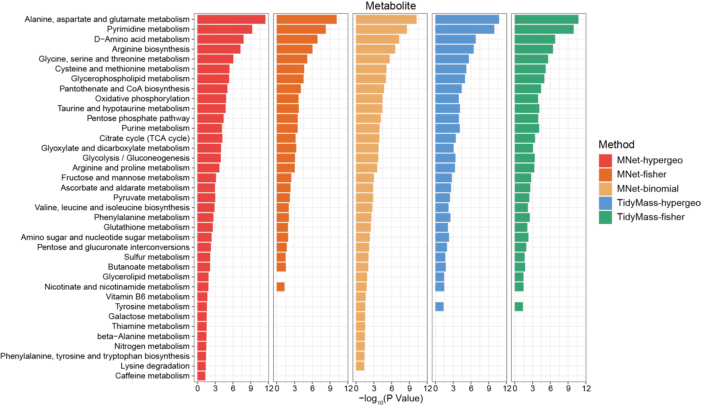
```

#### MNet vs clusterProfiler

The genes enriched pathways by MNwt and clusterProfiler.

```{r}
library(dplyr)
library(ggplot2)
library(MNet)

pathway_mnet_hypergeo <- data.table::fread("result/ORA/MNet-gene_hypergeo.txt") %>%
  as.data.frame() %>%
  dplyr::select(name,pvalue) %>%
  mutate(type="MNet_hypergeo") %>%
  filter(pvalue < 0.05)

pathway_mnet_fisher <- data.table::fread("result/ORA/MNet-gene_fisher.txt") %>%
  as.data.frame() %>%
  dplyr::select(name,pvalue) %>%
  mutate(type="MNet_fisher") %>%
  filter(pvalue < 0.05)

pathway_mnet_binomial <- data.table::fread("result/ORA/MNet-gene_binomial.txt") %>%
  as.data.frame() %>%
  dplyr::select(name,pvalue) %>%
  mutate(type="MNet_binomial") %>%
  filter(pvalue < 0.05)

pathway_clusterprofiler <- data.table::fread("result/ORA/clusterprofiler-gene-F.txt") %>%
  as.data.frame() %>%
  filter(ID %in% PathwayExtendData$kegg_pathwayid) %>%
  dplyr::select(Description,pvalue) %>%
  dplyr::rename("name"="Description") %>%
  mutate(type="clusterprofiler") %>%
  filter(pvalue < 0.05)

pathway_all_filter <- rbind(pathway_clusterprofiler,pathway_mnet_hypergeo,
                            pathway_mnet_fisher,pathway_mnet_binomial) %>%
  as.data.frame() %>%
  arrange(desc(pvalue)) %>%
  arrange(match(type,c("clusterprofiler","MNet_binomial","MNet_fisher","MNet_hypergeo"))) %>%
  mutate(name=factor(name,levels=unique(name)))

pathway_all_filter$type <- factor(pathway_all_filter$type,levels=c("MNet_hypergeo","MNet_fisher","MNet_binomial","clusterprofiler"))

p_all <- ggplot(pathway_all_filter,aes(name,-log10(pvalue),fill=type))+
  geom_bar(stat="identity",position="dodge")+
  scale_fill_manual(values=c("MNet_fisher"="#f16c23","MNet_hypergeo"="#F94141","MNet_binomial"="#F3B169","clusterprofiler"="#AA66EB"))+
  theme_bw()+
  facet_grid(. ~ type)+
  coord_flip()
ggsave("result/ORA/MNet_clusterprofiler_barplot.pdf",p_all,width=12,height = 3.5)
```

```{r,eval=TRUE,echo=FALSE,fig.align='center'}
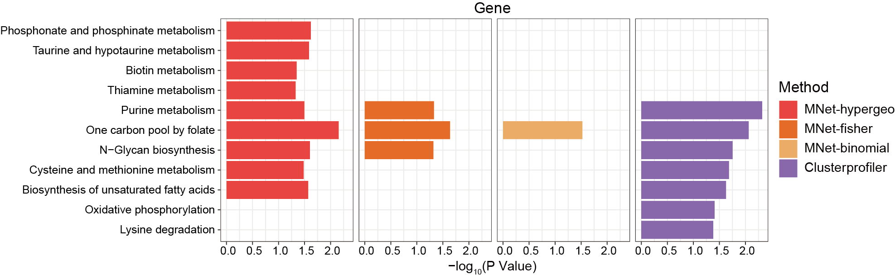
```

#### MNet vs PaintOmics

The extended enriched pathways by MNet and PaintOmics4.

```{r}
library(dplyr)
library(ggplot2)
library(MNet)

pathway_mnet_hypergeo <- data.table::fread("result/ORA/MNet-Extended-hypergeo.txt") %>%
  as.data.frame() %>%
  dplyr::select(name,pvalue) %>%
  mutate(type="MNet_hypergeo") %>%
  filter(pvalue < 0.05)
pathway_mnet_fisher <- data.table::fread("result/ORA/MNet-Extended-fisher.txt") %>%
  as.data.frame() %>%
  dplyr::select(name,pvalue) %>%
  mutate(type="MNet_fisher") %>%
  filter(pvalue < 0.05)
pathway_mnet_binomial <- data.table::fread("result/ORA/MNet-Extended-binomial.txt") %>%
  as.data.frame() %>%
  dplyr::select(name,pvalue) %>%
  mutate(type="MNet_binomial") %>%
  filter(pvalue < 0.05)

## Running metabolite pathway analysis at paintomics website
pathway_paintomics <- data.table::fread("result/ORA/PaintOmics.txt") %>%
  as.data.frame()  %>%
  filter(`Pathway name` %in% PathwayExtendData$kegg_pathwayname) %>%
  dplyr::rename("name"="Pathway name") %>%
  dplyr::filter(`Combined pValue(Fisher)` < 0.05) %>%
  dplyr::rename("pvalue"="Combined pValue(Fisher)") %>%
  mutate(type="PaintOmics") 

pathway_all_filter <- rbind(pathway_paintomics,pathway_mnet_hypergeo,
                            pathway_mnet_fisher,pathway_mnet_binomial) %>%
  as.data.frame() %>%
  arrange(match(type,c("paintomics","MNet_binomial","MNet_fisher","MNet_hypergeo"))) %>%
  arrange(desc(pvalue)) %>%
  mutate(name=factor(name,levels=unique(name)))

pathway_all_filter$type <- factor(pathway_all_filter$type,levels=c("MNet_hypergeo","MNet_fisher","MNet_binomial","paintomics"))

p_all <- ggplot(pathway_all_filter,aes(name,-log10(pvalue),fill=type))+
  geom_bar(stat="identity",position="dodge")+
  scale_fill_manual(values=c("MNet_fisher"="#f16c23","MNet_hypergeo"="#F94141","MNet_binomial"="#F3B169","paintomics"="#008080"))+
  theme_bw()+
  facet_grid(. ~ type)+
  coord_flip()
ggsave("result/ORA/MNet_extended_barplot.pdf",p_all,width=12,height = 6)
```

```{r,eval=TRUE,echo=FALSE,fig.align='center'}
knitr::include_graphics("figure/paintomics-barplot.png")
```

#### Runtime

Comparison of running time between different software.

```{r}
library(dplyr)
library(MNet)
library(tidymass)
library(clusterProfiler)
library(KEGG.db)
library(ggplot2)

## Metabolite
all_meta <- mlimma(meta_dat,group)

diff_meta <- all_meta %>%
  dplyr::filter(abs(logFC) > 0.58) %>%
  dplyr::filter(adj.P.Val < 0.05)

data("kegg_hsa_pathway", package = "metpath")
pathway_database = kegg_hsa_pathway

### MNet-hypergeo
time_start <- Sys.time()
result_meta <- ePEAlyser(diff_meta$name,out="metabolite",p_cutoff=1.5,test="hypergeo")
time_end <- Sys.time()
run_time <- difftime(time_end, time_start, units = "secs")
print(paste("MT-MNet-hypergeo_code execution time:", round(run_time, 2), "second"))

### MNet-fisher
time_start <- Sys.time()
result_meta <- ePEAlyser(diff_meta$name,out="metabolite",p_cutoff=1.5,test="fisher")
time_end <- Sys.time()
run_time <- difftime(time_end, time_start, units = "secs")
print(paste("MT-MNet-fisher—_code execution time:", round(run_time, 2), "second"))

### MNet-binomial
time_start <- Sys.time()
result_meta <- ePEAlyser(diff_meta$name,out="metabolite",p_cutoff=1.5,test="binomial")
time_end <- Sys.time()
run_time <- difftime(time_end, time_start, units = "secs")
print(paste("MT-MNet-binomial_code execution time:", round(run_time, 2), "second"))

### Tidymass-hypergeometric
time_start <- Sys.time()
result <- enrich_kegg(query_id = diff_meta$name,
                      query_type = "compound",
                      id_type = "KEGG",method = "hypergeometric",
                      pathway_database = pathway_database,
                      p_cutoff = 1.1,
                      p_adjust_method = "BH",
                      threads = 10)
time_end <- Sys.time()
run_time <- difftime(time_end, time_start, units = "secs")
print(paste("MT-Tidymass-hypergeometric_code execution time:", round(run_time, 2), "second"))

### Tidymass-fisher
time_start <- Sys.time()
result <- enrich_kegg(query_id = diff_meta$name,
                      query_type = "compound",
                      id_type = "KEGG",method = "fisher",
                      pathway_database = pathway_database,
                      p_cutoff = 1.1,
                      p_adjust_method = "BH",
                      threads = 10)
time_end <- Sys.time()
run_time <- difftime(time_end, time_start, units = "secs")
print(paste("MT-Tidymass-fisher_code execution time:", round(run_time, 2), "second"))

## Gene
all_gene <- mlimma(gene_dat,group)

gene_filter <- PathwayExtendData %>%
  filter(type=="gene") %>%
  pull(name) %>% unique()

diff_gene_all <- all_gene %>%
  dplyr::filter(abs(logFC) > 0.58) %>%
  dplyr::filter(adj.P.Val < 0.05)

gene.data <- clusterProfiler::bitr(diff_gene_all$name,fromType = "SYMBOL",toType ="ENTREZID",OrgDb='org.Hs.eg.db')

diff_gene_clusterprofiler <- diff_gene_all %>%
  inner_join(gene.data,by=c("name"="SYMBOL"))

diff_gene_mnet <- diff_gene_all %>%
  filter(name %in% gene_filter)

### MNet-hypergeo
time_start <- Sys.time()
gene_MNet_result_hypergeo <- ePEAlyser(diff_gene_mnet$name,out="gene",p_cutoff=1.1,test="hypergeo")
time_end <- Sys.time()
run_time <- difftime(time_end, time_start, units = "secs")
print(paste("MT-MNet-hypergeo_code execution time:", round(run_time, 2), "second"))

### MNet-fisher
time_start <- Sys.time()
gene_MNet_result_fisher <- ePEAlyser(diff_gene_mnet$name,out="gene",p_cutoff=1.1,test="fisher")
time_end <- Sys.time()
run_time <- difftime(time_end, time_start, units = "secs")
print(paste("MT-MNet-fisher_code execution time:", round(run_time, 2), "second"))

### MNet-binomial
time_start <- Sys.time()
gene_MNet_result_binomial <- ePEAlyser(diff_gene_mnet$name,out="gene",p_cutoff=1.1,test="binomial")
time_end <- Sys.time()
run_time <- difftime(time_end, time_start, units = "secs")
print(paste("MT-MNet-binomial_code execution time:", round(run_time, 2), "second"))

### clusterProfiler
time_start <- Sys.time()
kegg_F <- enrichKEGG(
  gene = diff_gene_clusterprofiler$ENTREZID,
  keyType = 'kegg',
  organism = 'hsa',
  minGSSize = 1,
  pAdjustMethod = 'BH',
  pvalueCutoff = 1.1,
  use_internal_data = F)
time_end <- Sys.time()
run_time <- difftime(time_end, time_start, units = "secs")
print(paste("MC-Clusterprofiler-F_code execution time:", round(run_time, 2), "second"))

## Extend
all_meta <- mlimma(meta_dat,group)
## metabolite
### Filter the increase differential genes and metabolites
diff_meta <- all_meta %>%
  dplyr::filter(abs(logFC) > 0.58) %>%
  dplyr::filter(adj.P.Val < 0.05)

all_gene <- mlimma(gene_dat,group)
## gene
## Filter the increase differential genes and metabolites
diff_gene <- all_gene %>%
  dplyr::filter(abs(logFC) > 0.58) %>%
  dplyr::filter(adj.P.Val < 0.05)

result <- rbind(diff_meta,diff_gene) %>%
  filter(name %in% PathwayExtendData$name)

### MNet-hypergeo
time_start <- Sys.time()
result_pathway_fisher <- ePEAlyser(result$name,out="Extended",p_cutoff=1.1,test="hypergeo")
time_end <- Sys.time()
run_time <- difftime(time_end, time_start, units = "secs")
print(paste("MP-MNet-hypergeo_code execution time:", round(run_time, 2), "second"))

### MNet-fisher
time_start <- Sys.time()
result_pathway_fisher <- ePEAlyser(result$name,out="Extended",p_cutoff=1.1,test="fisher")
time_end <- Sys.time()
run_time <- difftime(time_end, time_start, units = "secs")
print(paste("MP-MNet-fisher_code execution time:", round(run_time, 2), "second"))

### MNet-binomial
time_start <- Sys.time()
result_pathway_fisher <- ePEAlyser(result$name,out="Extended",p_cutoff=1.1,test="binomial")
time_end <- Sys.time()
run_time <- difftime(time_end, time_start, units = "secs")
print(paste("MP-MNet-binomial_code execution time:", round(run_time, 2), "second"))

### PaintOmics4
print("MP-PaintOmics4_code execution time: 228.71 second")

## Barplot
dat <- data.frame(
  y = c(1.34,0.45,0.41,164.88,161.44,0.52,0.49,0.49,6.16,0.52,0.57,0.5,228.71),
  x = c("MNet-hypergeo","MNet-fisher","MNet-binomial","TidyMass-hypergeo","TidyMass-fisher","MNet-hypergeo","MNet-fisher","MNet-binomial","Clusterprofiler","MNet-hypergeo","MNet-fisher","MNet-binomial","PaintOmics4"),
  group = c(rep("Metabolite",5),rep("Gene",4),rep("Extend",4)))
dat$group <- factor(dat$group, levels = c("Metabolite","Gene","Extend"))
dat$x <- factor(dat$x,levels = c("MNet-hypergeo","MNet-fisher","MNet-binomial","TidyMass-hypergeo","TidyMass-fisher","Clusterprofiler","PaintOmics4"))

corlor <- c(
  "MNet-fisher"="#f16c23",
  "MNet-hypergeo"="#F94141",
  "MNet-binomial"="#F3B169",
  "TidyMass-hypergeo"="#589FF3",
  "TidyMass-fisher"="#37AB78",
  "Clusterprofiler"="#AA66EB",
  "PaintOmics4"="#008080")

p <- ggplot(dat, aes(x, y, fill = x)) +
  geom_bar(stat = "identity") +
  scale_fill_manual(values = corlor) +
  theme_bw() +
  facet_wrap(~group,scales = "free_x") +
  labs(y = "Runtime (second)", x = "Software Name") +
  theme(strip.text = element_text(size = 12))
ggsave("result/Runtime_comparison.pdf",p,width=5,height = 4)
```

```{r,eval=TRUE,echo=FALSE,fig.align='center'}
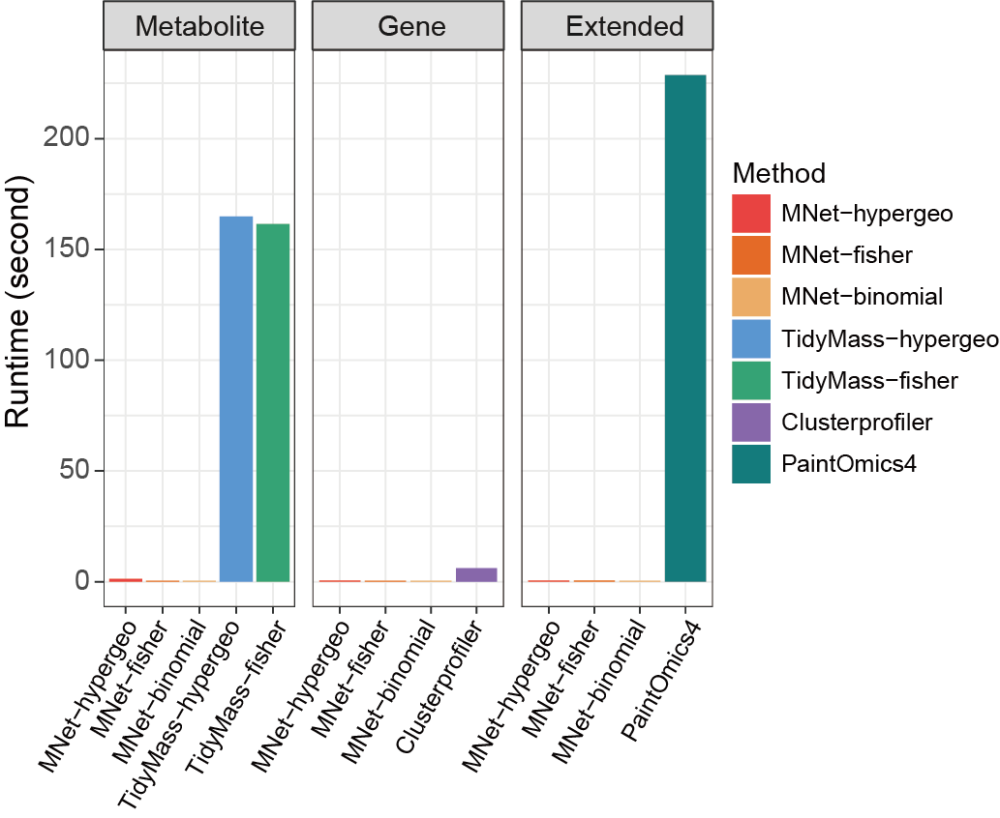
```

## Performance evaluation for GSEA

### MNet

Analyzing metabolites and metabolite-related genes data using MNet and using different method parameters.

```{r}
library(multiGSEA)
library(org.Hs.eg.db)
library(dplyr)
library(MNet)

data(transcriptome,package="multiGSEA")
data(metabolome,package="multiGSEA")

ah <- AnnotationHub::AnnotationHub()
aa <- ah[["AH91792"]]
metabolome_1 <- metabolome %>%
  mutate(HMDB=gsub("HMDB","HMDB00",HMDB)) %>%
  left_join(aa,by="HMDB") %>%
  filter(!is.na(KEGG)) %>%
  as.data.frame() %>%
  dplyr::select(HMDB,logFC,pValue,KEGG,HMDB) %>%
  unique() %>%
  filter(KEGG %in% PathwayExtendData$name) %>%
  distinct(KEGG,.keep_all = T) %>%
  arrange(desc(logFC)) %>%
  distinct(logFC,.keep_all = T)

dat_metabolome <- metabolome_1$logFC
names(dat_metabolome) <- metabolome_1$KEGG

set.seed(1)
result_metabolome <- eSEAlyser(dat_metabolome,minSize = 1,out="metabolite",gseaParam=1,nPermSimple=1000)

transcriptome_temp <- transcriptome %>%
  as.data.frame() %>%
  filter(Symbol %in% PathwayExtendData$name) %>%
  arrange(desc(logFC))
dat_transcriptome <- transcriptome_temp$logFC
names(dat_transcriptome) <- transcriptome_temp$Symbol

set.seed(1)
result_transcriptome <- eSEAlyser(dat_transcriptome,minSize = 1,out="gene",gseaParam=1,nPermSimple=1000)

dat_all_temp <- rbind(metabolome_1 %>%
                   dplyr::select(KEGG,logFC) %>%
                   dplyr::rename("name"="KEGG"),
                   transcriptome %>%
                   as.data.frame() %>%
                   dplyr::select(Symbol,logFC) %>%
                   dplyr::rename("name"="Symbol")) %>%
  filter(name %in% PathwayExtendData$name) %>%
  arrange(desc(logFC))

dat_all <- dat_all_temp$logFC
names(dat_all) <- dat_all_temp$name

set.seed(1)
result_extended <- eSEAlyser(dat_all,minSize = 1,out="Extended",gseaParam=1,nPermSimple=1000)

write.table(result_metabolome,"result/GSEA/MNet_GSEA_metabolome.txt",quote=F,row.names=F,sep="\t")
write.table(result_transcriptome,"result/GSEA/MNet_GSEA_transcriptome.txt",quote=F,row.names=F,sep="\t")
write.table(result_extended,"result/GSEA/MNet_GSEA_extended.txt",quote=F,row.names=F,sep="\t")
```

### multiGSEA

Analyzing metabolites and metabolite-related genes data using multiGSEA and using different method parameters.

```{r}
## different
data(transcriptome,package="multiGSEA")
data(metabolome,package="multiGSEA")

head(transcriptome)
head(metabolome)

transcriptome <- transcriptome %>%
  arrange(desc(logFC))

ah <- AnnotationHub::AnnotationHub()
aa <- ah[["AH91792"]]
metabolome <- metabolome %>%
  mutate(HMDB=gsub("HMDB","HMDB00",HMDB)) %>%
  left_join(aa,by="HMDB") %>%
  filter(!is.na(KEGG)) %>%
  as.data.frame() %>%
  dplyr::select(HMDB,logFC,pValue,KEGG,HMDB) %>%
  unique() %>%
  distinct(KEGG,.keep_all = T) %>%
  arrange(desc(logFC)) %>%
  distinct(logFC,.keep_all = T)

# create data structure
omics_data <- initOmicsDataStructure(layer = c("transcriptome","metabolome"))

## add transcriptome layer
omics_data$transcriptome <- transcriptome$logFC
names(omics_data$transcriptome) <- transcriptome$Symbol

## add metabolome layer
## HMDB features have to be updated to the new HMDB format

omics_data$metabolome <- metabolome$logFC
names(omics_data$metabolome) <- metabolome$KEGG

  databases <- c("kegg")
  layers <- names(omics_data)

  pathways <- getMultiOmicsFeatures(
    dbs = databases, layer = layers,
    returnTranscriptome = "SYMBOL",
    returnMetabolome = "KEGG",
    useLocal = T)

set.seed(1)
enrichment_scores <- multiGSEA(pathways, omics_data)

df <- extractPvalues(
  enrichmentScores = enrichment_scores,
  pathwayNames = names(pathways[[1]]))

df$combined_pval <- combinePvalues(df)
df$combined_padj <- p.adjust(df$combined_pval, method = "BH")

df <- cbind(data.frame(pathway = names(pathways[[1]])), df)
write.table(df,"result/GSEA/multiGSEA-diff.txt",quote=F,row.names = F,sep="\t")

## same
data(transcriptome,package="multiGSEA")
data(metabolome,package="multiGSEA")

head(transcriptome)
head(metabolome)

transcriptome <- transcriptome %>%
  filter(Symbol %in% PathwayExtendData$name) %>%
  arrange(desc(logFC))

ah <- AnnotationHub::AnnotationHub()
aa <- ah[["AH91792"]]
metabolome <- metabolome %>%
  mutate(HMDB=gsub("HMDB","HMDB00",HMDB)) %>%
  left_join(aa,by="HMDB") %>%
  filter(!is.na(KEGG)) %>%
  as.data.frame() %>%
  dplyr::select(HMDB,logFC,pValue,KEGG,HMDB) %>%
  unique() %>%
  filter(KEGG %in% PathwayExtendData$name) %>%
  distinct(KEGG,.keep_all = T) %>%
  arrange(desc(logFC)) %>%
  distinct(logFC,.keep_all = T)

# create data structure
omics_data <- initOmicsDataStructure(layer = c("transcriptome","metabolome"))

## add transcriptome layer
omics_data$transcriptome <- transcriptome$logFC
names(omics_data$transcriptome) <- transcriptome$Symbol

## add metabolome layer
## HMDB features have to be updated to the new HMDB format

omics_data$metabolome <- metabolome$logFC
names(omics_data$metabolome) <- metabolome$KEGG

pathways <- list()
pathways$transcriptome <- Pathways_gene
pathways$metabolome <- Pathways_metabolite

set.seed(1)
enrichment_scores <- multiGSEA(pathways, omics_data)

df <- extractPvalues(
  enrichmentScores = enrichment_scores,
  pathwayNames = names(pathways[[1]]))

df$combined_pval <- combinePvalues(df)
df$combined_padj <- p.adjust(df$combined_pval, method = "BH")

df <- cbind(data.frame(pathway = names(pathways[[1]])), df)
write.table(df,"result/GSEA/multiGSEA-same.txt",quote=F,row.names = F,sep="\t")
```

### Comparison between MNet and multiGSEA

#### Set different cutoffs

Compare the stability of the results of different methods under different cutoff values.

```{r}
library(ggplot2)

dat_mnet_gene <- data.table::fread("result/GSEA/MNet_GSEA_transcriptome.txt") %>%
  as.data.frame() %>%
  mutate(type="gene",software="MNet")

dat_mnet_metabolite <- data.table::fread("result/GSEA/MNet_GSEA_metabolome.txt") %>%
  as.data.frame() %>%
  mutate(type="metabolite",software="MNet")

dat_mnet_extended <- data.table::fread("result/GSEA/MNet_GSEA_extended.txt") %>%
  as.data.frame() %>%
  mutate(type="extended",software="MNet")

dat_mnet_all <- rbind(dat_mnet_gene,dat_mnet_metabolite,dat_mnet_extended) %>%
  dplyr::select(pathway,pval,type,software)

dat_multigsea <- data.table::fread("result/GSEA/multiGSEA-diff.txt") %>%
  as.data.frame() %>%
  mutate(pathway=substr(pathway, 8, nchar(pathway))) %>%
  filter(pathway %in% PathwayExtendData$kegg_pathwayname) %>%
  dplyr::select(pathway,transcriptome_pval,metabolome_pval,combined_pval)

dat_multigsea_melt <- reshape2::melt(dat_multigsea,id="pathway")

dat_multigsea_same <- dat_multigsea_melt %>%
  dplyr::rename("pval"="value","type"="variable") %>%
  mutate(software="multiGSEA-diffdatabase") %>%
  mutate(type=ifelse(type=="transcriptome_pval","gene",
                     ifelse(type=="metabolome_pval","metabolite",
                            ifelse(type=="combined_pval","extended","jj"))))

## same database
dat_multigsea <- data.table::fread("result/GSEA/multiGSEA-same.txt") %>%
  as.data.frame() %>%
  filter(pathway %in% PathwayExtendData$kegg_pathwayname) %>%
  dplyr::select(pathway,transcriptome_pval,metabolome_pval,combined_pval)

dat_multigsea_melt <- reshape2::melt(dat_multigsea,id="pathway")

dat_multigsea_diff <- dat_multigsea_melt %>%
  dplyr::rename("pval"="value","type"="variable") %>%
  mutate(software="multiGSEA-samedatabase") %>%
  mutate(type=ifelse(type=="transcriptome_pval","gene",
                     ifelse(type=="metabolome_pval","metabolite",
                            ifelse(type=="combined_pval","extended","jj"))))

all <- rbind(dat_mnet_all,dat_multigsea_same,dat_multigsea_diff)

n = seq(1,0.0001,-0.005)

result <- data.frame()

for (i in n) {
  ## Hypergeo
  result_temp <- all %>%
    filter(pval < i) %>%
    group_by(type,software) %>%
    summarise(n=n()) %>%
    as.data.frame() %>%
    mutate(cutoff=i)
  result <- rbind(result,result_temp)
}

result$type <- factor(result$type,levels=c("metabolite","gene","extended"))

p <- ggplot(result,aes(cutoff,n))+
  geom_point(color="gray",size=.5)+
  geom_smooth(aes(color=software))+
  geom_vline(xintercept=c(0.01), linetype = 'dashed',color="gray")+
  facet_grid(. ~ type)+
  scale_color_manual(values=c("MNet"="#EF2C2B",
                              "multiGSEA-diffdatabase"="#4FBD81",
                              "multiGSEA-samedatabase"="#FFC839"))+
  scale_x_reverse()+
  theme_bw()
ggsave("result/GSEA/MNet-multiGSEA-cutoff.pdf",p,width=12,height = 5)
```

```{r,eval=TRUE,echo=FALSE,fig.align='center'}
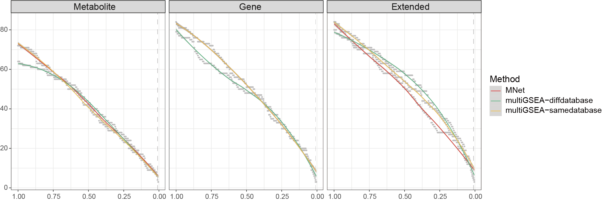
```

#### Venn plot

Quantifying the agreement of different methods using Venn diagrams.

```{r}
library(VennDiagram)

dat_mnet_gene <- data.table::fread("result/GSEA/MNet_GSEA_transcriptome.txt") %>%
  as.data.frame() %>%
  mutate(type="gene",software="MNet")

dat_mnet_metabolite <- data.table::fread("result/GSEA/MNet_GSEA_metabolome.txt") %>%
  as.data.frame() %>%
  mutate(type="metabolite",software="MNet")

dat_mnet_extended <- data.table::fread("result/GSEA/MNet_GSEA_extended.txt") %>%
  as.data.frame() %>%
  mutate(type="extended",software="MNet")

dat_mnet_all <- rbind(dat_mnet_gene,dat_mnet_metabolite,dat_mnet_extended) %>%
  dplyr::select(pathway,pval,type,software)

dat_multigsea <- data.table::fread("result/GSEA/multiGSEA-diff.txt") %>%
  as.data.frame() %>%
  mutate(pathway=substr(pathway, 8, nchar(pathway))) %>%
  filter(pathway %in% PathwayExtendData$kegg_pathwayname) %>%
  dplyr::select(pathway,transcriptome_pval,metabolome_pval,combined_pval)

dat_multigsea_melt <- reshape2::melt(dat_multigsea,id="pathway")

dat_multigsea_diff <- dat_multigsea_melt %>%
  dplyr::rename("pval"="value","type"="variable") %>%
  dplyr::mutate(software="multiGSEA-diffdatabase") %>%
  dplyr::mutate(type=ifelse(type=="transcriptome_pval","gene",
                     ifelse(type=="metabolome_pval","metabolite",
                            ifelse(type=="combined_pval","extended","jj"))))

dat_multigsea <- data.table::fread("result/GSEA/multiGSEA-same.txt") %>%
  as.data.frame() %>%
  filter(pathway %in% PathwayExtendData$kegg_pathwayname) %>%
  dplyr::select(pathway,transcriptome_pval,metabolome_pval,combined_pval)

dat_multigsea_melt <- reshape2::melt(dat_multigsea,id="pathway")

dat_multigsea_same <- dat_multigsea_melt %>%
  dplyr::rename("pval"="value","type"="variable") %>%
  dplyr::mutate(software="multiGSEA-samedatabase") %>%
  dplyr::mutate(type=ifelse(type=="transcriptome_pval","gene",
                            ifelse(type=="metabolome_pval","metabolite",
                                   ifelse(type=="combined_pval","extended","jj"))))

all <- rbind(dat_mnet_all,dat_multigsea_diff,dat_multigsea_same)

all_filter <- all %>%
  filter(pval < 0.01)

all_filter_metabolite <- all_filter %>%
  filter(type=="metabolite")

all_filter_gene <- all_filter %>%
  filter(type=="gene")

all_filter_extended <- all_filter %>%
  filter(type=="extended")

## metabolite
metabolite_MNet_venn <- all_filter_metabolite %>%
  filter(software=="MNet") %>%
  pull(pathway)
metabolite_multigsea_same_venn <- all_filter_metabolite %>%
  filter(software == "multiGSEA-samedatabase") %>%
  pull(pathway)
metabolite_multigsea_diff_venn <- all_filter_metabolite %>%
  filter(software == "multiGSEA-diffdatabase") %>%
  pull(pathway)

## gene
gene_MNet_venn <- all_filter_gene %>%
  filter(software=="MNet") %>%
  pull(pathway)
gene_multigsea_same_venn <- all_filter_gene %>%
  filter(software == "multiGSEA-samedatabase") %>%
  pull(pathway)
gene_multigsea_diff_venn <- all_filter_gene %>%
  filter(software == "multiGSEA-diffdatabase") %>%
  pull(pathway)

## extended
extended_MNet_venn <- all_filter_extended %>%
  filter(software=="MNet") %>%
  pull(pathway)
extended_multigsea_same_venn <- all_filter_extended %>%
  filter(software == "multiGSEA-samedatabase") %>%
  pull(pathway)
extended_multigsea_diff_venn <- all_filter_extended %>%
  filter(software == "multiGSEA-diffdatabase") %>%
  pull(pathway)

a<-venn.diagram(list(metabolite_mnet=metabolite_MNet_venn,
                     metabolite_multigsea_same=metabolite_multigsea_same_venn,
                     metabolite_multigsea_diff=metabolite_multigsea_diff_venn),
                filename=NULL,fill=c("#EF2C2B","#FFC839","#4FBD81"),
                alpha=0.9)
pdf("result/GSEA/GSEA_metabolite_venn.pdf",width=5,height = 5)
grid.draw(a)
dev.off()

a<-venn.diagram(list(gene_mnet=gene_MNet_venn,
                     gene_multigsea_same=gene_multigsea_same_venn,
                     gene_multigsea_diff=gene_multigsea_diff_venn),
                filename=NULL,fill=c("#EF2C2B","#FFC839","#4FBD81"),
                alpha=0.9)
pdf("result/GSEA/GSEA_gene_venn.pdf",width=5,height = 5)
grid.draw(a)
dev.off()

a<-venn.diagram(list(extended_mnet=extended_MNet_venn,
                     extended_multigsea_same=extended_multigsea_same_venn,
                     extended_multigsea_diff=extended_multigsea_diff_venn),
                filename=NULL,fill=c("#EF2C2B","#FFC839","#4FBD81"),
                alpha=0.9)
pdf("result/GSEA/GSEA_extended_venn.pdf",width=5,height = 5)
grid.draw(a)
dev.off()
```

```{r,eval=TRUE,echo=FALSE,fig.align='center'}
knitr::include_graphics("figure/multiGSEA-venn.png")
```

#### Barplot

The barplot shows the results of the analysis using only metabolism, only metabolite-related genes, and the combination of both data.

```{r}
dat_mnet_gene <- data.table::fread("result/GSEA/MNet_GSEA_transcriptome.txt") %>%
  as.data.frame() %>%
  mutate(type="gene",software="MNet")

dat_mnet_metabolite <- data.table::fread("result/GSEA/MNet_GSEA_metabolome.txt") %>%
  as.data.frame() %>%
  mutate(type="metabolite",software="MNet")

dat_mnet_extended <- data.table::fread("result/GSEA/MNet_GSEA_extended.txt") %>%
  as.data.frame() %>%
  mutate(type="extended",software="MNet")

dat_mnet_all <- rbind(dat_mnet_gene,dat_mnet_metabolite,dat_mnet_extended) %>%
  dplyr::select(pathway,pval,type,software)

dat_multigsea <- data.table::fread("result/GSEA/multiGSEA-diff.txt") %>%
  as.data.frame() %>%
  mutate(pathway=substr(pathway, 8, nchar(pathway))) %>%
  filter(pathway %in% PathwayExtendData$kegg_pathwayname) %>%
  dplyr::select(pathway,transcriptome_pval,metabolome_pval,combined_pval)

dat_multigsea_melt <- reshape2::melt(dat_multigsea,id="pathway")

dat_multigsea_diff <- dat_multigsea_melt %>%
  dplyr::rename("pval"="value","type"="variable") %>%
  dplyr::mutate(software="multiGSEA-diffdatabase") %>%
  dplyr::mutate(type=ifelse(type=="transcriptome_pval","gene",
                            ifelse(type=="metabolome_pval","metabolite",
                                   ifelse(type=="combined_pval","extended","jj"))))

dat_multigsea <- data.table::fread("result/GSEA/multiGSEA-same.txt") %>%
  as.data.frame() %>%
  filter(pathway %in% PathwayExtendData$kegg_pathwayname) %>%
  dplyr::select(pathway,transcriptome_pval,metabolome_pval,combined_pval)

dat_multigsea_melt <- reshape2::melt(dat_multigsea,id="pathway")

dat_multigsea_same <- dat_multigsea_melt %>%
  dplyr::rename("pval"="value","type"="variable") %>%
  dplyr::mutate(software="multiGSEA-samedatabase") %>%
  dplyr::mutate(type=ifelse(type=="transcriptome_pval","gene",
                            ifelse(type=="metabolome_pval","metabolite",
                                   ifelse(type=="combined_pval","extended","jj"))))

all <- rbind(dat_mnet_all,dat_multigsea_diff,dat_multigsea_same)

all_filter <- all %>%
  filter(pval < 0.01)

all_filter_metabolite <- all_filter %>%
  filter(type=="metabolite") %>%
  arrange(desc(pval)) %>%
  arrange(match(software,c("multiGSEA-diffdatabase","multiGSEA-samedatabase","MNet"))) %>%
  mutate(pathway=factor(pathway,
                        levels = unique(pathway))) %>%
  mutate(software=factor(software,levels=c("MNet","multiGSEA-samedatabase","multiGSEA-diffdatabase")))

all_filter_gene <- all_filter %>%
  filter(type=="gene") %>%
  arrange(desc(pval)) %>%
  arrange(match(software,c("multiGSEA-diffdatabase","multiGSEA-samedatabase","MNet"))) %>%
  mutate(pathway=factor(pathway,levels = unique(pathway))) %>%
  mutate(software=factor(software,levels=c("MNet","multiGSEA-samedatabase","multiGSEA-diffdatabase")))

all_filter_extended <- all_filter %>%
  filter(type=="extended") %>%
  arrange(desc(pval)) %>%
  arrange(match(software,c("multiGSEA-diffdatabase","multiGSEA-samedatabase","MNet"))) %>%
  mutate(pathway=factor(pathway,levels = unique(pathway))) %>%
  mutate(software=factor(software,levels=c("MNet","multiGSEA-samedatabase","multiGSEA-diffdatabase")))

p_metabolite <- ggplot(all_filter_metabolite,aes(pathway,-log10(pval),fill=software))+
  geom_bar(stat="identity",position="dodge")+
  scale_fill_manual(values=c("#EF2C2B","#FFC839","#4FBD81"))+
  theme_bw()+
  facet_grid(. ~ software)+
  coord_flip()+
  labs(title="metabolite")
#p_metabolite

p_gene <- ggplot(all_filter_gene,aes(pathway,-log10(pval),fill=software))+
  geom_bar(stat="identity",position="dodge")+
  scale_fill_manual(values=c("#EF2C2B","#FFC839","#4FBD81"))+
  theme_bw()+
  facet_grid(. ~ software)+
  coord_flip()+
  labs(title="gene")
#p_gene

p_extended <- ggplot(all_filter_extended,aes(pathway,-log10(pval),fill=software))+
  geom_bar(stat="identity",position="dodge")+
  scale_fill_manual(values=c("#EF2C2B","#FFC839","#4FBD81"))+
  theme_bw()+
  facet_grid(. ~ software)+
  coord_flip()+
  labs(title="extended")
#p_extended

ggsave("result/GSEA/GSEA_metabolite_barplot.pdf",p_metabolite,width=8,height = 3)
ggsave("result/GSEA/GSEA_gene_barplot.pdf",p_gene,width=8,height = 2)
ggsave("result/GSEA/GSEA_extended_barplot.pdf",p_extended,width=8,height = 3)
```

```{r,eval=TRUE,echo=FALSE,fig.align='center',out.width="70%"}
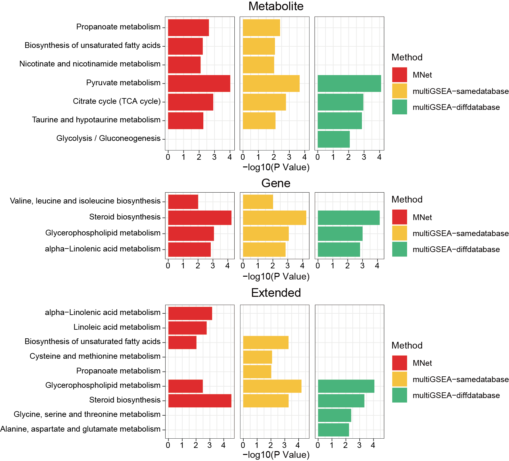
```

#### Radar plot

Quantifying the agreement of different methods using radar diagrams.

```{r}
library(dplyr)
library(MNet)
library(ggplot2)
library(fmsb)

## Metabolite
dat_mnet_gene <- data.table::fread("result/GSEA/MNet_GSEA_transcriptome.txt") %>%
  as.data.frame() %>%
  mutate(type="gene",software="MNet")

dat_mnet_metabolite <- data.table::fread("result/GSEA/MNet_GSEA_metabolome.txt") %>%
  as.data.frame() %>%
  mutate(type="metabolite",software="MNet")

dat_mnet_extended <- data.table::fread("result/GSEA/MNet_GSEA_extended.txt") %>%
  as.data.frame() %>%
  mutate(type="extended",software="MNet")

dat_mnet_all <- rbind(dat_mnet_gene,dat_mnet_metabolite,dat_mnet_extended) %>%
  dplyr::select(pathway,pval,type,software)

dat_multigsea <- data.table::fread("result/GSEA/multiGSEA-diff.txt") %>%
  as.data.frame() %>%
  mutate(pathway=substr(pathway, 8, nchar(pathway))) %>%
  filter(pathway %in% PathwayExtendData$kegg_pathwayname) %>%
  dplyr::select(pathway,transcriptome_pval,metabolome_pval,combined_pval)

dat_multigsea_melt <- reshape2::melt(dat_multigsea,id="pathway")

dat_multigsea_diff <- dat_multigsea_melt %>%
  dplyr::rename("pval"="value","type"="variable") %>%
  dplyr::mutate(software="multiGSEA-diffdatabase") %>%
  dplyr::mutate(type=ifelse(type=="transcriptome_pval","gene",
                            ifelse(type=="metabolome_pval","metabolite",
                                   ifelse(type=="combined_pval","extended","jj"))))

dat_multigsea <- data.table::fread("result/GSEA/multiGSEA-same.txt") %>%
  as.data.frame() %>%
  filter(pathway %in% PathwayExtendData$kegg_pathwayname) %>%
  dplyr::select(pathway,transcriptome_pval,metabolome_pval,combined_pval)

dat_multigsea_melt <- reshape2::melt(dat_multigsea,id="pathway")

dat_multigsea_same <- dat_multigsea_melt %>%
  dplyr::rename("pval"="value","type"="variable") %>%
  dplyr::mutate(software="multiGSEA-samedatabase") %>%
  dplyr::mutate(type=ifelse(type=="transcriptome_pval","gene",
                            ifelse(type=="metabolome_pval","metabolite",
                                   ifelse(type=="combined_pval","extended","jj"))))

all <- rbind(dat_mnet_all,dat_multigsea_diff,dat_multigsea_same)

pathway_filter_metabolite <- all %>%
  filter(type == "metabolite") %>%
  filter(pval < 0.01) %>%
  pull(pathway) %>% unique()

all_metabolite_filter <- all %>%
  filter(type == "metabolite") %>%
  filter(pathway %in% pathway_filter_metabolite)

all_metabolite_MNet <- all_metabolite_filter %>%
  filter(software == "MNet") %>%
  arrange(match(pathway,pathway_filter_metabolite)) %>%
  dplyr::select(pval,pathway) %>%
  mutate(pval=-log10(pval)) %>%
  tibble::column_to_rownames("pathway") %>%
  dplyr::rename("MNet"="pval")
all_metabolite_multiGSEA_samedatabase <- all_metabolite_filter %>%
  filter(software == "multiGSEA-samedatabase") %>%
  arrange(match(pathway,pathway_filter_metabolite)) %>%
  dplyr::select(pval,pathway) %>%
  mutate(pval=-log10(pval)) %>%
  tibble::column_to_rownames("pathway") %>%
  dplyr::rename("multiGSEA_samedatabase"="pval")
all_metabolite_multiGSEA_diffdatabase <- all_metabolite_filter %>%
  filter(software == "multiGSEA-diffdatabase") %>%
  arrange(match(pathway,pathway_filter_metabolite)) %>%
  dplyr::select(pval,pathway) %>%
  mutate(pval=-log10(pval)) %>%
  tibble::column_to_rownames("pathway") %>%
  dplyr::rename("multiGSEA_diffdatabase"="pval")

d_min <- rep(0,7)
d_max <- rep(5,7)

dd_all <- cbind(d_max,d_min,all_metabolite_MNet,
                all_metabolite_multiGSEA_samedatabase,all_metabolite_multiGSEA_diffdatabase) %>%
  t() %>%
  as.data.frame()

colors <- c(rgb(239, 44, 43,alpha=100,maxColorValue = 255),
            rgb(255, 200, 57,alpha=100,maxColorValue = 255),
            rgb(79, 189, 129,alpha=100,maxColorValue = 255))

colors1 <- c("#EF2C2B","#FFC839","#4FBD81")

pdf("result/GSEA/GSEA_metabolite_radar.pdf",width=6,height = 6)

radarchart(
  dd_all,
  axistype = 0,        
  seg=5,
  pcol = colors1,      
  pfcol = colors,      
  plwd = 2,            
  plty = 1,            
  cglcol = "grey",     
  cglty = 1,          
  cglwd = 0.8,         
  axislabcol = "grey", 
  vlcex = 0.8)

legend(
  "topright",
  legend = c("MNet","multiGSEA_samedatabase", "multiGSEA_diffedatabase"),
  bty = "n",
  pch = 20,
  col = colors1,
  text.col = "black",
  pt.cex = 1.5)
dev.off()

##  Gene
dat_mnet_gene <- data.table::fread("result/GSEA/MNet_GSEA_transcriptome.txt") %>%
  as.data.frame() %>%
  mutate(type="gene",software="MNet")

dat_mnet_metabolite <- data.table::fread("result/GSEA/MNet_GSEA_metabolome.txt") %>%
  as.data.frame() %>%
  mutate(type="metabolite",software="MNet")

dat_mnet_extended <- data.table::fread("result/GSEA/MNet_GSEA_extended.txt") %>%
  as.data.frame() %>%
  mutate(type="extended",software="MNet")

dat_mnet_all <- rbind(dat_mnet_gene,dat_mnet_metabolite,dat_mnet_extended) %>%
  dplyr::select(pathway,pval,type,software)

dat_multigsea <- data.table::fread("result/GSEA/multiGSEA-diff.txt") %>%
  as.data.frame() %>%
  mutate(pathway=substr(pathway, 8, nchar(pathway))) %>%
  filter(pathway %in% PathwayExtendData$kegg_pathwayname) %>%
  dplyr::select(pathway,transcriptome_pval,metabolome_pval,combined_pval)

dat_multigsea_melt <- reshape2::melt(dat_multigsea,id="pathway")

dat_multigsea_diff <- dat_multigsea_melt %>%
  dplyr::rename("pval"="value","type"="variable") %>%
  dplyr::mutate(software="multiGSEA-diffdatabase") %>%
  dplyr::mutate(type=ifelse(type=="transcriptome_pval","gene",
                            ifelse(type=="metabolome_pval","metabolite",
                                   ifelse(type=="combined_pval","extended","jj"))))

dat_multigsea <- data.table::fread("result/GSEA/multiGSEA-same.txt") %>%
  as.data.frame() %>%
  filter(pathway %in% PathwayExtendData$kegg_pathwayname) %>%
  dplyr::select(pathway,transcriptome_pval,metabolome_pval,combined_pval)

dat_multigsea_melt <- reshape2::melt(dat_multigsea,id="pathway")

dat_multigsea_same <- dat_multigsea_melt %>%
  dplyr::rename("pval"="value","type"="variable") %>%
  dplyr::mutate(software="multiGSEA-samedatabase") %>%
  dplyr::mutate(type=ifelse(type=="transcriptome_pval","gene",
                            ifelse(type=="metabolome_pval","metabolite",
                                   ifelse(type=="combined_pval","extended","jj"))))

all <- rbind(dat_mnet_all,dat_multigsea_diff,dat_multigsea_same)

pathway_filter_gene <- all %>%
  filter(type == "gene") %>%
  filter(pval < 0.01) %>%
  pull(pathway) %>% unique()

all_gene_filter <- all %>%
  filter(type == "gene") %>%
  filter(pathway %in% pathway_filter_gene)

all_gene_MNet <- all_gene_filter %>%
  filter(software == "MNet") %>%
  arrange(match(pathway,pathway_filter_gene)) %>%
  dplyr::select(pval,pathway) %>%
  mutate(pval=-log10(pval)) %>%
  tibble::column_to_rownames("pathway") %>%
  dplyr::rename("MNet"="pval")
all_gene_multiGSEA_samedatabase <- all_gene_filter %>%
  filter(software == "multiGSEA-samedatabase") %>%
  arrange(match(pathway,pathway_filter_gene)) %>%
  dplyr::select(pval,pathway) %>%
  mutate(pval=-log10(pval)) %>%
  tibble::column_to_rownames("pathway") %>%
  dplyr::rename("multiGSEA_samedatabase"="pval")
all_gene_multiGSEA_diffdatabase <- all_gene_filter %>%
  filter(software == "multiGSEA-diffdatabase") %>%
  arrange(match(pathway,pathway_filter_gene)) %>%
  dplyr::select(pval,pathway) %>%
  mutate(pval=-log10(pval)) %>%
  mutate(pval=ifelse(is.na(pval),0.000001,pval)) %>%
  tibble::column_to_rownames("pathway") %>%
  dplyr::rename("multiGSEA_diffdatabase"="pval")

d_min <- rep(0,4)
d_max <- rep(5,4)

dd_all <- cbind(d_max,d_min,all_gene_MNet,
                all_gene_multiGSEA_samedatabase,all_gene_multiGSEA_diffdatabase) %>%
  t() %>%
  as.data.frame()

colors <- c(rgb(239, 44, 43,alpha=100,maxColorValue = 255),
            rgb(255, 200, 57,alpha=100,maxColorValue = 255),
            rgb(79, 189, 129,alpha=100,maxColorValue = 255))

colors1 <- c("#EF2C2B","#FFC839","#4FBD81")

pdf("result/GSEA/GSEA_gene_radar.pdf",width=6,height = 6)

radarchart(
  dd_all,
  axistype = 0,     
  seg=5,
  pcol = colors1,      
  pfcol = colors,      
  plwd = 2,            
  plty = 1,            
  cglcol = "grey",    
  cglty = 1,           
  cglwd = 0.8,         
  axislabcol = "grey", 
  vlcex = 0.8)

legend(
  "topright",
  legend = c("MNet","multiGSEA_samedatabase", "multiGSEA_diffedatabase"),
  bty = "n",
  pch = 20,
  col = colors1,
  text.col = "black",
  pt.cex = 1.5)
dev.off()

##  Extended
dat_mnet_gene <- data.table::fread("result/GSEA/MNet_GSEA_transcriptome.txt") %>%
  as.data.frame() %>%
  mutate(type="gene",software="MNet")

dat_mnet_metabolite <- data.table::fread("result/GSEA/MNet_GSEA_metabolome.txt") %>%
  as.data.frame() %>%
  mutate(type="metabolite",software="MNet")

dat_mnet_extended <- data.table::fread("result/GSEA/MNet_GSEA_extended.txt") %>%
  as.data.frame() %>%
  mutate(type="extended",software="MNet")

dat_mnet_all <- rbind(dat_mnet_gene,dat_mnet_metabolite,dat_mnet_extended) %>%
  dplyr::select(pathway,pval,type,software)

dat_multigsea <- data.table::fread("result/GSEA/multiGSEA-diff.txt") %>%
  as.data.frame() %>%
  mutate(pathway=substr(pathway, 8, nchar(pathway))) %>%
  filter(pathway %in% PathwayExtendData$kegg_pathwayname) %>%
  dplyr::select(pathway,transcriptome_pval,metabolome_pval,combined_pval)

dat_multigsea_melt <- reshape2::melt(dat_multigsea,id="pathway")

dat_multigsea_diff <- dat_multigsea_melt %>%
  dplyr::rename("pval"="value","type"="variable") %>%
  dplyr::mutate(software="multiGSEA-diffdatabase") %>%
  dplyr::mutate(type=ifelse(type=="transcriptome_pval","gene",
                            ifelse(type=="metabolome_pval","metabolite",
                                   ifelse(type=="combined_pval","extended","jj"))))

dat_multigsea <- data.table::fread("result/GSEA/multiGSEA-same.txt") %>%
  as.data.frame() %>%
  filter(pathway %in% PathwayExtendData$kegg_pathwayname) %>%
  dplyr::select(pathway,transcriptome_pval,metabolome_pval,combined_pval)

dat_multigsea_melt <- reshape2::melt(dat_multigsea,id="pathway")

dat_multigsea_same <- dat_multigsea_melt %>%
  dplyr::rename("pval"="value","type"="variable") %>%
  dplyr::mutate(software="multiGSEA-samedatabase") %>%
  dplyr::mutate(type=ifelse(type=="transcriptome_pval","gene",
                            ifelse(type=="metabolome_pval","metabolite",
                                   ifelse(type=="combined_pval","extended","jj"))))

all <- rbind(dat_mnet_all,dat_multigsea_diff,dat_multigsea_same)

pathway_filter_extended <- all %>%
  filter(type == "extended") %>%
  filter(pval < 0.01) %>%
  pull(pathway) %>% unique()

all_extended_filter <- all %>%
  filter(type == "extended") %>%
  filter(pathway %in% pathway_filter_extended)

all_extended_MNet <- all_extended_filter %>%
  filter(software == "MNet") %>%
  arrange(match(pathway,pathway_filter_extended)) %>%
  dplyr::select(pval,pathway) %>%
  mutate(pval=-log10(pval)) %>%
  tibble::column_to_rownames("pathway") %>%
  dplyr::rename("MNet"="pval")
all_extended_multiGSEA_samedatabase <- all_extended_filter %>%
  filter(software == "multiGSEA-samedatabase") %>%
  arrange(match(pathway,pathway_filter_extended)) %>%
  dplyr::select(pval,pathway) %>%
  mutate(pval=-log10(pval)) %>%
  tibble::column_to_rownames("pathway") %>%
  dplyr::rename("multiGSEA_samedatabase"="pval")
all_extended_multiGSEA_diffdatabase <- all_extended_filter %>%
  filter(software == "multiGSEA-diffdatabase") %>%
  arrange(match(pathway,pathway_filter_extended)) %>%
  dplyr::select(pval,pathway) %>%
  mutate(pval=-log10(pval)) %>%
  mutate(pval=ifelse(is.na(pval),0.000001,pval)) %>%
  tibble::column_to_rownames("pathway") %>%
  dplyr::rename("multiGSEA_diffdatabase"="pval")

d_min <- rep(0,9)
d_max <- rep(5,9)

dd_all <- cbind(d_max,d_min,all_extended_MNet,
                all_extended_multiGSEA_samedatabase,all_extended_multiGSEA_diffdatabase) %>%
  t() %>%
  as.data.frame()

colors <- c(rgb(239, 44, 43,alpha=100,maxColorValue = 255),
            rgb(255, 200, 57,alpha=100,maxColorValue = 255),
            rgb(79, 189, 129,alpha=100,maxColorValue = 255))

colors1 <- c("#EF2C2B","#FFC839","#4FBD81")

pdf("result/GSEA/GSEA_extended_radar.pdf",width=6,height = 6)

radarchart(
  dd_all,
  axistype = 0,        
  seg=5,
  pcol = colors1,      
  pfcol = colors,      
  plwd = 2,            
  plty = 1,            
  cglcol = "grey",     
  cglty = 1,           
  cglwd = 0.8,         
  axislabcol = "grey", 
  vlcex = 0.8)

legend(
  "topright",
  legend = c("MNet","multiGSEA_samedatabase", "multiGSEA_diffedatabase"),
  bty = "n",
  pch = 20,
  col = colors1,
  text.col = "black",
  pt.cex = 1.5)
dev.off()
```

```{r,eval=TRUE,echo=FALSE,fig.align='center'}
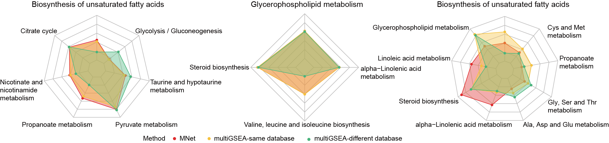
```

#### Glycerophospholipid metabolism

Using MNet to analyze the Glycerophospholipid metabolism pathway.

```{r}
library(multiGSEA)
library(org.Hs.eg.db)
library(dplyr)
library(MNet)
library(ggplot2)

data(transcriptome,package="multiGSEA")
data(metabolome,package="multiGSEA")

ah <- AnnotationHub::AnnotationHub()
aa <- ah[["AH91792"]]
metabolome_1 <- metabolome %>%
  mutate(HMDB=gsub("HMDB","HMDB00",HMDB)) %>%
  left_join(aa,by="HMDB") %>%
  filter(!is.na(KEGG)) %>%
  as.data.frame() %>%
  dplyr::select(HMDB,logFC,pValue,KEGG,HMDB) %>%
  unique() %>%
  filter(KEGG %in% PathwayExtendData$name) %>%
  distinct(KEGG,.keep_all = T) %>%
  arrange(desc(logFC)) %>%
  distinct(logFC,.keep_all = T)

dat_metabolome <- metabolome_1$logFC
names(dat_metabolome) <- metabolome_1$KEGG

p_Glycerophospholipid_metabolite <- pESEA("Glycerophospholipid metabolism",dat_metabolome,out = "metabolite",minSize = 1,gseaParam = 1)

## gene
transcriptome_temp <- transcriptome %>%
  as.data.frame() %>%
  filter(Symbol %in% PathwayExtendData$name) %>%
  arrange(desc(logFC))
dat_transcriptome <- transcriptome_temp$logFC
names(dat_transcriptome) <- transcriptome_temp$Symbol
p_Glycerophospholipid_gene <- pESEA("Glycerophospholipid metabolism",dat_transcriptome,out = "gene",minSize = 1,gseaParam = 1)

## metabolite and gene
dat_all_temp <- rbind(metabolome_1 %>%
                        dplyr::select(KEGG,logFC) %>%
                        rename("name"="KEGG"),
                      transcriptome %>%
                        as.data.frame() %>%
                        dplyr::select(Symbol,logFC) %>%
                        rename("name"="Symbol")) %>%
  filter(name %in% PathwayExtendData$name) %>%
  arrange(desc(logFC))

dat_all <- dat_all_temp$logFC
names(dat_all) <- dat_all_temp$name

p_Glycerophospholipid_extended <- pESEA("Glycerophospholipid metabolism",dat_all,out = "Extended",minSize = 1,gseaParam = 1)

ggsave("result/GSEA/GSEA_Glycerophospholipid_metabolite.pdf",p_Glycerophospholipid_metabolite,width=5,height = 5)
ggsave("result/GSEA/GSEA_Glycerophospholipid_gene.pdf",p_Glycerophospholipid_gene,width=5,height = 5)
ggsave("result/GSEA/GSEA_Glycerophospholipid_extended.pdf",p_Glycerophospholipid_extended,width=5,height = 5)
```

```{r,eval=TRUE,echo=FALSE,fig.align='center'}
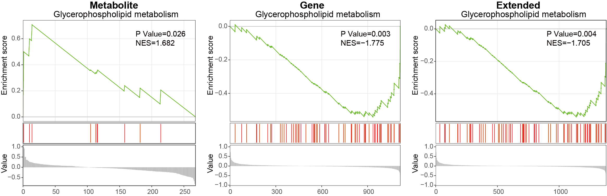
```

#### Propanoate metabolism

Using MNet to analyze the Propanoate metabolism pathway.

```{r}
data(transcriptome,package="multiGSEA")
data(metabolome,package="multiGSEA")

ah <- AnnotationHub::AnnotationHub()
aa <- ah[["AH91792"]]
metabolome_1 <- metabolome %>%
  mutate(HMDB=gsub("HMDB","HMDB00",HMDB)) %>%
  left_join(aa,by="HMDB") %>%
  filter(!is.na(KEGG)) %>%
  as.data.frame() %>%
  dplyr::select(HMDB,logFC,pValue,KEGG,HMDB) %>%
  unique() %>%
  filter(KEGG %in% PathwayExtendData$name) %>%
  distinct(KEGG,.keep_all = T) %>%
  arrange(desc(logFC)) %>%
  distinct(logFC,.keep_all = T)

dat_metabolome <- metabolome_1$logFC
names(dat_metabolome) <- metabolome_1$KEGG

p_Propanoate_metabolite <- pESEA("Propanoate metabolism",dat_metabolome,out = "metabolite",minSize = 1,gseaParam = 1)

## gene
transcriptome_temp <- transcriptome %>%
  as.data.frame() %>%
  filter(Symbol %in% PathwayExtendData$name) %>%
  arrange(desc(logFC))
dat_transcriptome <- transcriptome_temp$logFC
names(dat_transcriptome) <- transcriptome_temp$Symbol
p_Propanoate_gene <- pESEA("Propanoate metabolism",dat_transcriptome,out = "gene",minSize = 1,gseaParam = 1)

## metabolite and gene
dat_all_temp <- rbind(metabolome_1 %>%
                        dplyr::select(KEGG,logFC) %>%
                        rename("name"="KEGG"),
                      transcriptome %>%
                        as.data.frame() %>%
                        dplyr::select(Symbol,logFC) %>%
                        rename("name"="Symbol")) %>%
  filter(name %in% PathwayExtendData$name) %>%
  arrange(desc(logFC))

dat_all <- dat_all_temp$logFC
names(dat_all) <- dat_all_temp$name

p_Propanoate_extended <- pESEA("Propanoate metabolism",dat_all,out = "Extended",minSize = 1,gseaParam = 1)

ggsave("result/GSEA/GSEA_Propanoate_metabolite.pdf",p_Propanoate_metabolite,width=6,height = 5)
ggsave("result/GSEA/GSEA_Propanoate_gene.pdf",p_Propanoate_gene,width=6,height = 5)
ggsave("result/GSEA/GSEA_Propanoate_extended.pdf",p_Propanoate_extended,width=6,height = 5)
```

```{r,eval=TRUE,echo=FALSE,fig.align='center'}
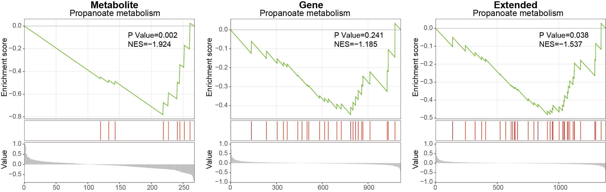
```

## Apply to acute myeloid leukemia

Acute myeloid leukemia (AML) is a group of myeloid neoplasms characterized by high heterogeneity in clinical courses and prognosis, and most AML patients respond poorly to immunotherapies.  

Acute monocytic leukemia (AMoL, or AML-M5) is a common subtype of AML, which is characterized by a dominance of monocytes in the bone marrow. These overproduced monocytes interfere with normal immune cell production, which can cause many health complications for the affected individual. While the clinical features distinguishing AML-M5 and other types of AML are well-defined, the exploration of disparities in metabolism and transcriptome remains relatively scarce.  

Leveraging the data from Cancer Cell Line Encyclopedia (CCLE), MNet was employed to conduct an in-depth analysis of the discernible difference in metabolism and transcriptome between AML-M5 and other subtypes of AML.

### Input data

The Cancer Cell Line Encyclopedia (CCLE) serves as a valuable resource, offering comprehensive metabolomic and transcriptomic data for cancer cell lines, and includes every type of AML. Leveraging the data from CCLE, MNet was employed to conduct an in-depth analysis of the discernible difference in metabolism and transcriptome between AML-M5 and other subtypes of AML.  

The differentially expressed metabolic genes (DEMG) and metabolites (DM) between AML-M5 and other subtypes of AML were selected by P values < 0.1. There are 360 DEMGs in 1,548 metabolic genes and 43 DMs in 225 metabolites.  

```{r}
library(dplyr)
library(MNet)
library(ggplot2)

#-------------------------------------------------------------------------------
#  Step 1: Input transcriptome data for mllima analysis
#-------------------------------------------------------------------------------

gene_1 <- PathwayExtendData %>%
  dplyr::filter(type=="gene")
gene_id <- data.table::fread("input/gene.id.v38.txt",header=F) %>%
  as.data.frame() %>%
  dplyr::filter(V2=="protein_coding") %>%
  dplyr::filter(V3 %in% gene_1$name)

sample <- data.table::fread("input/AML_sample.txt") %>%
  as.data.frame()
dat <- data.table::fread("input/CCLE_RNAseq_genes_rpkm_20180929.gct") %>%
  as.data.frame()

coding_gene <- data.table::fread("input/gene.id.v38.txt",header=F) %>%
  as.data.frame() %>%
  dplyr::filter(V2 == "protein_coding")
sample_overlap_info <- data.frame(CCLE_ID=intersect(sample$CCLE_ID,colnames(dat))) %>%
  dplyr::left_join(sample,by="CCLE_ID")

dat_filter <- dat %>%
  dplyr::select(-Name) %>%
  dplyr::filter(Description %in% gene_id$V3) %>%
  dplyr::select(Description,all_of(sample_overlap_info$CCLE_ID)) %>%
  dplyr::distinct(Description,.keep_all = T) %>%
  tibble::column_to_rownames("Description")

write.table(dat_filter,"result/AML_coding_gene.txt",quote=F,sep="\t")

group <- sample_overlap_info$Hist_Subtype2
group[group=="M5"] <- "tumor"
group[group != "tumor"] <- "normal"
table(group)

gene_all <- mlimma(log2(dat_filter+1),group)
write.table(gene_all,"result/AML_gene_all_M5vsOther.txt",quote=F,row.names = F,sep="\t")

#-------------------------------------------------------------------------------
#  Step 2: Input metabolome data for mllima analysis and convert metabolite names to KEGG IDs.
#-------------------------------------------------------------------------------

sample <- data.table::fread("input/AML_sample.txt") %>%
  as.data.frame()
dat <- data.table::fread("input/CCLE_metabolomics_20190502.csv") %>%
  as.data.frame() %>%
  dplyr::filter(CCLE_ID %in% sample$CCLE_ID) %>%
  dplyr::select(-DepMap_ID) %>%
  tibble::column_to_rownames("CCLE_ID") %>%
  t() %>%
  as.data.frame()

sample_overlap_info <- data.frame(CCLE_ID=intersect(sample$CCLE_ID,colnames(dat))) %>%
  dplyr::left_join(sample,by="CCLE_ID")

dat_filter <- dat %>%
  dplyr::select(sample_overlap_info$CCLE_ID)
group <- sample_overlap_info$Hist_Subtype2
group[group=="M5"] <- "tumor"
group[group != "tumor"] <- "normal"
table(group)

metabolite_all <- mlimma(dat_filter,group)
write.table(metabolite_all,"result/AML_metabolite_all_M5vsOther.txt",quote=F,row.names = F,sep="\t")

kid <- name2keggid(metabolite_all$name)
metabolite_kid <- metabolite_all %>%
  dplyr::left_join(kid,by=c("name"="Name")) %>%
  unique()
write.table(metabolite_kid,"result/AML_metabolite_all_M5vsOther_KEGGID.txt",quote=F,row.names = F,sep="\t")
```

### sNETlyser

Conducted metabolism-related subnetwork analysis based on metabolomic and transcriptomic data by comparing AML-M5 with other subtypes of AML. Upon examining the metabolites and genes within the subnetwork, glutamate emerged as an important metabolite in AML-M5, aligning with the differential analysis and pathway enrichment findings and indicating glutamate best explains the biological processes while comparing with the other AML subtypes.

```{r}
library(dplyr)
library(MNet)
library(ggplot2)

#-------------------------------------------------------------------------------
#  Step 1: Load mlimma analysis data and set parameters
#-------------------------------------------------------------------------------
diff_gene <- data.table::fread("result/AML_gene_all_M5vsOther.txt") %>%
  as.data.frame()
diff_meta <- data.table::fread("result/AML_metabolite_all_M5vsOther_KEGGID.txt") %>%
  as.data.frame() %>%
  dplyr::filter(!is.na(KEGG_id)) %>%
  tidyr::separate_rows(KEGG_id,sep=";") %>%
  dplyr::distinct(KEGG_id,.keep_all = T) %>%
  dplyr::select(-name) %>%
  dplyr::rename("name"="KEGG_id")

names(diff_meta)[4]  <- "p_value"
names(diff_gene)[4] <- "p_value"

#-------------------------------------------------------------------------------
#  Step 2: Conducted metabolism-related subnetwork analysis
#-------------------------------------------------------------------------------
pdf("result/AML_pdent.pdf",width=10,height = 10)
a <- sNETlyser(diff_meta,diff_gene,nsize=80)
dev.off()

node <- a$node_result
write.table(node,"result/AML-pdnet_node.txt",quote=F,row.names=F,sep="\t")

edge <- a$edge_result
write.table(edge,"result/AML-pdnet_edge.txt",quote=F,row.names=F,sep="\t")

metabolite <- node %>%
  dplyr::filter(type=="metabolite")

gene <- node %>%
  dplyr::filter(type=="gene")

result_metabolite <- ePEAlyser(metabolite$name,out="metabolite",test="hypergeo")
result_gene <- ePEAlyser(gene$name,out="gene",test="hypergeo")
result_all <- ePEAlyser(c(gene$name,metabolite$name),out="Extended",test="hypergeo")

write.table(result_metabolite$output,"result/AML-pdnet_metabolite_enrichment.txt",quote=F,row.names = F,sep="\t")
write.table(result_gene$output,"result/AML-pdnet_gene_enrichment.txt",quote=F,row.names = F,sep="\t")
write.table(result_all$output,"result/AML-pdnet_all_enrichment.txt",quote=F,row.names = F,sep="\t")

if (0) {
  
kegg_pathway_uniq <- PathwayExtendData %>%
  dplyr::select(kegg_pathwayname,kegg_category) %>%
  dplyr::rename("PATHWAY"="kegg_pathwayname") %>%
  dplyr::rename("pathway_type"="kegg_category") %>%
  unique()


result <- rbind(result_metabolite$output %>% dplyr::mutate(type="metabolite"),
                    result_gene$output %>% dplyr::mutate(type="gene"),
                    result_all$output %>% dplyr::mutate(type="all")) %>%
 # dplyr::filter(nOverlap > 1) %>%
  dplyr::left_join(kegg_pathway_uniq,by=c("name"="PATHWAY")) %>%
  dplyr::filter(pathway_type != "Glycan biosynthesis and metabolism") %>%
  dplyr::filter(!name %in% c("Fructose and mannose metabolism","Amino sugar and nucleotide sugar metabolism",
                            "Galactose metabolism","Ascorbate and aldarate metabolism","Pentose and glucuronate interconversions")) %>%
  dplyr::arrange(pvalue)

pathway_hh <- unique(result$pathway_type)

result <- result %>%
  dplyr::filter(!pathway_type %in% c("Metabolism of terpenoids and polyketides","Metabolism of cofactors and vitamins",
                                     "Biosynthesis of other secondary metabolites","Metabolism of other amino acids",
                                     "Xenobiotics biodegradation and metabolism")) %>%
  dplyr::arrange(match(pathway_type,pathway_hh))


result$name <- factor(result$name,levels = rev(unique(result$name)))
result$pathway_type <- factor(result$pathway_type,levels=unique(kegg_pathway_uniq$pathway_type))
result$type <- factor(result$type,levels=c("metabolite","gene","all"))
p1 <- ggplot(result,aes(name,-log10(pvalue)))+
  geom_bar(stat="identity",aes(fill=pathway_type))+
  scale_fill_manual(values=RColorBrewer::brewer.pal(11, "Set3"),name="Pathway Category",
                    breaks=unique(kegg_pathway_uniq$pathway_type))+
  scale_y_continuous(expand = c(0, 0))+
  coord_flip()+
  facet_grid(. ~ type,scales="free_x")+
  theme_bw()+
  labs(x=NULL)
ggsave("result/AML-pdnet_epe.pdf",p1,width=10,height = 5)
}
```

```{r,eval=TRUE,echo=FALSE,fig.align='center',out.width="70%"}
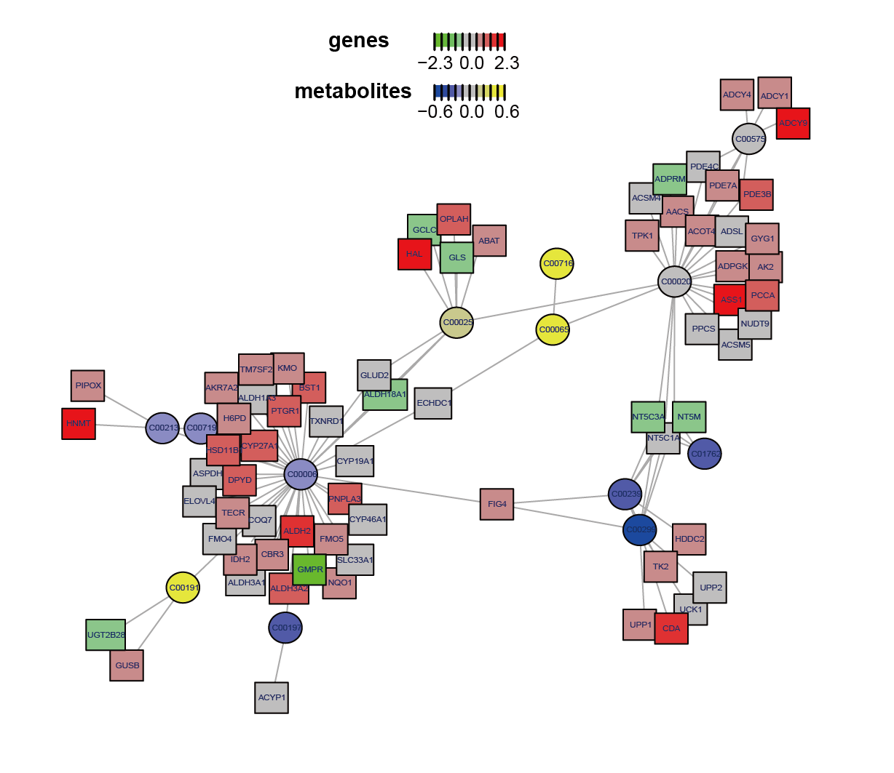
```

<center>**sNETlyser analysis of AML:** Visualization of the identified optimal subnetwork that best explains the biological processes comparing AML-M5 and other subtypes of AML. The colors represent the logFC (logarithm of fold change) of genes, with red and green indicating different expression levels, while yellow and blue represent the logFC of metabolites, indicating varying levels.<center>

### Extended Pathway Analysers

Conducted comprehensive pathway analyses based on genes, metabolites, and genes with metabolites.

#### ePEAlyser

The results of metabolite-based and gene-based pathway enrichment analysis (M-based PEA and G-based PEA) identified a smaller set of overlapping entities than those uncovered by extended pathway enrichment analysis (ePEA) in every pathway. Notably, ePEA uncovered a broader and more statistically significant set of biological pathways, as indicated by more significant P values. 

```{r}
library(MNet)
library(dplyr)
library(ggplot2)

#-------------------------------------------------------------------------------
#  Step 1: Load mlimma analysis data and conduct PathwayAnalysis
#-------------------------------------------------------------------------------

gene_all <- data.table::fread("result/AML_gene_all_M5vsOther.txt") %>%
  as.data.frame()
metabolite_all <- data.table::fread("result/AML_metabolite_all_M5vsOther_KEGGID.txt") %>%
  as.data.frame() %>%
  dplyr::filter(!is.na(KEGG_id)) %>%
  tidyr::separate_rows(KEGG_id,sep=";") %>%
  dplyr::distinct(KEGG_id,.keep_all = T) %>%
  dplyr::select(-name) %>%
  dplyr::rename("name"="KEGG_id")

dat_all <- rbind(gene_all,metabolite_all)

diff_gene <- gene_all %>%
  dplyr::filter(P.Value < 0.1)
diff_meta <- metabolite_all %>%
  dplyr::filter(P.Value < 0.1)
diff_all <- rbind(diff_gene,diff_meta)

result_gene <- ePEAlyser(diff_gene$name,out="gene",p_cutoff=1.5)
result_meta <- ePEAlyser(diff_meta$name,out="metabolite",p_cutoff=1.5)
result_all <- ePEAlyser(diff_all$name,out="Extended",p_cutoff=1.5)

pathway_overlap <- intersect(result_gene$output$name,result_meta$output$name)
pathway_all <- rbind(result_gene$output,result_meta$output,result_all$output) %>%
  dplyr::filter(pvalue < 0.05) %>%
  dplyr::filter(nOverlap >= 3) %>%
  dplyr::filter(name %in% pathway_overlap) %>%
  dplyr::pull(name) %>%
  unique()

result_gene_filter <- result_gene$output %>%
  as.data.frame() %>%
  dplyr::select(name,nOverlap,pvalue) %>%
  dplyr::filter(name %in% pathway_all) %>%
  dplyr::mutate(type="gene")

result_meta_filter <- result_meta$output %>%
  as.data.frame() %>%
  dplyr::select(name,nOverlap,pvalue) %>%
  dplyr::filter(name %in% pathway_all) %>%
  dplyr::mutate(type="metabolite")

result_all_filter <- result_all$output %>%
  as.data.frame() %>%
  dplyr::select(name,nOverlap,pvalue) %>%
  dplyr::filter(name %in% pathway_all) %>%
  dplyr::mutate(type="all")

pathway_type <- PathwayExtendData %>%
  dplyr::select(kegg_pathwayname,kegg_category) %>%
  unique()

all <- rbind(result_gene_filter,result_meta_filter,result_all_filter) %>%
  dplyr::mutate(type=factor(type,levels=c("metabolite","gene","all"))) %>%
  dplyr::left_join(pathway_type,by=c("name"="kegg_pathwayname")) %>%
  dplyr::arrange(kegg_category) %>%
  dplyr::mutate(name=factor(name,levels=unique(name)))

#-------------------------------------------------------------------------------
#  Step 2: Dotplot
#-------------------------------------------------------------------------------
p <- ggplot(all,aes(type,name))+
  geom_point(aes(size=log2(nOverlap),color=-log10(pvalue)))+
  theme_bw()+
  theme(panel.border = element_blank(),panel.grid.major = element_blank(),
        panel.grid.minor = element_blank(),axis.line = element_line(colour = "black"))+
  scale_color_gradient(low="white",high="red")+
  labs(x=NULL,y="Pathway name")

ggsave("result/AML-ePEA.pdf",p,width=6,height = 3.5)

if (0) {
pathway_gene_filter <- result_gene$output %>%
  dplyr::filter(pvalue < 0.05)
pathway_meta_filter <- result_meta$output %>%
  dplyr::filter(pvalue < 0.05)
pathway_all_filter <- result_all$output %>%
  dplyr::filter(pvalue < 0.05)
library("VennDiagram")
a<-venn.diagram(list(gene=pathway_gene_filter$name,
                     metabolite=pathway_meta_filter$name,
                     all=pathway_all_filter$name),filename=NULL,fill=c("#2b6a99","#f16c23","#005B1D"),alpha =1)
pdf("result/AML-PE-ven.pdf",width=5,height = 5)
grid.draw(a)
dev.off()
}
```

```{r,eval=TRUE,echo=FALSE,fig.align='center',out.width="70%"}
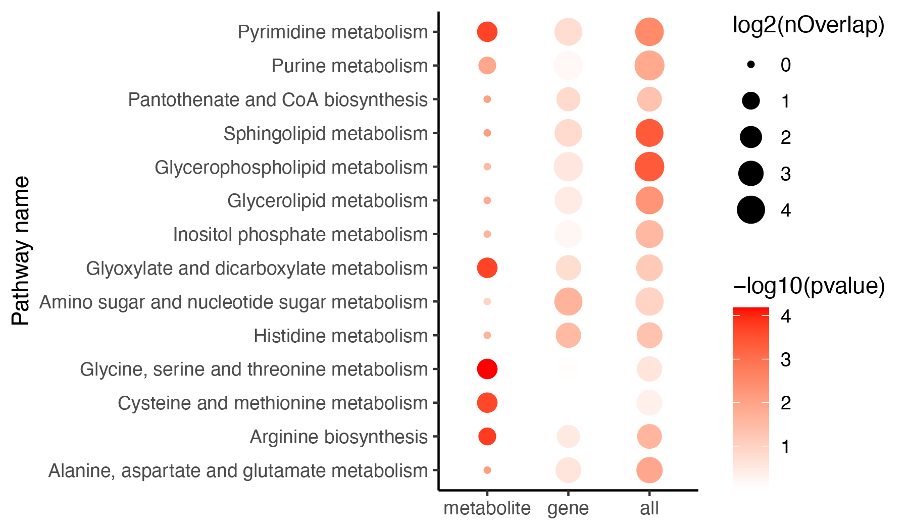
```

<center>**Dot plot illustrating enriched pathways. **<center>

#### ePDAlyser

The extended pathway differential abundance (ePDA) method revealed a greater number of pathways compared to gene-based or metabolite-based approaches, demonstrating higher stringency.

```{r}
library(dplyr)
library(ggplot2)
library(MNet)

#-------------------------------------------------------------------------------
#  Step 1: Load mlimma analysis data and conduct DAscore analysis
#-------------------------------------------------------------------------------

## Metabolite
metabolite_kid <- data.table::fread("result/AML_metabolite_all_M5vsOther_KEGGID.txt") %>%
  as.data.frame()

meta_all <- metabolite_kid %>%
  dplyr::filter(!is.na(KEGG_id)) %>%
  tidyr::separate_rows(KEGG_id,sep=";") %>%
  dplyr::distinct(KEGG_id,.keep_all = T) %>%
  dplyr::select(-name) %>%
  dplyr::rename("name"="KEGG_id")

meta_diff <- meta_all %>%
  dplyr::filter(P.Value < 0.5) %>%
  dplyr::filter(abs(logFC) > 0)

diff_meta_increase <- meta_all %>%
  dplyr::filter(logFC > 0) %>%
  dplyr::filter(P.Value < 0.5)

diff_meta_decrease <- meta_all %>%
  dplyr::filter(logFC < 0) %>%
  dplyr::filter(P.Value < 0.5)

DAscore_meta <- ePDAlyser(diff_meta_increase$name,diff_meta_decrease$name,meta_all$name,
                        min_measured_num = 3,out="metabolite",sort_plot="category")
ggsave("result/AML-metabolite_DA.pdf",DAscore_meta$p,width=10,height = 8)
write.table(DAscore_meta$result,"result/AML-metabolite_DA.txt",quote=F,row.names=F,sep="\t")

## Gene
gene_all <- data.table::fread("result/AML_gene_all_M5vsOther.txt") %>%
  as.data.frame()

diff_gene_increase <- gene_all %>%
  dplyr::filter(logFC > 0) %>%
  dplyr::filter(P.Value < 0.1)

diff_gene_decrease <- gene_all %>%
  dplyr::filter(logFC < -0) %>%
  dplyr::filter(P.Value < 0.1)

DAscore_gene <- ePDAlyser(diff_gene_increase$name,diff_gene_decrease$name,gene_all$name,
                        min_measured_num = 10,out="gene",sort_plot="category")
ggsave("result/AML-gene_DA.pdf",DAscore_gene$p,width=10,height = 8)
write.table(DAscore_gene$result,"result/AML-gene_DA.txt",quote=F,row.names=F,sep="\t")

## Met-Gene
gene_all <- data.table::fread("result/AML_gene_all_M5vsOther.txt") %>%
  as.data.frame()
metabolite_all <- data.table::fread("result/AML_metabolite_all_M5vsOther_KEGGID.txt") %>%
  as.data.frame() %>%
  dplyr::filter(!is.na(KEGG_id)) %>%
  tidyr::separate_rows(KEGG_id,sep=";") %>%
  dplyr::distinct(KEGG_id,.keep_all = T) %>%
  dplyr::select(-name) %>%
  dplyr::rename("name"="KEGG_id")

dat_all <- rbind(gene_all,metabolite_all)

dat_diff <- rbind(gene_all %>% filter(abs(logFC) > 0) %>% filter(P.Value < 0.1),
                  metabolite_all %>% filter(abs(logFC) > 0) %>% filter(P.Value < 0.1))

diff_dat_increase <- dat_diff %>%
  dplyr::filter(logFC > 0)

diff_dat_decrease <- dat_diff %>%
  dplyr::filter(logFC < 0)

DAscore_GM <- ePDAlyser(diff_dat_increase$name,diff_dat_decrease$name,dat_all$name,
                        min_measured_num = 10,out="Extended",sort_plot="category")
ggsave("result/AML-GM_DA.pdf",DAscore_GM$p,width=10,height = 8)
write.table(DAscore_GM$result,"result/AML-GM_DA.txt",quote=F,row.names=F,sep="\t")

#-------------------------------------------------------------------------------
#  Step 2: Barplot
#-------------------------------------------------------------------------------
da_meta <- data.table::fread("result/AML-metabolite_DA.txt") %>%
  as.data.frame() %>%
  dplyr::select(Pathway,DA_score,`Pathway Category`,Measured_members_num) %>%
  dplyr::mutate(Type="metabolite") %>%
  dplyr::mutate(da_type_meta=ifelse(DA_score > 0,"big",
                               ifelse(DA_score < 0,"little","middle")))
da_gene <- data.table::fread("result/AML-gene_DA.txt") %>%
  as.data.frame() %>%
  dplyr::select(Pathway,DA_score,`Pathway Category`,Measured_members_num) %>%
  dplyr::mutate(Type="gene") %>%
  dplyr::mutate(da_type_gene=ifelse(DA_score > 0,"big",
                               ifelse(DA_score < 0,"little","middle")))
da_all <- data.table::fread("result/AML-GM_DA.txt") %>%
  as.data.frame() %>%
  dplyr::select(Pathway,DA_score,`Pathway Category`,Measured_members_num) %>%
  dplyr::mutate(Type="all") %>%
  dplyr::mutate(da_type_all =ifelse(DA_score > 0,"big",
                               ifelse(DA_score < 0,"little","middle")))

pathway_overlap <- da_meta %>%
  dplyr::full_join(da_gene,by="Pathway") %>%
  dplyr::full_join(da_all,by="Pathway") %>%
  dplyr::filter(!is.na(DA_score.x)) %>%
  dplyr::filter(!is.na(DA_score.y)) %>%
  dplyr::filter(da_type_meta == da_type_gene | da_type_meta=="middle"|da_type_gene=="middle") %>%
  dplyr::pull(Pathway)

result_filter <- rbind(da_meta %>%
                  dplyr::select(-da_type_meta),
                da_gene %>%
                  dplyr::select(-da_type_gene),
                da_all %>%
                  dplyr::select(-da_type_all)) %>%
  dplyr::filter(Pathway %in% pathway_overlap) %>%
  dplyr::arrange(DA_score) %>%
  dplyr::arrange(`Pathway Category`) %>%
  dplyr::filter(Measured_members_num >= 3) %>%
  dplyr::filter(!(Measured_members_num < 10 & Type=="gene")) %>%
  dplyr::mutate(Pathway=factor(Pathway,levels = unique(Pathway))) %>%
  dplyr::mutate(Type=factor(Type,levels=c("metabolite","gene","all")))

colp <- c("Amino acid metabolism" ="#1B9E77",
          "Carbohydrate metabolism"="#D95F02","Glycan biosynthesis and metabolism"="#1F78B4",
          "Metabolism of cofactors and vitamins"="#7570B3","Metabolism of terpenoids and polyketides"="#BC80BD",
          "Metabolism of other amino acids"="#8DD3C7",
          "Energy metabolism"="#E7298A","Lipid metabolism"="#66A61E","Nucleotide metabolism"="#E6AB02",
          "Biosynthesis of other secondary metabolites"="#A6761D",
          "Xenobiotics biodegradation and metabolism"="#666666")

p <- ggplot2::ggplot(result_filter)+
  ggplot2::geom_point(ggplot2::aes(x=Pathway,y=DA_score,size=log2(Measured_members_num),color=`Pathway Category`))+
  ggplot2::geom_pointrange(ggplot2::aes(x=Pathway,y=DA_score,ymin=0,ymax=DA_score,color=`Pathway Category`))+
  scale_color_manual(values=colp)+
  theme_bw()+
  theme(panel.grid.major = element_blank(), panel.grid.minor = element_blank(),
        axis.line = element_line(colour = "black"))+
  geom_hline(yintercept=c(0))+
  ggplot2::coord_flip()+
  ggplot2::xlab(NULL)+
  facet_grid(. ~ Type)

ggsave("result/AML-ePDA.pdf",p,width=12.5,height = 6)

### venn
if (0) {
num_meta <- da_meta$Pathway
num_gene <- da_gene$Pathway
num_all <- da_all$Pathway

dat_num <- data.frame(type=c("metabolite","gene","all"),
                      num=c(length(num_meta),length(num_gene),length(num_all))) %>%
  dplyr::mutate(type=factor(type,levels=c("metabolite","gene","all")))

p <- ggplot(dat_num,aes(type,num,fill=type))+
  geom_bar(stat="identity")+
  scale_fill_manual(values=c("metabolite"="#f16c23","gene"="#2b6a99","all"="#005B1D"))+
  theme_bw()
ggsave("result/AML-DA_num.pdf",p,width=6,height = 5)
}
```

```{r,eval=TRUE,echo=FALSE,fig.align='center'}
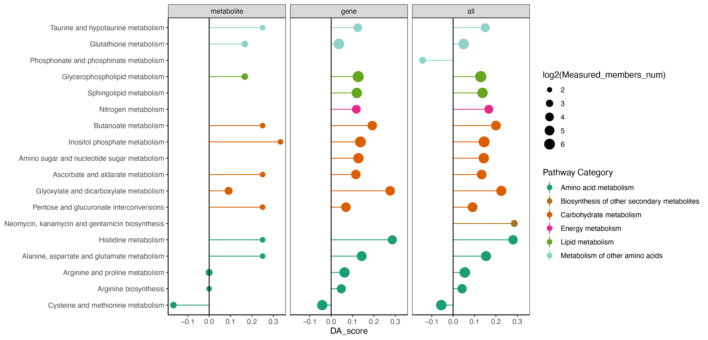
```

<center>**Dot plot illustrating the DA pathway results.**<center>

#### eSEAlyser

Gene set enrichment analysis (GSEA) and metabolite set enrichment analysis (MSEA) exhibited minimal pathway overlap, indicating a limitation of this method. This limitation was effectively addressed through extended pathway set enrichment analysis (eSEA), considering both genes and metabolites, thereby enhancing and complementing the insights provided by GSEA and MSEA.

```{r}
library(MNet)
library(ggplot2)
library(dplyr)

#-------------------------------------------------------------------------------
#  Step 1: Load mlimma analysis data and conduct ESEA analysis
#-------------------------------------------------------------------------------

gene_all <- data.table::fread("result/AML_gene_all_M5vsOther.txt") %>%
  as.data.frame() %>%
  dplyr::arrange(desc(logFC))
metabolite_all <- data.table::fread("result/AML_metabolite_all_M5vsOther_KEGGID.txt") %>%
  as.data.frame() %>%
  dplyr::filter(!is.na(KEGG_id)) %>%
  tidyr::separate_rows(KEGG_id,sep=";") %>%
  dplyr::distinct(KEGG_id,.keep_all = T) %>%
  dplyr::select(-name) %>%
  dplyr::rename("name"="KEGG_id") %>%
  dplyr::arrange(desc(logFC))
all_result <- rbind(metabolite_all,gene_all) %>%
  dplyr::arrange(desc(logFC))

all <- all_result$logFC
names(all) <- all_result$name

gene <- gene_all$logFC
names(gene) <- gene_all$name

meta <- metabolite_all$logFC
names(meta) <- metabolite_all$name

result_meta <- eSEAlyser(meta,out="metabolite",minSize = 2)
result_gene <- eSEAlyser(gene,out = "gene",minSize = 5)
result_all <- eSEAlyser(all,out="Extended",minSize = 7)

result_meta_filter <- result_meta %>%
  dplyr::filter(pval < 0.1) %>%
  dplyr::mutate(type="metabolite")
result_gene_filter <- result_gene %>%
  dplyr::filter(pval < 0.1) %>%
  dplyr::mutate(type="gene")
result_all_filter <- result_all %>%
  dplyr::filter(pval < 0.1) %>%
  dplyr::mutate(type="all")

if (0) {
library("VennDiagram")
a<-venn.diagram(list(gene=result_gene_filter$pathway,
                     metabolite=result_meta_filter$pathway,
                     all=result_all_filter$pathway),filename=NULL,fill=c("#2b6a99","#f16c23","#005B1D"),alpha =1)
pdf("result/AML-eSEA-ven.pdf",width=5,height = 5)
grid.draw(a)
dev.off()
}

pathway_overlap <- unique(c(result_meta_filter$pathway,result_gene_filter$pathway,result_all_filter$pathway))

## Only one omics
only_one <- c(setdiff(result_meta$pathway,result_gene$pathway),setdiff(result_gene$pathway,result_meta$pathway))

result_temp <- rbind(result_meta %>% mutate(type="metabolite"),
                result_gene %>% mutate(type="gene"),
                result_all %>% mutate(type="all")) %>%
  dplyr::filter(pathway %in% pathway_overlap) %>%
  dplyr::filter(!pathway %in% only_one) %>%
  dplyr::filter(!pathway %in% c("Tryptophan metabolism","Porphyrin metabolism","Pentose phosphate pathway",
                                "Galactose metabolism","D-Amino acid metabolism","Glycolysis / Gluconeogenesis",
                                "Glycerolipid metabolism","Citrate cycle (TCA cycle)"))

result_1 <- result_temp %>%
  dplyr::filter(type=="all") %>%
  dplyr::arrange(NES)
result <- result_temp %>%
  dplyr::arrange(match(pathway,result_1$pathway)) %>%
  dplyr::arrange(match(type,c("metabolite","gene","all"))) %>%
  dplyr::mutate(type=factor(type,levels = c("metabolite","gene","all"))) %>%
  dplyr::mutate(pathway=factor(pathway,levels=result_1$pathway))

#-------------------------------------------------------------------------------
#  Step 2: Barplot
#-------------------------------------------------------------------------------
p <- ggplot(result,aes(pathway,NES,fill=-log10(pval)))+
  geom_bar(stat="identity")+
  theme_bw()+
  geom_hline(yintercept=c(0))+
  theme(panel.grid.major = element_blank(),
        panel.grid.minor = element_blank())+
  scale_fill_gradient(low="pink",high="red")+
  coord_flip()+
  facet_grid(. ~ type,scales="free_x")+
  labs(x="Pathway name")

ggsave("result/AML-eSEA.pdf",p,width=10,height = 3)
```

```{r,eval=TRUE,echo=FALSE,fig.align='center'}
knitr::include_graphics("figure/AML-ESEA_barplot.png")
```

<center>**Bar plot illustrating NES of enriched pathways.**<center>

## Apply to triple-negative breast cancer

The case study involves an integrated analysis of metabolomic and transcriptomic data, with the aim of understanding rapidly proliferating breast cancers [Cancer Research](https://aacrjournals.org/cancerres/article/82/4/665/678072/Integrated-Metabolic-Profiling-and-Transcriptional).

The study characterizes the metabolomic profile of two types of 31 breast tumors in human, revealing elevated pyrimidine metabolism and glutaminolysis pathways in triple-negative breast cancer (TNBC).  

As an example of mixed metabolites and genes analyses, we use both dataset of metabolite intensity and gene expression data as reported in the paper. The metabolomics data was accessed from the paper, and the gene expression data was obtained from **GEO (GSE173991)**.

### sNETlyser

The authors’ results demonstrate the essential role of glutamine catabolism-based pyrimidine metabolism in TNBC. MNet not only corroborates this finding but also highlights the significance of oxidative phosphorylation in cluster 2.

```{r}
library(dplyr)
library(MNet)
library(ggplot2)

#-------------------------------------------------------------------------------
#  Step 1: Input metabolome and transcriptome data for mllima analysis
#-------------------------------------------------------------------------------

diff_meta <- mlimma(meta_dat,group)
diff_gene <- mlimma(gene_dat,group)
names(diff_meta)[4]  <- "p_value"
names(diff_gene)[4] <- "p_value"

#-------------------------------------------------------------------------------
#  Step 2: Conducted metabolism-related subnetwork analysis
#-------------------------------------------------------------------------------

pdf("result/TNBC_pdent.pdf",width=10,height = 10)
a <- sNETlyser(diff_meta,diff_gene,nsize=100)
dev.off()

node <- a$node_result
write.table(node,"result/TNBC_pdnet_node.txt",quote=F,row.names=F,sep="\t")

edge <- a$edge_result
write.table(edge,"result/TNBC_pdnet_edge.txt",quote=F,row.names=F,sep="\t")

metabolite <- node %>%
  dplyr::filter(type=="metabolite")

gene <- node %>%
  dplyr::filter(type=="gene")

result_metabolite <- ePEAlyser(metabolite$name,out="metabolite",test="hypergeo")
result_gene <- ePEAlyser(gene$name,out="gene",test="hypergeo")
result_all <- ePEAlyser(c(gene$name,metabolite$name),out="Extended",test="hypergeo")

write.table(result_metabolite$output,"result/TNBC_pdnet_metabolite_enrichment.txt",quote=F,row.names = F,sep="\t")
write.table(result_gene$output,"result/TNBC_pdnet_gene_enrichment.txt",quote=F,row.names = F,sep="\t")
write.table(result_all$output,"result/TNBC_pdnet_all_enrichment.txt",quote=F,row.names = F,sep="\t")

kegg_pathway_uniq <- PathwayExtendData %>%
  dplyr::select(kegg_pathwayname,kegg_category) %>%
  dplyr::rename("PATHWAY"="kegg_pathwayname") %>%
  dplyr::rename("pathway_type"="kegg_category") %>%
  unique()

result <- rbind(result_metabolite$output %>% dplyr::mutate(type="metabolite"),
                    result_gene$output %>% dplyr::mutate(type="gene"),
                    result_all$output %>% dplyr::mutate(type="all")) %>%
  dplyr::left_join(kegg_pathway_uniq,by=c("name"="PATHWAY")) %>%
  dplyr::filter(pathway_type != "Glycan biosynthesis and metabolism") %>%
  dplyr::filter(!name %in% c("Fructose and mannose metabolism",
                             "Amino sugar and nucleotide sugar metabolism",
                            "Galactose metabolism",
                            "Ascorbate and aldarate metabolism",
                            "Pentose and glucuronate interconversions")) %>%
  dplyr::arrange(pvalue)

pathway_hh <- unique(result$pathway_type)

result <- result %>%
  dplyr::filter(!pathway_type %in% c("Metabolism of terpenoids and polyketides",
                                     "Metabolism of cofactors and vitamins",
                                     "Biosynthesis of other secondary metabolites",
                                     "Metabolism of other amino acids",
                                     "Xenobiotics biodegradation and metabolism")) %>%
  dplyr::arrange(match(pathway_type,pathway_hh))

result$name <- factor(result$name,levels = rev(unique(result$name)))
result$pathway_type <- factor(result$pathway_type,levels=unique(kegg_pathway_uniq$pathway_type))
result$type <- factor(result$type,levels=c("metabolite","gene","all"))
p1 <- ggplot(result,aes(name,-log10(pvalue)))+
  geom_bar(stat="identity",aes(fill=pathway_type))+
  scale_fill_manual(values=RColorBrewer::brewer.pal(11, "Set3"),name="Pathway Category",
                    breaks=unique(kegg_pathway_uniq$pathway_type))+
  scale_y_continuous(expand = c(0, 0))+
  coord_flip()+
  facet_grid(. ~ type,scales="free_x")+
  theme_bw()+
  labs(x=NULL)
ggsave("result/TNBC_pdnet_epe.pdf",p1,width=10,height = 5)
```

```{r,eval=TRUE,echo=FALSE,fig.align='center',out.width="70%"}
knitr::include_graphics("figure/TNBC-net.png")
```

<center>**sNETlyser analysis of TNBC:** Leveraging the input data including the significance level (such as P-values) for metabolites and genes, MNet extracts the optimal subnetwork that best explains the biological processes underlying the input data. The colors represent the logFC (logarithm of fold change) of genes (red and green indicating different expression levels), while yellow and blue represent the logFC of metabolites, indicating varying levels.<center> 

### Extended Pathway Analyses

The authors found that pyrimidine and purine metabolism, carbon metabolism, and the energy production related pathways were highly enriched in cluster 2 while many lipid/fatty acid metabolism related pathways were enriched in cluster 1, which aligns with similar result obtained from MNet.

#### ePEAlyser

Extended pathway enrichment analysis.

```{r}
library(dplyr)
library(MNet)
library(stringr)
library(ggplot2)
library(RColorBrewer)

#-------------------------------------------------------------------------------
#  Step 1: Input metabolome and transcriptome data for mllima analysis
#-------------------------------------------------------------------------------

all_meta <- mlimma(meta_dat,group)
all_gene <- mlimma(gene_dat,group)

#-------------------------------------------------------------------------------
#  Step 2: PathwayAnalysis
#-------------------------------------------------------------------------------

## Gene
diff_gene_increase <- all_gene %>%
  dplyr::filter(logFC > 0.58) %>%
  dplyr::filter(adj.P.Val < 0.05)

result_gene_increase <- ePEAlyser(diff_gene_increase$name,out="gene",p_cutoff=0.05)
ggsave("result/TNBC_gene_increase.pdf",result_gene_increase$p_barplot,width=10,height = 5)
write.table(result_gene_increase$output,"result/TNBC_gene_increase.txt",quote=F,row.names = F,sep="\t")

diff_gene_decrease <- all_gene %>%
  dplyr::filter(logFC < -0.58) %>%
  dplyr::filter(adj.P.Val < 0.05)

result_gene_decrease <- ePEAlyser(diff_gene_decrease$name,out="gene",p_cutoff=0.05)
ggsave("result/TNBC_gene_decrease.pdf",result_gene_decrease$p_barplot,width=10,height = 5)
write.table(result_gene_decrease$output,"result/TNBC_gene_decrease.txt",quote=F,row.names = F,sep="\t")

## Metabolite
## Filter the increase differential genes and metabolites
diff_meta_increase <- all_meta %>%
  dplyr::filter(logFC > 0.58) %>%
  dplyr::filter(adj.P.Val < 0.05)

result_meta_increase <- ePEAlyser(diff_meta_increase$name,out="metabolite",p_cutoff=0.05)
ggsave("result/TNBC_meta_increase.pdf",result_meta_increase$p_barplot,width=10,height = 5)
write.table(result_meta_increase$output,"result/TNBC_meta_increase.txt",quote=F,row.names = F,sep="\t")

diff_meta_decrease <- all_meta %>%
  dplyr::filter(logFC < -0.58) %>%
  dplyr::filter(adj.P.Val < 0.05)

result_meta_decrease <- ePEAlyser(diff_meta_decrease$name,out="metabolite",p_cutoff=0.05)
ggsave("result/TNBC_meta_decrease.pdf",result_meta_decrease$p_barplot,width=10,height = 5)
write.table(result_meta_decrease$output,"result/TNBC_meta_decrease.txt",quote=F,row.names = F,sep="\t")

## Met-Gene
diff_increase <- rbind(diff_gene_increase,diff_meta_increase)
result_all_increase <- ePEAlyser(diff_increase$name,out="Extended",p_cutoff=0.05)
ggsave("result/TNBC_all_increase.pdf",result_all_increase$p_barplot,width=10,height = 5)
write.table(result_all_increase$output,"result/TNBC_all_increase.txt",quote=F,row.names = F,sep="\t")

diff_decrease <- rbind(diff_gene_decrease,diff_meta_decrease)
result_all_decrease <- ePEAlyser(diff_decrease$name,out="Extended",p_cutoff=0.05)
ggsave("result/TNBC_all_decrease.pdf",result_all_decrease$p_barplot,width=10,height = 5)
write.table(result_all_decrease$output,"result/TNBC_all_decrease.txt",quote=F,row.names = F,sep="\t")

#-------------------------------------------------------------------------------
#  Step 3: Dotplot
#-------------------------------------------------------------------------------

meta_increase <- data.table::fread("result/TNBC_meta_increase.txt") %>%
  as.data.frame() %>%
  dplyr::select(name,pvalue) %>%
  dplyr::mutate(type1 ="meta_Cluster1") %>%
  dplyr::mutate(type2 ="metabolite")
meta_decrease <- data.table::fread("result/TNBC_meta_decrease.txt") %>%
  as.data.frame() %>%
  dplyr::select(name,pvalue) %>%
  dplyr::mutate(type1="meta_Cluster2") %>%
  dplyr::mutate(type2 ="metabolite")

gene_increase <- data.table::fread("result/TNBC_gene_increase.txt") %>%
  as.data.frame() %>%
  dplyr::select(name,pvalue) %>%
  dplyr::mutate(type1 ="gene_Cluster1") %>%
  dplyr::mutate(type2 ="gene")
gene_decrease <- data.table::fread("result/TNBC_gene_decrease.txt") %>%
  as.data.frame() %>%
  dplyr::select(name,pvalue) %>%
  dplyr::mutate(type1="gene_Cluster2") %>%
  dplyr::mutate(type2 ="gene")

all_increase <- data.table::fread("result/TNBC_all_increase.txt") %>%
  as.data.frame() %>%
  dplyr::select(name,pvalue) %>%
  dplyr::mutate(type1 ="all_Cluster1") %>%
  dplyr::mutate(type2 ="all")
all_decrease <- data.table::fread("result/TNBC_all_decrease.txt") %>%
  as.data.frame() %>%
  dplyr::select(name,pvalue) %>%
  dplyr::mutate(type1="all_Cluster2") %>%
  dplyr::mutate(type2 ="all")

kegg_pathway_uniq <- PathwayExtendData %>%
  dplyr::select(kegg_pathwayname,kegg_category) %>%
  dplyr::rename("PATHWAY"="kegg_pathwayname") %>%
  dplyr::rename("pathway_type"="kegg_category") %>%
  unique()

result_meta <- rbind(meta_increase,meta_decrease) %>%
  dplyr::filter(pvalue < 0.01)

result_gene <- rbind(gene_increase,gene_decrease) %>%
  dplyr::filter(pvalue < 0.05)

result_all <- rbind(all_increase,all_decrease) %>%
  dplyr::filter(pvalue < 0.05)

result <- rbind(result_meta,result_gene,result_all) %>%
  dplyr::filter(!name %in% c("Sulfur metabolism",
                             "Fructose and mannose metabolism",
                             "Ascorbate and aldarate metabolism",
                             "Galactose metabolism",
                             "Butanoate metabolism",
                             "Pentose and glucuronate interconversions",
                             "Amino sugar and nucleotide sugar metabolism",
                             "Propanoate metabolism")) %>%
  dplyr::left_join(kegg_pathway_uniq,by=c("name"="PATHWAY")) %>%
  dplyr::filter(pathway_type != "Glycan biosynthesis and metabolism") %>%
  dplyr::arrange(pvalue)

pathway_hh <- unique(result$pathway_type)

result <- result %>%
  dplyr::filter(!pathway_type %in% c("Metabolism of terpenoids and polyketides","Metabolism of cofactors and vitamins","Biosynthesis of other secondary metabolites","Metabolism of other amino acids")) %>%
  dplyr::arrange(match(pathway_type,pathway_hh))

result$name <- factor(result$name,levels = rev(unique(result$name)))
result$pathway_type <- factor(result$pathway_type,levels=unique(kegg_pathway_uniq$pathway_type))
result$type1 <- factor(result$type1,
                       levels=c("meta_Cluster1","meta_Cluster2",
                                "gene_Cluster1","gene_Cluster2",
                                "all_Cluster1","all_Cluster2"))

colp <- c("Amino acid metabolism" ="#1B9E77",
          "Carbohydrate metabolism"="#D95F02",
          "Glycan biosynthesis and metabolism"="#1F78B4",
          "Metabolism of cofactors and vitamins"="#7570B3",
          "Metabolism of terpenoids and polyketides"="#BC80BD",
          "Metabolism of other amino acids"="#8DD3C7",
          "Energy metabolism"="#E7298A",
          "Lipid metabolism"="#66A61E",
          "Nucleotide metabolism"="#E6AB02",
          "Biosynthesis of other secondary metabolites"="#A6761D",
          "Xenobiotics biodegradation and metabolism"="#666666")

p1 <- ggplot(result,aes(name,-log10(pvalue)))+
  geom_bar(stat="identity",aes(fill=pathway_type))+
  scale_fill_manual(values=colp)+
  scale_y_continuous(expand = c(0, 0))+
  coord_flip()+
  facet_grid(. ~ type1,scales="free_x")+
  theme_bw()+
  labs(x=NULL)
ggsave("result/TNBC_ePEA.pdf",p1,width=15,height = 7)
```

```{r,eval=TRUE,echo=FALSE,fig.align='center'}
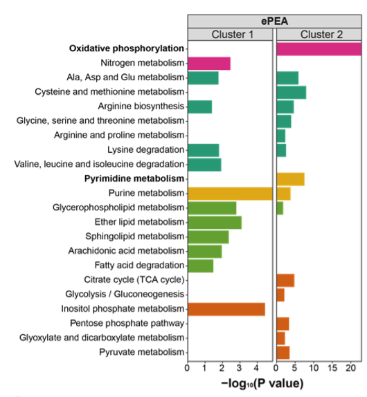
```

<center>**Pathway enrichment analysis of metabolites and genes.**<center>

#### ePDAlyser

Extended pathway differential abundance score.

```{r}
library(dplyr)
library(MNet)
library(ggplot2)

#-------------------------------------------------------------------------------
#  Step 1: Input metabolome and transcriptome data for mllima analysis
#-------------------------------------------------------------------------------

group[which(group=="normal")] <- "a"
group[which(group=="tumor")] <- "normal"
group[which(group=="a")] <- "tumor"

all_meta <- mlimma(meta_dat,group)
all_gene <- mlimma(gene_dat,group)

#-------------------------------------------------------------------------------
#  Step 2: ePDAlyser
#-------------------------------------------------------------------------------

## gene
diff_gene_increase <- all_gene %>%
  dplyr::filter(logFC > 0.58) %>%
  dplyr::filter(adj.P.Val < 0.05)

diff_gene_decrease <- all_gene %>%
  dplyr::filter(logFC < -0.58) %>%
  dplyr::filter(adj.P.Val < 0.05)

DAscore_gene <- ePDAlyser(diff_gene_increase$name,
                        diff_gene_decrease$name,all_gene$name,
                        min_measured_num = 10,
                        out="gene",sort_plot="category")
ggsave("result/TNBC_DA_gene.pdf",DAscore_gene$p,width=10,height = 8)
write.table(DAscore_gene$result,"result/TNBC_DA_gene.txt",quote=F,row.names=F,sep="\t")

## metabolite
## filter the increase differential genes and metabolites
diff_meta_increase <- all_meta %>%
  dplyr::filter(logFC > 0) %>%
  dplyr::filter(P.Value < 0.05)

diff_meta_decrease <- all_meta %>%
  dplyr::filter(logFC < 0) %>%
  dplyr::filter(P.Value < 0.05)

DAscore_meta <- ePDAlyser(diff_meta_increase$name,
                        diff_meta_decrease$name,all_meta$name,
                        min_measured_num = 3,
                        out="metabolite",sort_plot="category")
ggsave("result/TNBC_DA_meta.pdf",DAscore_meta$p,width=10,height = 8)
write.table(DAscore_meta$result,"result/TNBC_DA_meta.txt",quote=F,row.names=F,sep="\t")

## gene and metabolite
DAscore_all <- ePDAlyser(c(diff_gene_increase$name,diff_meta_increase$name),
                        c(diff_gene_decrease$name,diff_meta_decrease$name),
                        c(all_gene$name,all_meta$name),min_measured_num = 13,
                        out="Extended",sort_plot="category")
ggsave("result/TNBC_DA_all.pdf",DAscore_all$p,width=10,height = 8)
write.table(DAscore_all$result,"result/TNBC_DA_all.txt",quote=F,row.names=F,sep="\t")

#-------------------------------------------------------------------------------
#  Step 3: Barplot
#-------------------------------------------------------------------------------

meta <- data.table::fread("result/TNBC_DA_meta.txt") %>%
  as.data.frame() %>%
  dplyr::filter(Measured_members_num >= 3) %>%
  dplyr::mutate(Type="metabolite")

gene <- data.table::fread("result/TNBC_DA_gene.txt") %>%
  as.data.frame() %>%
  dplyr::filter(Measured_members_num >= 10) %>%
  dplyr::mutate(Type="gene")

all <- data.table::fread("result/TNBC_DA_all.txt") %>%
  as.data.frame() %>%
  dplyr::filter(Measured_members_num >= 13) %>%
  dplyr::mutate(Type="all")

result <- rbind(meta,gene,all) %>%
  dplyr::filter(!Pathway %in% c("Sulfur metabolism",
                                "Fructose and mannose metabolism",
                                "Ascorbate and aldarate metabolism",
                                "Galactose metabolism",
                                "Butanoate metabolism",
                                "Pentose and glucuronate interconversions",
                                "Starch and sucrose metabolism",
                                "Amino sugar and nucleotide sugar metabolism",
                                "Propanoate metabolism",
                                "Inositol phosphate metabolism",
                                "Tryptophan metabolism",
                                "Selenocompound metabolism")) %>%
  dplyr::filter(!`Pathway Category` %in% 
                  c("Metabolism of terpenoids and polyketides",
                    "Metabolism of cofactors and vitamins",
                    "Biosynthesis of other secondary metabolites",
                    "Xenobiotics biodegradation and metabolism",
                    "Glycan biosynthesis and metabolism",
                    "Metabolism of other amino acids"))

result_filter <- result %>%
  dplyr::arrange(DA_score) %>%
  dplyr::arrange(`Pathway Category`)
  
result_filter$Pathway <- factor(result_filter$Pathway,levels=unique(result_filter$Pathway))

kegg_pathway_uniq <- PathwayExtendData %>%
  dplyr::select(kegg_pathwayname,kegg_category) %>%
  dplyr::rename("PATHWAY"="kegg_pathwayname") %>%
  dplyr::rename("pathway_type"="kegg_category") %>%
  unique()

result_filter$Type <- factor(result_filter$Type,levels=c("metabolite",
                                                         "gene","all"))

colp <- c("Amino acid metabolism" ="#1B9E77",
          "Carbohydrate metabolism"="#D95F02",
          "Glycan biosynthesis and metabolism"="#1F78B4",
          "Metabolism of cofactors and vitamins"="#7570B3",
          "Metabolism of terpenoids and polyketides"="#BC80BD",
          "Metabolism of other amino acids"="#8DD3C7",
          "Energy metabolism"="#E7298A",
          "Lipid metabolism"="#66A61E",
          "Nucleotide metabolism"="#E6AB02",
          "Biosynthesis of other secondary metabolites"="#A6761D",
          "Xenobiotics biodegradation and metabolism"="#666666")


p <- ggplot2::ggplot(result_filter)+
  ggplot2::geom_point(ggplot2::aes(x=Pathway,y=DA_score,size=log2(Measured_members_num),color=`Pathway Category`))+
  ggplot2::geom_pointrange(ggplot2::aes(x=Pathway,y=DA_score,ymin=0,ymax=DA_score,color=`Pathway Category`))+
  scale_color_manual(values=colp)+
  ggplot2::coord_flip()+
  ggplot2::xlab(NULL)+
  ggplot2::theme_bw()+
  facet_grid(. ~ Type,scales="free_x")
ggsave("result/TNBC_ePDA.pdf",p,width=18,height = 7)
```

```{r,eval=TRUE,echo=FALSE,fig.align='center'}
knitr::include_graphics("figure/TNBC-ePDA.png")
```

<center>The **ePDA score** captures the tendency for a pathway to exhibit increased or decreased levels of genes and metabolites that are statistically significant differences between the cluster 1 and cluster 2. <center>

#### eSEAlyser

Extended pathway set enrichment analysis.

```{r}
library(dplyr)
library(MNet)
library(ggplot2)

#-------------------------------------------------------------------------------
#  Step 1: Input metabolome and transcriptome data for mllima analysis
#-------------------------------------------------------------------------------

all_meta <- mlimma(meta_dat,group)
all_gene <- mlimma(gene_dat,group)

all_result <- rbind(all_meta,all_gene)

all <- all_result$logFC
names(all) <- all_result$name

gene <- all_gene$logFC
names(gene) <- all_gene$name

meta <- all_meta$logFC
names(meta) <- all_meta$name

#-------------------------------------------------------------------------------
#  Step 2: eSEA
#-------------------------------------------------------------------------------

result_meta <- eSEAlyser(meta,out="metabolite",minSize = 3)
result_gene <- eSEAlyser(gene,out = "gene",minSize = 10)
result_all <- eSEAlyser(all,out="Extended",minSize = 13)

kegg_pathway_uniq <- PathwayExtendData %>%
  dplyr::select(kegg_pathwayname,kegg_category) %>%
  dplyr::rename("PATHWAY"="kegg_pathwayname") %>%
  dplyr::rename("pathway_type"="kegg_category") %>%
  unique()

#-------------------------------------------------------------------------------
#  Step 3: Barplot
#-------------------------------------------------------------------------------

result_meta_filter <- result_meta %>%
  dplyr::filter(pval < 0.5) %>%
  dplyr::mutate(Type=ifelse(NES>0,"meta_Cluster1","meta_Cluster2"))

result_gene_filter <- result_gene %>%
  dplyr::filter(pval < 0.2) %>%
  dplyr::mutate(Type=ifelse(NES>0,"gene_Cluster1","gene_Cluster2"))

result_all_filter <- result_all %>%
  dplyr::filter(pval < 0.2) %>%
  dplyr::mutate(Type=ifelse(NES>0,"all_Cluster1","all_Cluster2"))

result <- rbind(result_meta_filter,result_gene_filter,result_all_filter)

result_filter <- result %>%
  dplyr::left_join(kegg_pathway_uniq,by=c("pathway"="PATHWAY")) %>%
  dplyr::filter(pathway_type != "Glycan biosynthesis and metabolism") %>%
dplyr::filter(!pathway_type %in% 
                c("Metabolism of terpenoids and polyketides",
                  "Metabolism of cofactors and vitamins",
                  "Biosynthesis of other secondary metabolites",
                  "Xenobiotics biodegradation and metabolism",
                  "Metabolism of other amino acids")) %>%
  dplyr::arrange(pval)

pathway_hh <- unique(result_filter$pathway_type)

result_filter <- result_filter %>%
  dplyr::arrange(match(pathway_type,pathway_hh))

result_filter$pathway <- factor(result_filter$pathway,levels = rev(unique(result_filter$pathway)))
result_filter$pathway_type <- factor(result_filter$pathway_type,levels=unique(kegg_pathway_uniq$pathway_type))
result_filter$Type <- factor(result_filter$Type,
                             levels=c("meta_Cluster1","meta_Cluster2",
                                      "gene_Cluster1","gene_Cluster2",
                                      "all_Cluster1","all_Cluster2"))

colp <- c("Amino acid metabolism" ="#1B9E77",
          "Carbohydrate metabolism"="#D95F02",
          "Glycan biosynthesis and metabolism"="#1F78B4",
          "Metabolism of cofactors and vitamins"="#7570B3",
          "Metabolism of terpenoids and polyketides"="#BC80BD",
          "Metabolism of other amino acids"="#8DD3C7",
          "Energy metabolism"="#E7298A",
          "Lipid metabolism"="#66A61E",
          "Nucleotide metabolism"="#E6AB02",
          "Biosynthesis of other secondary metabolites"="#A6761D",
          "Xenobiotics biodegradation and metabolism"="#666666")

p <- ggplot(result_filter,aes(pathway,-log10(pval))) +
  geom_bar(stat="identity",aes(fill=pathway_type))+
  scale_fill_manual(values=colp)+
  scale_y_continuous(expand = c(0, 0))+
  facet_grid(. ~ Type,scales="free_x")+
  theme_bw()+
  labs(x=NULL)+
  coord_flip()
ggsave("result/TNBC_eSEA.pdf",p,width=15,height = 7)
```

```{r,eval=TRUE,echo=FALSE,fig.align='center'}
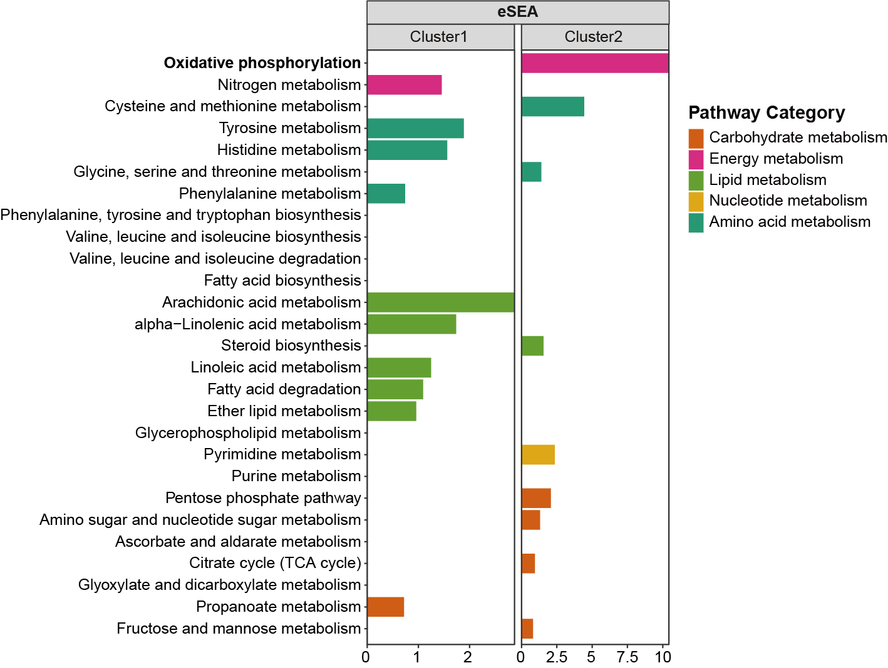
```

<center>**Extended gene and metabolite set enrichment analysis. **<center>

## Apply to spatial metabolomics
MSI-based spatially resolved metabolomics (SM) allow in situ screening of tumor initiation-, progression-, and metastasis-related metabolic biomarkers, thus allowing for the characterization of metabolic architecture of tumor and its surrounding microenvironment. Spatially resolved transcriptomics (ST) in cancer tissue transcriptome-wide profiling has greatly revealed tumor metabolic mechanisms. Gastric cancer ranks as one of the most prevalent malignant diseases, with an annual incidence of over 1,080,000 new cases and a mortality rate exceeding 760,000 deaths per year. Researchers found an integrated SM approach to explore the cell-specific metabolic remodeling.

### PEA

We conducted a reanalysis of both region-specific metabolite markers and gene markers provided by the author. Beyond the arginine and proline metabolism, our findings revealed dysregulation in glycine, serine, and threonine metabolism as well. Furthermore, our study demonstrated that glutathione metabolism is enriched not only at the metabolite level but also at the gene level, with a combined enrichment observed when considering both metabolites and genes.

```{r}
library(ggplot2)
library(dplyr)
library(MNet)
#-------------------------------------------------------------------------------
#  Step 1: Input metabolome and transcriptome data for pathway analysis
#-------------------------------------------------------------------------------

kegg_pathway_uniq <- PathwayExtendData %>%
  dplyr::select(kegg_pathwayname,kegg_category) %>%
  dplyr::rename("PATHWAY"="kegg_pathwayname") %>%
  dplyr::rename("pathway_type"="kegg_category") %>%
  unique()

dat_gene <- data.table::fread("input/special-gene-pathway.txt") %>%
  as.data.frame() %>%
  select(name,pvalue) %>%
  mutate(type="gene")
dat_metabolite <- data.table::fread("input/special-metabolite-pathway.txt") %>%
  as.data.frame() %>%
  select(name,pvalue) %>%
  mutate(type="metabolite")
dat_all <- data.table::fread("input/special-all-pathway.txt") %>%
  as.data.frame() %>%
  select(name,pvalue) %>%
  mutate(type="all")

result_1 <- rbind(dat_gene,dat_metabolite,dat_all) %>%
  dplyr::left_join(kegg_pathway_uniq,by=c("name"="PATHWAY")) %>%
  dplyr::arrange(pvalue)

pathway_hh <- unique(result_1$pathway_type)

result_1 <- result_1 %>%
  dplyr::arrange(match(pathway_type,pathway_hh))

result_1$name <- factor(result_1$name,levels = rev(unique(result_1$name)))
result_1$pathway_type <- factor(result_1$pathway_type,levels=unique(kegg_pathway_uniq$pathway_type))
result_1$type <- factor(result_1$type,levels=c("metabolite","gene","all"))

#-------------------------------------------------------------------------------
#  Step 2: Barplot
#-------------------------------------------------------------------------------

colp <- c("Amino acid metabolism" ="#1B9E77",
          "Carbohydrate metabolism"="#D95F02","Glycan biosynthesis and metabolism"="#1F78B4",
          "Metabolism of cofactors and vitamins"="#7570B3","Metabolism of terpenoids and polyketides"="#BC80BD",
          "Metabolism of other amino acids"="#8DD3C7",
          "Energy metabolism"="#E7298A","Lipid metabolism"="#66A61E","Nucleotide metabolism"="#E6AB02",
          "Biosynthesis of other secondary metabolites"="#A6761D",
          "Xenobiotics biodegradation and metabolism"="#666666")

p1 <- ggplot(result_1,aes(name,-log10(pvalue)))+
  geom_bar(stat="identity",aes(fill=pathway_type))+
  scale_fill_manual(values=colp,name="Pathway Category")+
  coord_flip()+
  theme_bw()+
  facet_wrap(vars(type),nrow=1)+
  labs(x=NULL)
ggsave("result/special-ePEA.pdf",p1,width=10,height = 5.5)
```

```{r,eval=TRUE,echo=FALSE,fig.align='center'}
knitr::include_graphics("figure/Spatial.png")
```

<center>**Metabolite pathway enrichment analysis, genes pathway enrichment and extend pathway enrichment analysis.**<center>

## Need help?

**If you have any questions about MNet, please don’t hesitate to email me (guituant2009@163.com).**

### Frequently Asked Questions

<ul>

<li>Can not install dependent packages dnet

If the ERROR is “Error: Failed to install ‘dnet’ from GitHub: Could not resolve host: api.github.com”, please try it again.

```{r}
BiocManager::install("hfang-bristol/dnet", dependencies=T)
```

</ul>
