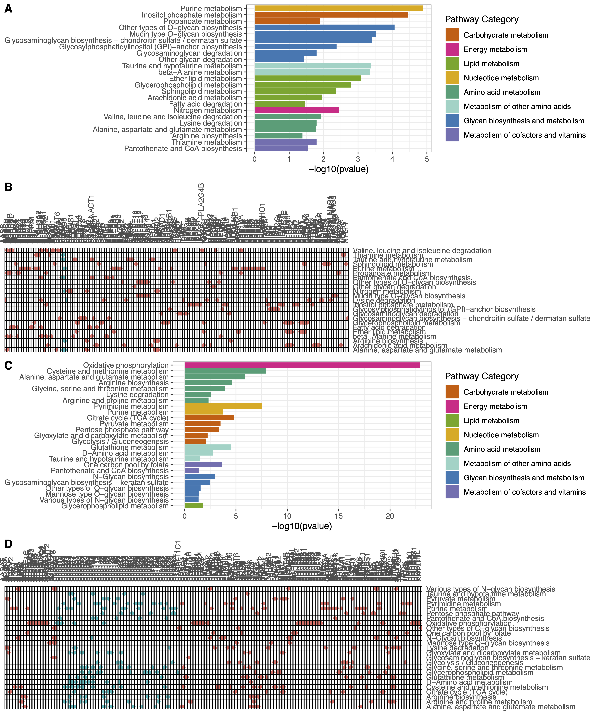
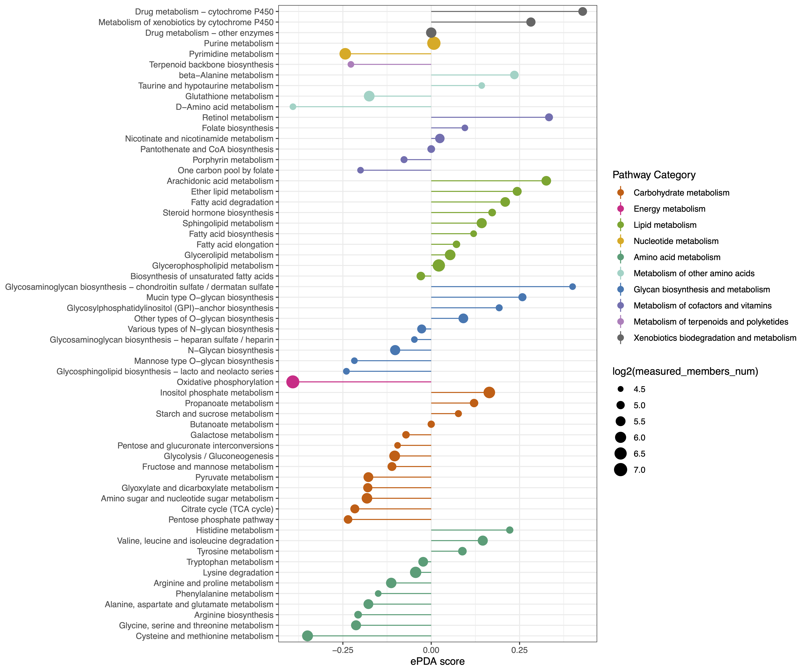
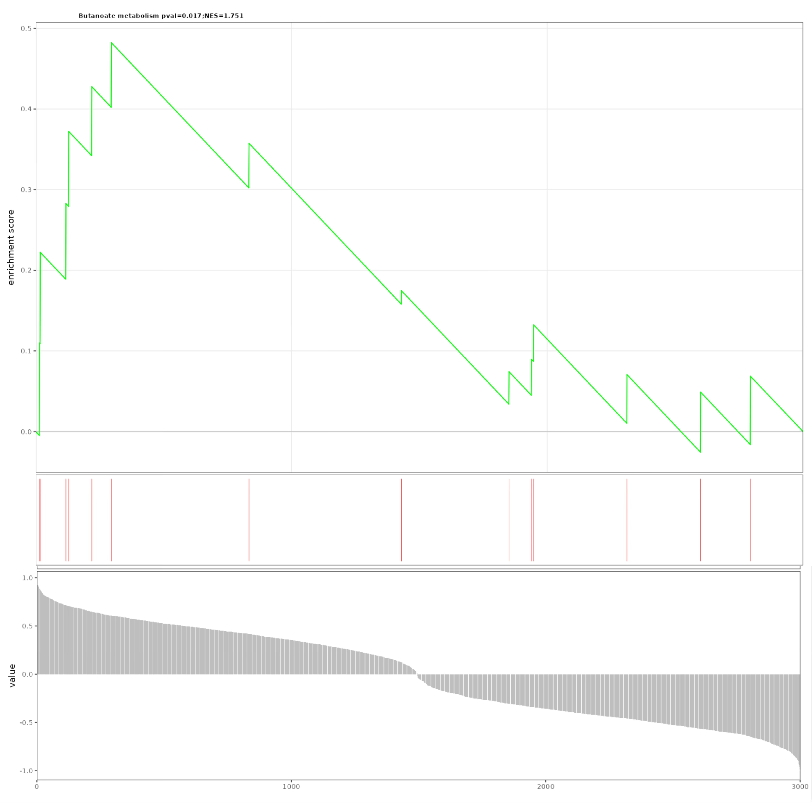

# Extended Pathway Analyses

## Extended pathway enrichment analysis (ePEA)

### Interface

<blockquote>
**Procedure**
</blockquote>

<ul>  

<li>Step 1: Enter **Metabolite Data**, **GeneExp Data** and **Group Data**,  respectively.  

<li>Step 2: Select **Log(FoldChange), Padjust Cutoff and Pathway Pcutoff**, respectively.  

<ul>  

<li>**Fold change**: Identifies key metabolites with significant expression shifts between conditions, revealing potential metabolic alterations and pathway involvement in biological processes.  

<li>**Padjust Cutoff**: Helps filter significant results by controlling for false positives, ensuring that only statistically robust pathways are identified for further investigation.  

<li>**Pathway Pcutoff**: Sets a significance threshold, helping to identify pathways with meaningful changes while reducing the likelihood of false-positive findings.  

</ul>  

<li>Step 3: Select **Figure Format** and adjust **figure width, height and DPI**.  

<li>Step 4: Click the **User** panel to **view the input and output**, and finally click **Figure Download** and export the analysis results.  

</ul>

```{r,eval=TRUE,echo=FALSE,fig.align='center'}
knitr::include_graphics("figure/1.M-G.png")
```

<blockquote>
**Demo data**
</blockquote>

<ul>

<li>**Expand the Demo Panel and click Metabolic Data to download demo data**, which comprises an integrated analysis of metabolomic and transcriptomic profiles in triple-negative breast cancer.

<ul>
<li>**Metabolite Data**: an interactive table for user-input metabolic data with rows corresponding to metabolites and columns corresponding to samples.

```{r,eval=TRUE,echo=FALSE}
knitr::include_graphics("figure/Metabolite.png")
```

<li>**GeneExp Data**: an interactive table for user-input metabolic data with rows corresponding to genes and columns correspond to the samples.

```{r,eval=TRUE,echo=FALSE}
knitr::include_graphics("figure/GeneExp.png")
```

<li>**Group Data**: Group information.

```{r,eval=TRUE,echo=FALSE,fig.align='left'}
knitr::include_graphics("figure/GroupInfo.png")
```

</ul>

</ul>


### Results

```{r,eval=TRUE,echo=FALSE,fig.align='center'}

```


## Extended differential abundance (EDA) score

### Interface

<blockquote>
**Procedure**
</blockquote>

<ul>  

<li>Step 1: Enter **Metabolite Data**, **GeneExp Data** and **Group Data**,  respectively.  

<li>Step 2: Select **Log(FoldChange), Padjust Cutoff and Pathway Pcutoff**, respectively.  

<ul>  

<li>**Fold change**: Identifies key metabolites with significant expression shifts between conditions, revealing potential metabolic alterations and pathway involvement in biological processes.  

<li>**Padjust Cutoff**: Helps filter significant results by controlling for false positives, ensuring that only statistically robust pathways are identified for further investigation.  

<li>**Pathway Pcutoff**: Sets a significance threshold, helping to identify pathways with meaningful changes while reducing the likelihood of false-positive findings.  

</ul>  

<li>Step 3: Select **Figure Format** and adjust **figure width, height and DPI**.  

<li>Step 4: Click the **User** panel to **view the input and output**, and finally click **Figure Download** and export the analysis results.  

</ul>

```{r,eval=TRUE,echo=FALSE,fig.align='center'}
knitr::include_graphics("figure/1.M-G.png")
```

<blockquote>
**Demo data**
</blockquote>

<ul>

<li>**Expand the Demo Panel and click Metabolic Data to download demo data**, which comprises an integrated analysis of metabolomic and transcriptomic profiles in triple-negative breast cancer.

<ul>
<li>**Metabolite Data**: an interactive table for user-input metabolic data with rows corresponding to metabolites and columns corresponding to samples.

```{r,eval=TRUE,echo=FALSE}
knitr::include_graphics("figure/Metabolite.png")
```

<li>**GeneExp Data**: an interactive table for user-input metabolic data with rows corresponding to genes and columns correspond to the samples.

```{r,eval=TRUE,echo=FALSE}
knitr::include_graphics("figure/GeneExp.png")
```

<li>**Group Data**: Group information.

```{r,eval=TRUE,echo=FALSE,fig.align='left'}
knitr::include_graphics("figure/GroupInfo.png")
```

</ul>

</ul>


### Results

```{r,eval=TRUE,echo=FALSE,fig.align='center',out.width="70%"}

```


## Extended data set enrichment analysis (ESEA)

### Interface

<blockquote>
**Procedure**
</blockquote>

<ul>  

<li>Step 1: Enter **Metabolite Data**, **GeneExp Data** and **Group Data**,  respectively.  

<li>Step 2: Select **Log(FoldChange), Padjust Cutoff and Pathway Pcutoff**, respectively.  

<ul>  

<li>**Fold change**: Identifies key metabolites with significant expression shifts between conditions, revealing potential metabolic alterations and pathway involvement in biological processes.  

<li>**Padjust Cutoff**: Helps filter significant results by controlling for false positives, ensuring that only statistically robust pathways are identified for further investigation.  

<li>**Pathway Pcutoff**: Sets a significance threshold, helping to identify pathways with meaningful changes while reducing the likelihood of false-positive findings.  

</ul>  

<li>Step 3: Select **Figure Format** and adjust **figure width, height and DPI**.  

<li>Step 4: Click the **User** panel to **view the input and output**, and finally click **Figure Download** and export the analysis results.  

</ul>

```{r,eval=TRUE,echo=FALSE,fig.align='center'}
knitr::include_graphics("figure/1.M-G.png")
```

<blockquote>
**Demo data**
</blockquote>

<ul>

<li>**Expand the Demo Panel and click Metabolic Data to download demo data**, which comprises an integrated analysis of metabolomic and transcriptomic profiles in triple-negative breast cancer.

<ul>
<li>**Metabolite Data**: an interactive table for user-input metabolic data with rows corresponding to metabolites and columns corresponding to samples.

```{r,eval=TRUE,echo=FALSE}
knitr::include_graphics("figure/Metabolite.png")
```

<li>**GeneExp Data**: an interactive table for user-input metabolic data with rows corresponding to genes and columns correspond to the samples.

```{r,eval=TRUE,echo=FALSE}
knitr::include_graphics("figure/GeneExp.png")
```

<li>**Group Data**: Group information.

```{r,eval=TRUE,echo=FALSE,fig.align='left'}
knitr::include_graphics("figure/GroupInfo.png")
```

</ul>

</ul>


### Results

```{r,eval=TRUE,echo=FALSE,fig.align='center',out.width="60%"}

```

