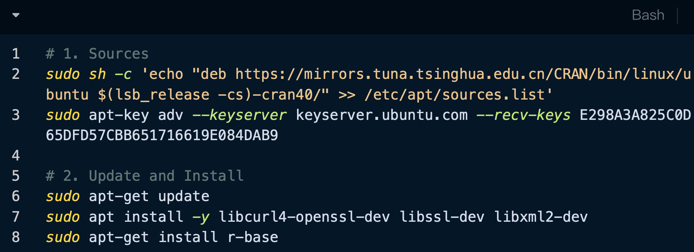
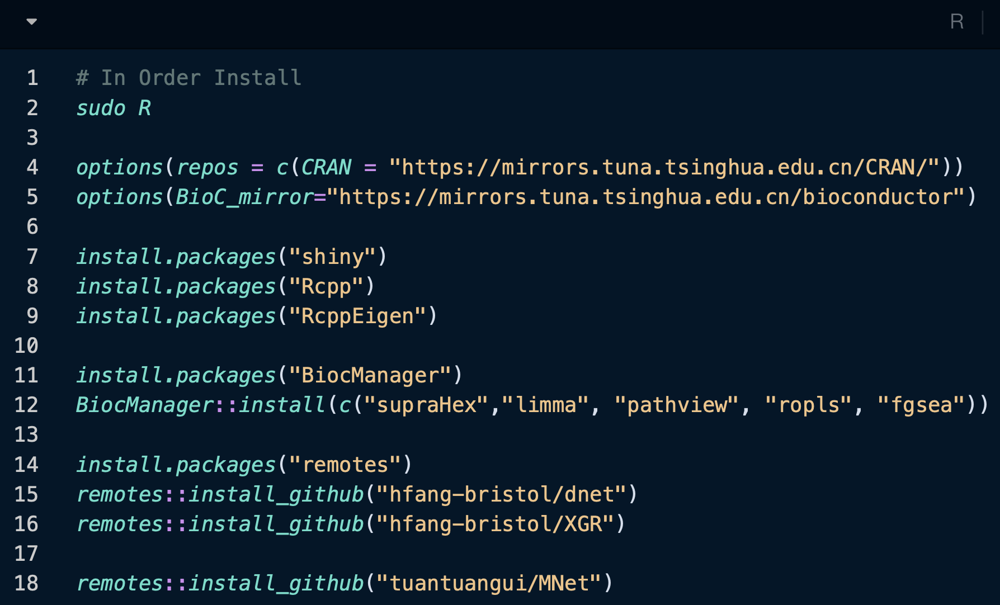
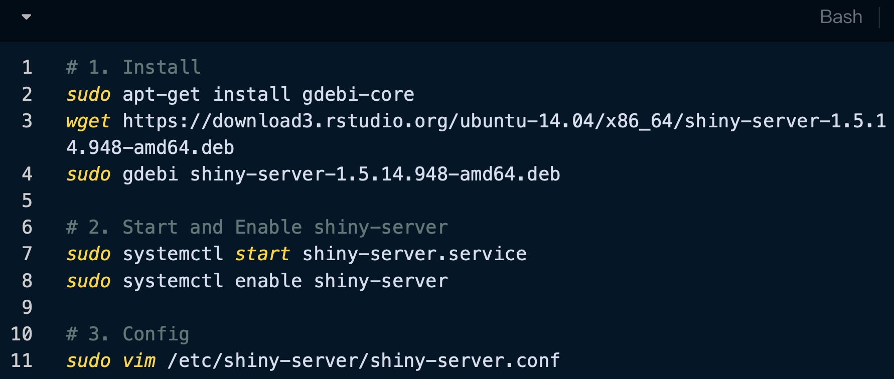
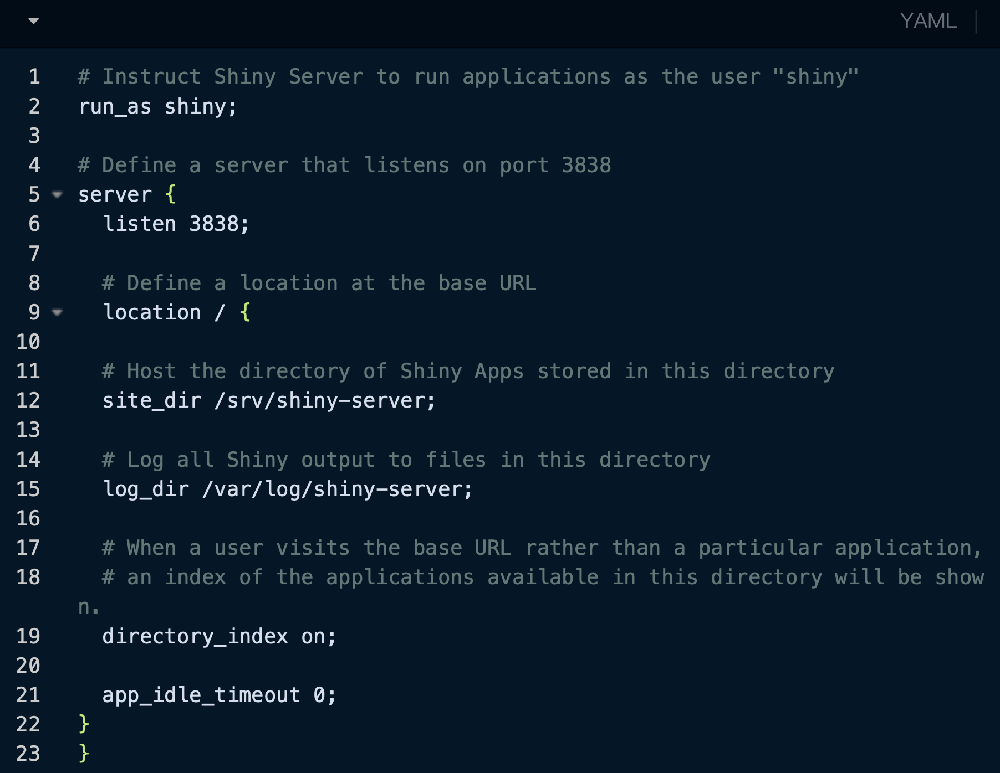
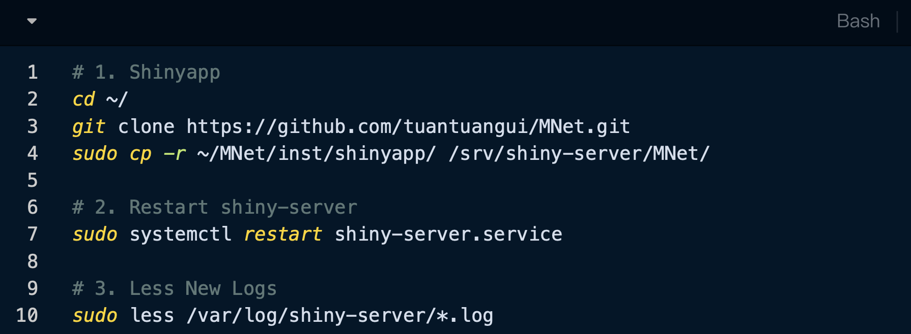
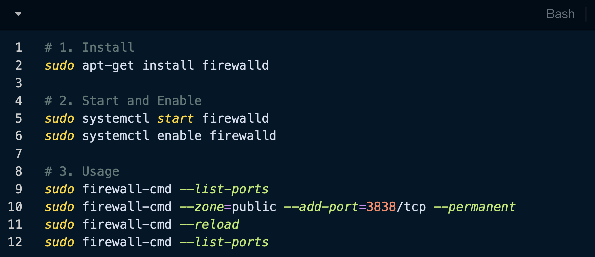
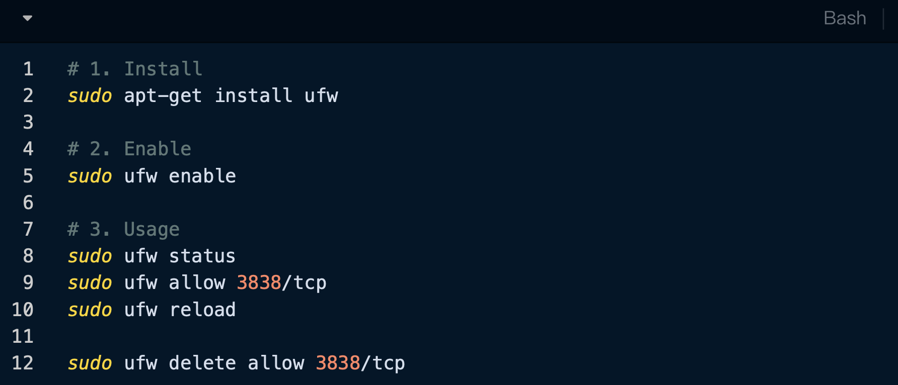
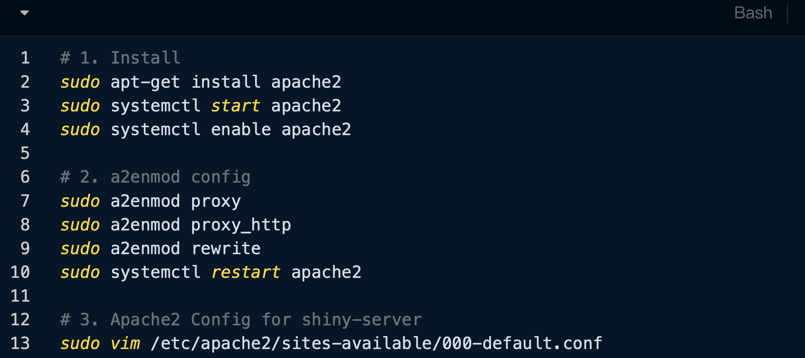
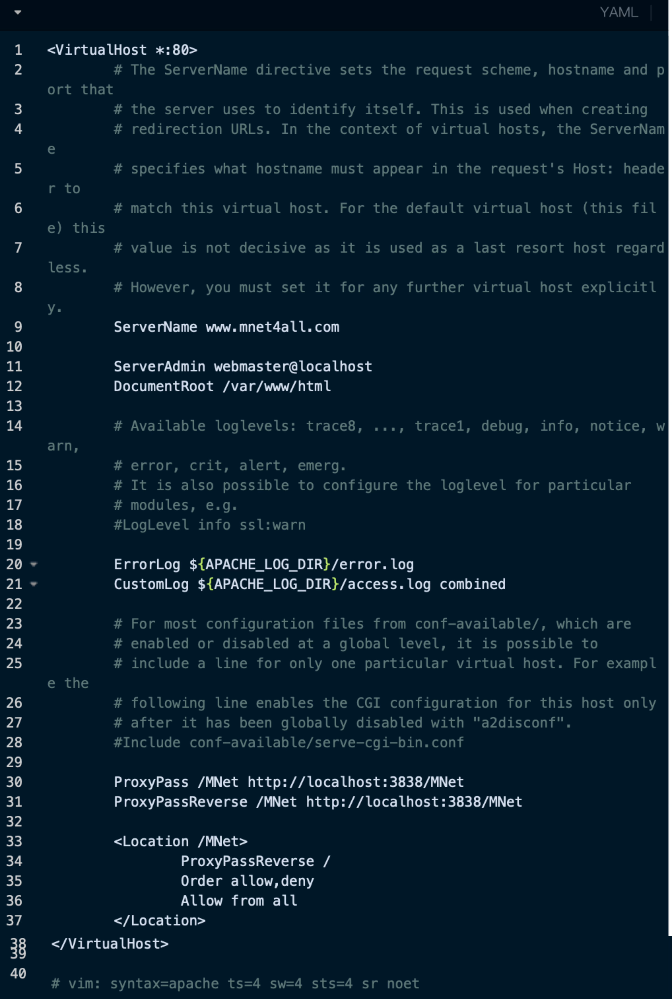

# Deployment

[MNet Source Files](https://github.com/tuantuangui/MNet)

[MNet Web server](http://www.mnet4all.com/MNet/)

## Installing R 4.4.1 for Ubuntu 20

```{r,eval=TRUE,echo=FALSE,fig.align='center'}

```

## Installing R Packages

```{r,eval=TRUE,echo=FALSE,fig.align='center'}

```

## Installing shiny-sever

```{r,eval=TRUE,echo=FALSE,fig.align='center'}

```

```{r,eval=TRUE,echo=FALSE,fig.align='center'}

```

## Shiny App Server and Logs

```{r,eval=TRUE,echo=FALSE,fig.align='center'}

```

## Firewall: firewalld or ufw

```{r,eval=TRUE,echo=FALSE,fig.align='center'}

```

```{r,eval=TRUE,echo=FALSE,fig.align='center'}

```

## Apache2 Config

```{r,eval=TRUE,echo=FALSE,fig.align='center'}

```

```{r,eval=TRUE,echo=FALSE,fig.align='center'}

```

```{r,eval=TRUE,echo=FALSE,fig.align='center',out.width="150%"}

```
