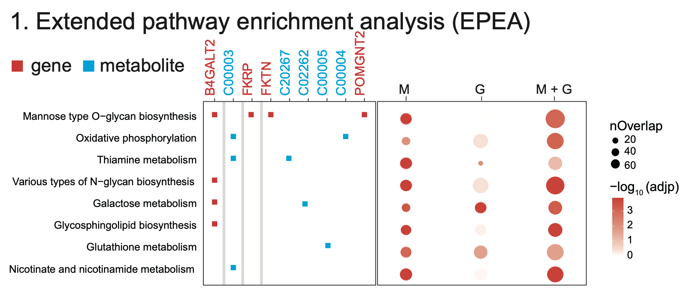
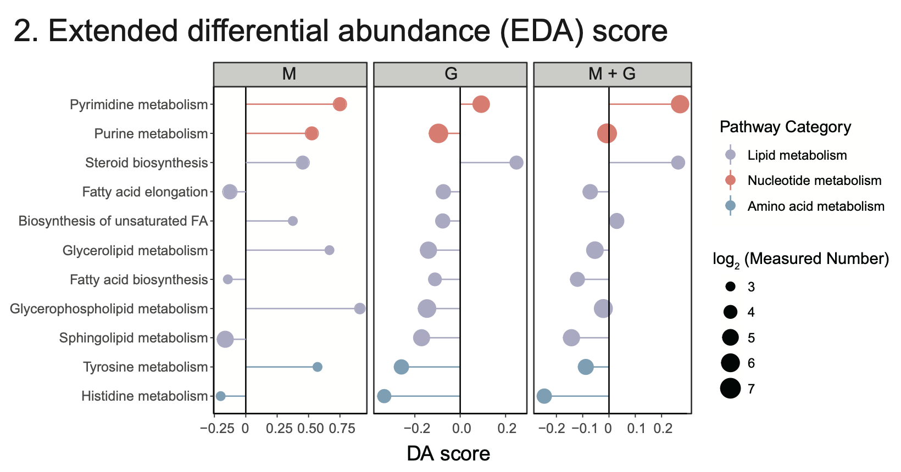
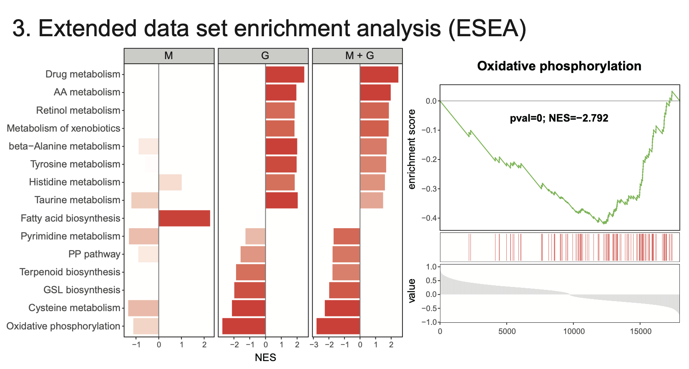

# Extended Pathway Analyses

## Extended pathway enrichment analysis (ePEA)

**Procedure**

<ul>  

<li>Step 1: Enter **Metabolite Data**, **GeneExp Data** and **Group Data**,  respectively.  

<li>Step 2: Select **Log(FoldChange), Padjust Cutoff and Pathway Pcutoff**, respectively.  

<ul>  

<li>**Fold change**: Identifies key metabolites with significant expression shifts between conditions, revealing potential metabolic alterations and pathway involvement in biological processes.  

<li>**Padjust Cutoff**: Helps filter significant results by controlling for false positives, ensuring that only statistically robust pathways are identified for further investigation.  

<li>**Pathway Pcutoff**: Sets a significance threshold, helping to identify pathways with meaningful changes while reducing the likelihood of false-positive findings.  

</ul>  

<li>Step 3: Select **Figure Format** and adjust **figure width, height and DPI**.  

<li>Step 4: click **Figure Download** to export analysis result.  

</ul>

------------------------------------------------------------------------------

**Results**

```{r,eval=TRUE,echo=FALSE,fig.align='center'}

```


## Extended differential abundance (EDA) score

**Procedure**

<ul>  

<li>Step 1: Enter **Metabolite Data**, **GeneExp Data** and **Group Data**,  respectively.  

<li>Step 2: Select **Log(FoldChange), Padjust Cutoff and Pathway Pcutoff**, respectively.  

<ul>  

<li>**Fold change**: Identifies key metabolites with significant expression shifts between conditions, revealing potential metabolic alterations and pathway involvement in biological processes.  

<li>**Padjust Cutoff**: Helps filter significant results by controlling for false positives, ensuring that only statistically robust pathways are identified for further investigation.  

<li>**Pathway Pcutoff**: Sets a significance threshold, helping to identify pathways with meaningful changes while reducing the likelihood of false-positive findings.  

</ul>  

<li>Step 3: Select **Figure Format** and adjust **figure width, height and DPI**.  

<li>Step 4: click **Figure Download** to export analysis result.  

</ul>

------------------------------------------------------------------------------

**Results**

```{r,eval=TRUE,echo=FALSE,fig.align='center'}

```


## Extended data set enrichment analysis (ESEA)

**Procedure**

<ul>  

<li>Step 1: Enter **Metabolite Data**, **GeneExp Data** and **Group Data**,  respectively.  

<li>Step 2: Select **Log(FoldChange), Padjust Cutoff and Pathway Pcutoff**, respectively.  

<ul>  

<li>**Fold change**: Identifies key metabolites with significant expression shifts between conditions, revealing potential metabolic alterations and pathway involvement in biological processes.  

<li>**Padjust Cutoff**: Helps filter significant results by controlling for false positives, ensuring that only statistically robust pathways are identified for further investigation.  

<li>**Pathway Pcutoff**: Sets a significance threshold, helping to identify pathways with meaningful changes while reducing the likelihood of false-positive findings.  

</ul>  

<li>Step 3: Select **Figure Format** and adjust **figure width, height and DPI**.  

<li>Step 4: click **Figure Download** to export analysis result.  

</ul>

------------------------------------------------------------------------------

**Results**

```{r,eval=TRUE,echo=FALSE,fig.align='center'}

```

