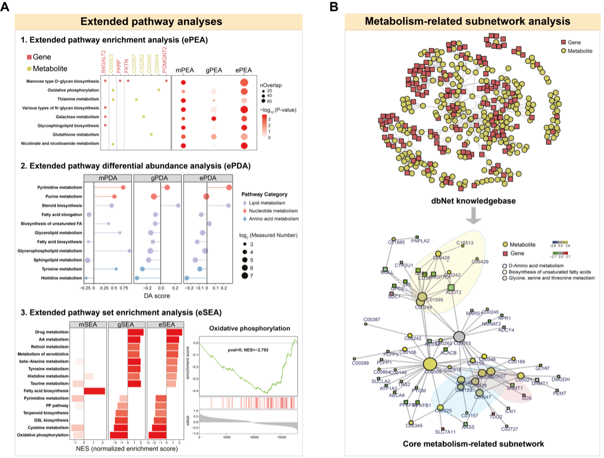
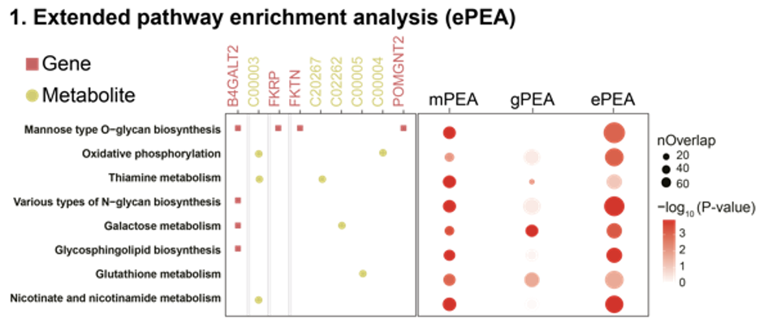
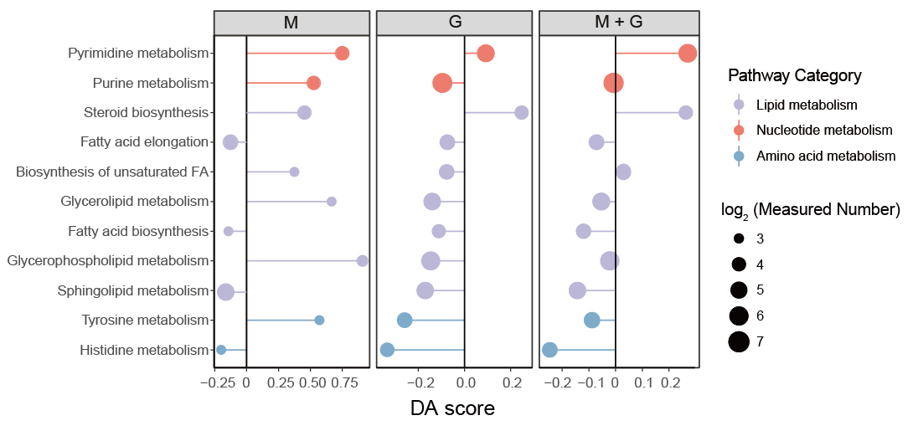
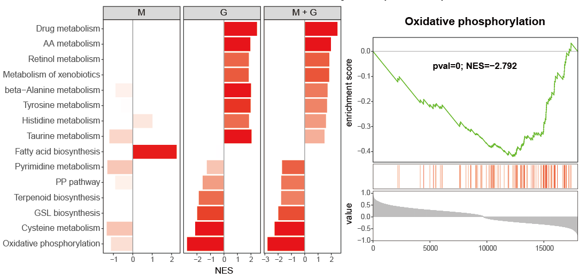
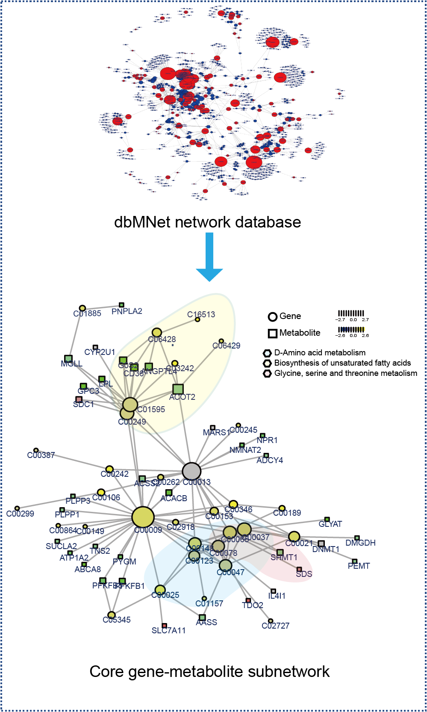

# Figure 2

```{r,eval=TRUE,echo=FALSE,fig.align='center'}

```

**Figure 2: Integrated analyses uniquely supported by MNet.**  

A. MNet offers integrated analysis, featuring extended pathway enrichment analysis (ePEA), extended pathway differential abundance analysis (ePDA), and extended pathway set enrichment analysis (eSEA).  

B. MNet constructs a knowledgebase and thus supports metabolism-related subnetwork analysis. It enables the extraction of the optimal subnetwork from the dbNet knowledgebase for the input genes and metabolites, thereby elucidating the underlying mechanisms that best explain the input data.  

## (A1) ePEA

```{r}

library(MNet)
library(dplyr)
library(ggplot2)

group[which(group=="normal")] <- "a"
group[which(group=="tumor")] <- "normal"
group[which(group=="a")] <- "tumor"

all_meta <- mlimma(meta_dat,group)
all_gene <- mlimma(gene_dat,group)

diff_gene <- all_gene %>%
  dplyr::filter(abs(logFC) > 1) %>%
  dplyr::filter(adj.P.Val < 0.05)

diff_meta <- all_meta %>%
  dplyr::filter(abs(logFC) > 0.58) %>%
  dplyr::filter(adj.P.Val < 0.05)

diff_all <- rbind(diff_gene,diff_meta)

result_gene <- PathwayAnalysis(diff_gene$name,out="gene",p_cutoff=1.5)
result_meta <- PathwayAnalysis(diff_meta$name,out="metabolite",p_cutoff=1.5)
result_all <- PathwayAnalysis(diff_all$name,out="Extended",p_cutoff=1.5)

pathway_all <- rbind(result_gene$output,result_meta$output,result_all$output) %>%
  dplyr::filter(adjp < 0.001) %>%
  dplyr::pull(name) %>%
  unique()

result_gene_filter <- result_gene$output %>%
  as.data.frame() %>%
  dplyr::select(name,nOverlap,adjp) %>%
  dplyr::filter(name %in% pathway_all) %>%
  dplyr::mutate(type="gene")

result_meta_filter <- result_meta$output %>%
  as.data.frame() %>%
  dplyr::select(name,nOverlap,adjp) %>%
  dplyr::filter(name %in% pathway_all) %>%
  dplyr::mutate(type="metabolite")

result_all_filter <- result_all$output %>%
  as.data.frame() %>%
  dplyr::select(name,nOverlap,adjp) %>%
  dplyr::filter(name %in% pathway_all) %>%
  dplyr::mutate(type="all")

all <- rbind(result_gene_filter,result_meta_filter,result_all_filter) %>%
  dplyr::mutate(adjp=ifelse(adjp < 1.3e-04 ,1.3e-04,adjp)) %>%
  dplyr::mutate(type=factor(type,levels=c("metabolite","gene","all")))

p <- ggplot(all,aes(type,name))+
  geom_point(aes(size=nOverlap,color=-log10(adjp)))+
  theme_bw()+
  theme(panel.border = element_blank(),panel.grid.major = element_blank(), 
        panel.grid.minor = element_blank(),axis.line = element_line(colour = "black"))+
  scale_color_gradient(low="white",high="red")+
  labs(x=NULL,y="Pathway name")
ggsave("result/2A_01.ePEA.pdf",p,width=6,height = 4)
```

```{r,eval=TRUE,echo=FALSE,fig.align='center'}

```

## (A2) ePDA

```{r}

library(MNet)
library(dplyr)
library(ggplot2)

## Gene
diff_gene_increase <- all_gene %>%
  dplyr::filter(logFC > 2) %>%
  dplyr::filter(adj.P.Val < 0.01)

diff_gene_decrease <- all_gene %>%
  dplyr::filter(logFC < -2) %>%
  dplyr::filter(adj.P.Val < 0.01)

DA_gene <- DAscore(diff_gene_increase$name,
                        diff_gene_decrease$name,all_gene$name,
                        min_measured_num = 10,
                   out="gene",sort_plot="category") 
write.table(DA_gene$result,"result/2A_02.DA_gene.txt",quote=F,row.names=F,sep="\t")

gene <- data.table::fread("result/2A_02.DA_gene.txt") %>%
  as.data.frame() %>%
  dplyr::filter(Measured_members_num >= 10) %>%
  dplyr::mutate(Type="gene")

## Metabolite
diff_meta_increase <- all_meta %>%
  dplyr::filter(logFC > 2) %>%
  dplyr::filter(P.Value < 0.01)

diff_meta_decrease <- all_meta %>%
  dplyr::filter(logFC < 2) %>%
  dplyr::filter(P.Value < 0.01)

DAscore_meta <- DAscore(diff_meta_increase$name,
                        diff_meta_decrease$name,all_meta$name,
                        min_measured_num = 3,
                        out="metabolite",sort_plot="category")
write.table(DAscore_meta$result,"result/2A_02.DA_meta.txt",quote=F,row.names=F,sep="\t")

meta <- data.table::fread("result/2A_02.DA_meta.txt") %>%
  as.data.frame() %>%
  dplyr::filter(Measured_members_num >= 3) %>%
  dplyr::mutate(Type="metabolite")

## Gene + Metabolite
DAscore_all <- DAscore(c(diff_gene_increase$name,diff_meta_increase$name),
                       c(diff_gene_decrease$name,diff_meta_decrease$name),
                       c(all_gene$name,all_meta$name),min_measured_num = 13,
                       out="Extended",sort_plot="category")
write.table(DAscore_all$result,"result/2A_02.DA_all.txt",quote=F,row.names=F,sep="\t")

all <- data.table::fread("result/2A_02.DA_all.txt") %>%
  as.data.frame() %>%
  dplyr::filter(Measured_members_num >= 13) %>%
  dplyr::mutate(Type="metabolite+gene")

result <- rbind(meta,gene,all) %>%
  dplyr::filter(!Pathway %in% c("Sulfur metabolism",
                                "Fructose and mannose metabolism",
                                "Ascorbate and aldarate metabolism",
                                "Galactose metabolism",
                                "Butanoate metabolism",
                                "Pentose and glucuronate interconversions",
                                "Starch and sucrose metabolism",
                                "Amino sugar and nucleotide sugar metabolism",
                                "Propanoate metabolism",
                                "Inositol phosphate metabolism",
                                "Tryptophan metabolism",
                                "Selenocompound metabolism")) %>%
  dplyr::filter(!`Pathway Category` %in% 
                  c("Metabolism of terpenoids and polyketides",
                    "Metabolism of cofactors and vitamins",
                    "Biosynthesis of other secondary metabolites",
                    "Xenobiotics biodegradation and metabolism",
                    "Glycan biosynthesis and metabolism",
                    "Metabolism of other amino acids"))

result_filter <- result %>%
  dplyr::filter(Pathway %in% 
                  c("Sphingolipid metabolism","Glycerophospholipid metabolism",
                    "Fatty acid biosynthesis","Glycerolipid metabolism",                           "Biosynthesis of unsaturated fatty acids",
                    "Fatty acid elongation",                            
                    "Steroid biosynthesis","Purine metabolism",                                    "Pyrimidine metabolism",
                    "Histidine metabolism","Tyrosine metabolism")) %>%
  dplyr::mutate(DA_score=
                  ifelse(Pathway=="Histidine metabolism" & Type=="metabolite",-0.2,
                  ifelse(Pathway=="Sphingolipid metabolism" & Type=="metabolite",-0.2,DA_score))) %>%
  dplyr::arrange(DA_score) %>%
  dplyr::arrange(`Pathway Category`)

result_filter$Pathway <- factor(result_filter$Pathway,levels=unique(result_filter$Pathway))

kegg_pathway_uniq <- PathwayExtendData %>%
  dplyr::select(kegg_pathwayname,kegg_category) %>%
  dplyr::rename("PATHWAY"="kegg_pathwayname") %>%
  dplyr::rename("pathway_type"="kegg_category") %>%
  unique()

result_filter$Type <- factor(result_filter$Type,levels=c("metabolite","gene","metabolite+gene"))

p <- ggplot2::ggplot(result_filter)+
  ggplot2::geom_point(ggplot2::aes(x=Pathway,y=DA_score,size=log2(Measured_members_num),color=`Pathway Category`))+
  ggplot2::geom_pointrange(ggplot2::aes(x=Pathway,y=DA_score,ymin=0,ymax=DA_score,color=`Pathway Category`))+
  scale_color_manual(values=RColorBrewer::brewer.pal(11, "Set3"),
                     name="Pathway Category",
                     breaks=unique(kegg_pathway_uniq$pathway_type))+
  theme_bw()+
  theme(panel.grid.major = element_blank(), panel.grid.minor = element_blank(),
        axis.line = element_line(colour = "black"))+
  geom_hline(yintercept=c(0))+
  ggplot2::coord_flip()+
  ggplot2::xlab(NULL)+
  facet_grid(. ~ Type,scales="free_x")
ggsave("result/2A_02.ePDA.pdf",p,width=10,height = 4)
```

```{r,eval=TRUE,echo=FALSE,fig.align='center'}

```

## (A3) eSEA

```{r}

library(MNet)
library(dplyr)
library(ggplot2)

all_meta <- mlimma(meta_dat,group)
all_gene <- mlimma(gene_dat,group)
all_result <- rbind(all_meta,all_gene)

all <- all_result$logFC
names(all) <- all_result$name

gene <- all_gene$logFC
names(gene) <- all_gene$name

meta <- all_meta$logFC
names(meta) <- all_meta$name

result_meta <- ESEA(meta,out="metabolite",minSize = 3)
result_gene <- ESEA(gene,out = "gene",minSize = 10)
result_all <- ESEA(all,out="Extended",minSize = 13)

pathway_msea <- rbind(result_meta,result_gene,result_all) %>%
  dplyr::filter(pval < 0.01) %>%
  dplyr::pull(pathway) %>%
  unique()

length(pathway_msea)

msea_meta_filter <- result_meta %>%
  dplyr::filter(pathway %in% pathway_msea) %>%
  dplyr::select(pathway,pval,NES) %>%
  dplyr::mutate(type="metabolite")

msea_gene_filter <- result_gene %>%
  dplyr::filter(pathway %in% pathway_msea) %>%
  dplyr::select(pathway,pval,NES) %>%
  dplyr::mutate(type="gene")

msea_all_filter <- result_all %>%
  dplyr::filter(pathway %in% pathway_msea) %>%
  dplyr::select(pathway,pval,NES) %>%
  dplyr::mutate(type="metabolite+gene") %>%
  dplyr::arrange(NES)

result <- rbind(msea_meta_filter,msea_gene_filter,msea_all_filter) %>%
  dplyr::mutate(pval=ifelse(pval < 8.048183e-04,8.048183e-04,pval)) %>%
  dplyr::mutate(pathway=factor(pathway,levels=msea_all_filter$pathway)) %>%
  dplyr::mutate(type=factor(type,levels = c("metabolite","gene","metabolite+gene")))

p <- ggplot(result,aes(pathway,NES,fill=-log10(pval)))+
  geom_bar(stat="identity")+
  theme_bw()+
  geom_hline(yintercept=c(0))+
  theme(panel.grid.major = element_blank(), 
        panel.grid.minor = element_blank())+
  scale_fill_gradient(low="white",high="red")+
  coord_flip()+
  facet_grid(. ~ type,scales="free_x")+
  labs(x="Pathway name")
ggsave("result/2A_03.ESEA_barplot.pdf",p,width=10,height = 5)

p_Oxi <- pMSEA("Oxidative phosphorylation",all,out="Extended")
ggsave("result/2A_03.plot_msea_oxipho_metabolite.pdf",p_Oxi,width=5,height = 5)
```

```{r,eval=TRUE,echo=FALSE,fig.align='center'}

```

## (B) Subnetwork

```{r}

library(MNet)
library(dplyr)
library(ggplot2)

diff_meta <- mlimma(meta_dat,group)
diff_gene <- mlimma(gene_dat,group)
names(diff_meta)[4]  <- "p_value"
names(diff_gene)[4] <- "p_value"

pdf("result/2B_pdent.pdf",width=10,height = 10)
a <- pdnet(diff_meta,diff_gene,nsize=60)
dev.off()

node <- a$node_result
write.table(node,"result/2B_pdnet_node.txt",quote=F,row.names=F,sep="\t")

edge <- a$edge_result
write.table(edge,"result/2B_pdnet_edge.txt",quote=F,row.names=F,sep="\t")

metabolite <- node %>%
  dplyr::filter(type=="metabolite")

gene <- node %>%
  dplyr::filter(type=="gene")

result_metabolite <- PathwayAnalysis(metabolite$name,out="metabolite",test="hypergeo")
result_gene <- PathwayAnalysis(gene$name,out="gene",test="hypergeo")
result_all <- PathwayAnalysis(c(gene$name,metabolite$name),out="Extended",test="hypergeo")

write.table(result_metabolite$output,"result/2B_pdnet_metabolite_enrichment.txt",quote=F,row.names = F,sep="\t")
write.table(result_gene$output,"result/2B_pdnet_gene_enrichment.txt",quote=F,row.names = F,sep="\t")
write.table(result_all$output,"result/2B_pdnet_all_enrichment.txt",quote=F,row.names = F,sep="\t")

kegg_pathway_uniq <- PathwayExtendData %>%
  dplyr::select(kegg_pathwayname,kegg_category) %>%
  dplyr::rename("PATHWAY"="kegg_pathwayname") %>%
  dplyr::rename("pathway_type"="kegg_category") %>%
  unique()

result <- rbind(result_metabolite$output %>% dplyr::mutate(type="metabolite"),
                    result_gene$output %>% dplyr::mutate(type="gene"),
                    result_all$output %>% dplyr::mutate(type="all")) %>%
  dplyr::left_join(kegg_pathway_uniq,by=c("name"="PATHWAY")) %>%
  dplyr::filter(pathway_type != "Glycan biosynthesis and metabolism") %>%
  dplyr::filter(!name %in% c("Fructose and mannose metabolism",
                             "Amino sugar and nucleotide sugar metabolism",
                            "Galactose metabolism",
                            "Ascorbate and aldarate metabolism",
                            "Pentose and glucuronate interconversions")) %>%
  dplyr::arrange(pvalue)

pathway_hh <- unique(result$pathway_type)

result <- result %>%
  dplyr::filter(!pathway_type %in% 
                  c("Metabolism of terpenoids and polyketides",
                    "Metabolism of cofactors and vitamins",
                    "Biosynthesis of other secondary metabolites",
                    "Metabolism of other amino acids",
                    "Xenobiotics biodegradation and metabolism")) %>%
  dplyr::arrange(match(pathway_type,pathway_hh))

result$name <- factor(result$name,levels = rev(unique(result$name)))
result$pathway_type <- factor(result$pathway_type,levels=unique(kegg_pathway_uniq$pathway_type))
result$type <- factor(result$type,levels=c("metabolite","gene","all"))
p1 <- ggplot(result,aes(name,-log10(pvalue)))+
  geom_bar(stat="identity",aes(fill=pathway_type))+
  scale_fill_manual(values=RColorBrewer::brewer.pal(11, "Set3"),
                    name="Pathway Category",
                    breaks=unique(kegg_pathway_uniq$pathway_type))+
  scale_y_continuous(expand = c(0, 0))+
  coord_flip()+
  facet_grid(. ~ type,scales="free_x")+
  theme_bw()+
  labs(x=NULL)
ggsave("result/2B_pdnet_epe.pdf",p1,width=10,height = 5)
```

```{r,eval=TRUE,echo=FALSE,fig.align='center'}

```
