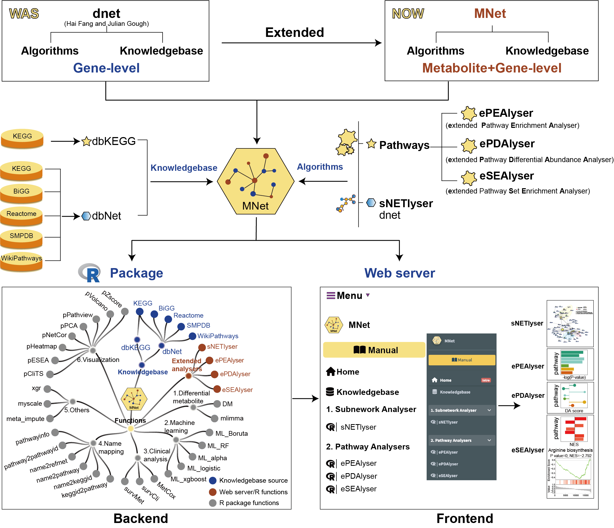

--- 
title: "MNet Manual"
date: "`r Sys.Date()`"
site: bookdown::bookdown_site
documentclass: book
description:MNet: an R package and Shiny app for integrative analysis of metabolomic and transcriptomic data.
---

```{r setup, include=FALSE}
knitr::opts_chunk$set(results="asis")
knitr::opts_chunk$set(eval=FALSE)
knitr::opts_chunk$set(echo=TRUE)
knitr::opts_chunk$set(warning=FALSE)
knitr::opts_chunk$set(message=FALSE)
knitr::opts_chunk$set(fig_cap="yes")
```

# OVERVIEW
```{r,eval=TRUE,echo=FALSE,fig.align='center'}

```

The surge in metabolomics and transcriptomic data has necessitated the development of innovative network analysis tools for the integrated analysis of multi-omics data. However, current tools often focus on individual pathways, extracting the subnetwork for the interested genes and metabolites or extracting the correlation subnetwork, neglecting the valuable information embedded in gene-metabolite or metabolite-metabolite knowledge networks across all metabolic pathways. In response to this gap, we introduce **an integrated analytical tool MNet, an R package for mining metabolomics coupled with clinical and transcriptomic data**. 

MNet introduces three key feature to enhance the analytical capabilities：

<ul>
<li>**Knowledgebase - dbMNet**: dbKEGG for extended pathway analysis and dbNet for metabolism-related subnetwork analysis  
<li>**Algorithm for extended pathway analysis**: identify dysregulated metabolic pathways via considering both metabolites and genes  
<ul> 
<li>Extended pathway enrichment analysis (EPEA)
<li>Extended differential abundance analysis (EDA)
<li>Extended data sets enrichment analysis (ESEA)
</ul>
<li>**Algorithm for metabolism-related subnetwork analysis**: Maximising the potential of our well-established dnet algorithm in integrative analysis of metabolomic and transcriptomic data to provide a systems-level understanding of metabolic interconnections   
</ul> 

-------------------------------------------------------------------------------
**MNet Installation**
-------------------------------------------------------------------------------
```{r,eval=FALSE}

if(!require(BiocManager)){
  install.packages("BiocManager")
}

if (!require(remotes)) {
  BiocManager::install("remotes", dependencies=T)
}

if (!require(devtools)) {
  BiocManager::install("devtools", dependencies=T)
}

BiocManager::install("hfang-bristol/dnet", dependencies=T)
BiocManager::install("tuantuangui/MNet", dependencies=T)

## Check the package ‘MNet’ successfully installed
library(help=MNet)

```


